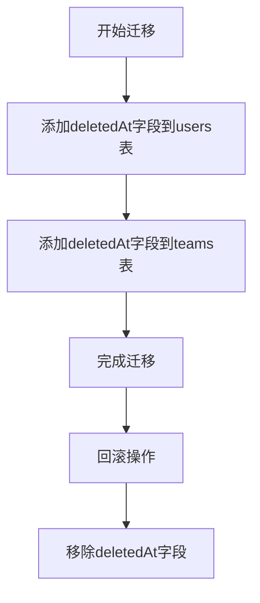
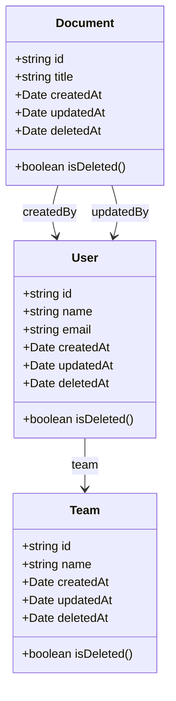
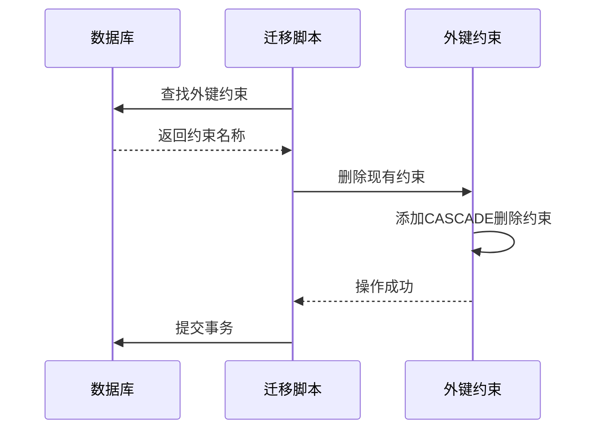
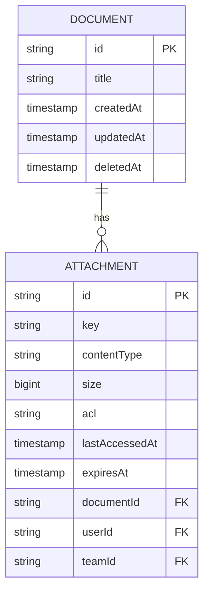
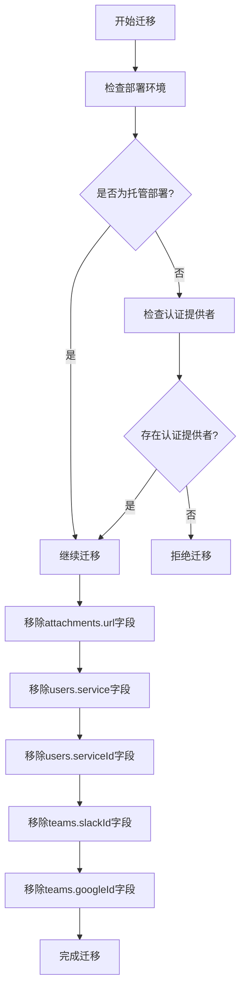
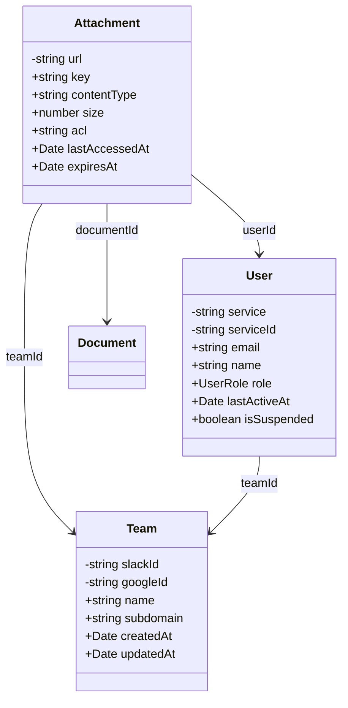
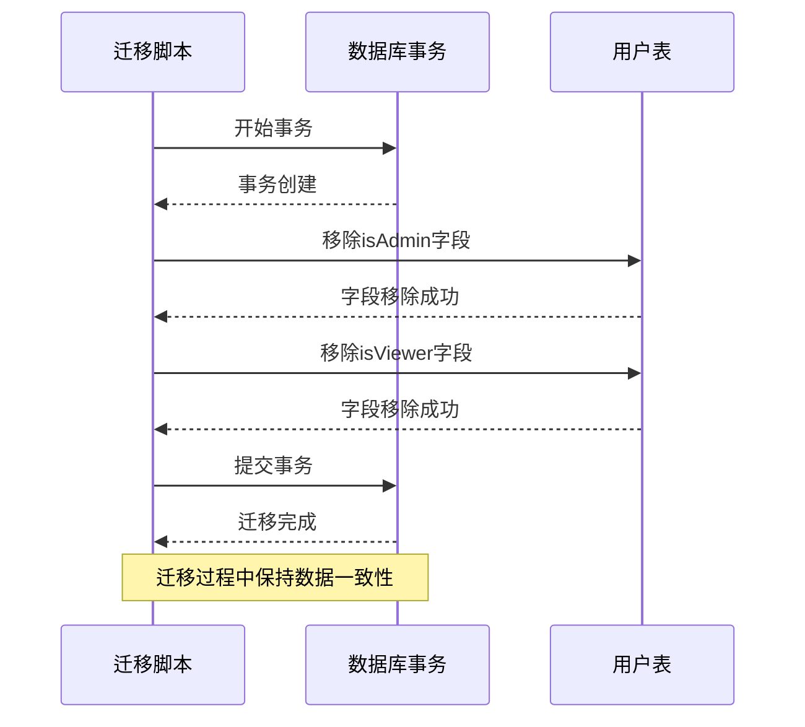
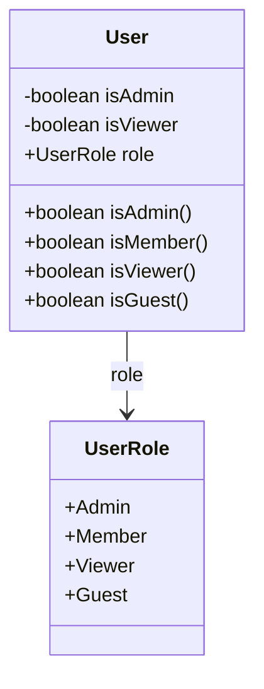

# 生产环境迁移

<cite>
**Referenced Files in This Document**   
- [20171017055026-remove-document-html.js](file://server/migrations/20171017055026-remove-document-html.js)
- [20180707220121-more-soft-delete.js](file://server/migrations/20180707220121-more-soft-delete.js)
- [20200328175012-cascade-delete.js](file://server/migrations/20200328175012-cascade-delete.js)
- [20201211080408-attachment-no-cascade.js](file://server/migrations/20201211080408-attachment-no-cascade.js)
- [20220720221531-remove-deprecated-columns.js](file://server/migrations/20220720221531-remove-deprecated-columns.js)
- [20230330181038-remove-column-userId-from-documents.js](file://server/migrations/20230330181038-remove-column-userId-from-documents.js)
- [20240329012958-remove-old-role-columns.js](file://server/migrations/20240329012958-remove-old-role-columns.js)
- [Document.ts](file://app/models/Document.ts)
- [User.ts](file://app/models/User.ts)
- [Attachment.ts](file://server/models/Attachment.ts)
</cite>

## 目录
1. [引言](#引言)
2. [软删除实现](#软删除实现)
3. [级联删除优化](#级联删除优化)
4. [废弃字段清理](#废弃字段清理)
5. [旧角色列移除](#旧角色列移除)
6. [生产环境迁移实践](#生产环境迁移实践)
7. [检查清单与最佳实践](#检查清单与最佳实践)
8. [结论](#结论)

## 引言
本文档详细介绍了baozi项目在生产环境中的数据库迁移实践，重点阐述了安全迁移的实施细节。文档涵盖了软删除、级联删除优化、废弃字段清理和旧角色列移除等关键迁移操作，并提供了完整的审批流程、备份策略、灰度发布、监控机制和回滚计划。通过分析实际迁移文件，为初学者提供概念性概述，同时为经验丰富的开发者提供深入的技术细节。

## 软删除实现
软删除是一种在数据库中保留数据但标记为已删除的技术，允许在需要时恢复数据。baozi项目通过添加`deletedAt`字段来实现软删除。

### 软删除迁移文件分析
迁移文件`20180707220121-more-soft-delete.js`为`users`和`teams`表添加了`deletedAt`字段，实现了软删除功能。

**Diagram sources**
- [20180707220121-more-soft-delete.js](file://server/migrations/20180707220121-more-soft-delete.js)

**Section sources**
- [20180707220121-more-soft-delete.js](file://server/migrations/20180707220121-more-soft-delete.js)

### 软删除技术细节
软删除通过在模型中添加`deletedAt`字段来实现，该字段在记录被删除时设置为当前时间戳。查询时通过过滤`deletedAt`为`null`的记录来获取未删除的数据。

**Diagram sources**
- [Document.ts](file://app/models/Document.ts)
- [User.ts](file://app/models/User.ts)

**Section sources**
- [Document.ts](file://app/models/Document.ts)
- [User.ts](file://app/models/User.ts)

## 级联删除优化
级联删除是指当父记录被删除时，自动删除相关子记录的数据库操作。baozi项目通过优化级联删除策略来提高数据一致性和性能。

### 级联删除迁移文件分析
迁移文件`20200328175012-cascade-delete.js`和`20201211080408-attachment-no-cascade.js`对附件表的外键约束进行了优化。

**Diagram sources**
- [20200328175012-cascade-delete.js](file://server/migrations/20200328175012-cascade-delete.js)
- [20201211080408-attachment-no-cascade.js](file://server/migrations/20201211080408-attachment-no-cascade.js)

**Section sources**
- [20200328175012-cascade-delete.js](file://server/migrations/20200328175012-cascade-delete.js)
- [20201211080408-attachment-no-cascade.js](file://server/migrations/20201211080408-attachment-no-cascade.js)

### 级联删除技术细节
级联删除通过修改外键约束的`ON DELETE`行为来实现。baozi项目在附件表中实现了两种不同的级联删除策略：

1. **启用级联删除**：当文档被删除时，相关附件也被删除
2. **禁用级联删除**：附件独立于文档存在，需要手动清理

**Diagram sources**
- [Attachment.ts](file://server/models/Attachment.ts)
- [Document.ts](file://app/models/Document.ts)

**Section sources**
- [Attachment.ts](file://server/models/Attachment.ts)
- [Document.ts](file://app/models/Document.ts)

## 废弃字段清理
随着项目的发展，一些数据库字段变得过时或不再需要。baozi项目通过系统性的迁移来清理这些废弃字段。

### 废弃字段清理迁移文件分析
迁移文件`20220720221531-remove-deprecated-columns.js`和`20230330181038-remove-column-userId-from-documents.js`清理了多个废弃字段。

**Diagram sources**
- [20220720221531-remove-deprecated-columns.js](file://server/migrations/20220720221531-remove-deprecated-columns.js)

**Section sources**
- [20220720221531-remove-deprecated-columns.js](file://server/migrations/20220720221531-remove-deprecated-columns.js)

### 废弃字段清理技术细节
废弃字段清理迁移包含重要的安全检查，确保不会意外删除生产数据。迁移脚本首先验证环境和数据完整性，然后才执行字段删除操作。

**Diagram sources**
- [Attachment.ts](file://server/models/Attachment.ts)
- [User.ts](file://app/models/User.ts)
- [Team.ts](file://server/models/Team.ts)

**Section sources**
- [Attachment.ts](file://server/models/Attachment.ts)
- [User.ts](file://app/models/User.ts)
- [Team.ts](file://server/models/Team.ts)

## 旧角色列移除
随着用户角色系统的演进，baozi项目从基于布尔字段的角色系统迁移到基于枚举的角色系统。

### 旧角色列移除迁移文件分析
迁移文件`20240329012958-remove-old-role-columns.js`移除了`users`表中的`isAdmin`和`isViewer`字段。

**Diagram sources**
- [20240329012958-remove-old-role-columns.js](file://server/migrations/20240329012958-remove-old-role-columns.js)

**Section sources**
- [20240329012958-remove-old-role-columns.js](file://server/migrations/20240329012958-remove-old-role-columns.js)

### 旧角色列移除技术细节
角色系统迁移从布尔字段到枚举字段，提供了更好的可扩展性和类型安全性。新的角色系统支持更多角色类型，并且更容易维护。

**Diagram sources**
- [User.ts](file://app/models/User.ts)

**Section sources**
- [User.ts](file://app/models/User.ts)

## 生产环境迁移实践
本节详细介绍了baozi项目在生产环境中执行数据库迁移的最佳实践。

### 审批流程
生产环境迁移需要经过严格的审批流程：

1. **代码审查**：所有迁移脚本必须经过至少两名核心开发者的审查
2. **测试验证**：在预生产环境中验证迁移脚本的正确性和性能影响
3. **风险评估**：评估迁移可能带来的风险和回滚计划
4. **时间窗口**：选择低流量时段执行迁移
5. **通知相关方**：提前通知所有相关团队和用户

### 备份策略
在执行任何生产环境迁移之前，必须执行完整的数据库备份：

- **全量备份**：迁移前执行完整的数据库备份
- **增量备份**：在迁移过程中持续进行增量备份
- **备份验证**：验证备份的完整性和可恢复性
- **异地存储**：将备份存储在不同的物理位置

### 灰度发布
采用灰度发布策略来降低迁移风险：

1. **小范围测试**：首先在一小部分生产数据上测试迁移
2. **监控指标**：密切监控系统性能和错误率
3. **逐步扩大**：在确认无问题后逐步扩大迁移范围
4. **自动回滚**：设置自动回滚机制，当检测到异常时自动回滚

### 监控机制
建立全面的监控机制来确保迁移过程的可见性：

- **性能监控**：监控数据库查询性能和系统响应时间
- **错误监控**：实时捕获和分析错误日志
- **数据一致性检查**：验证迁移后数据的完整性和一致性
- **业务指标监控**：监控关键业务指标的变化

### 回滚计划
为每个迁移操作制定详细的回滚计划：

1. **回滚条件**：明确触发回滚的条件
2. **回滚脚本**：准备经过测试的回滚脚本
3. **回滚时间预估**：预估回滚所需时间
4. **沟通计划**：制定回滚时的沟通计划

## 检查清单与最佳实践
### 迁移前检查清单
- [ ] 迁移脚本已通过代码审查
- [ ] 在预生产环境测试通过
- [ ] 数据库备份已完成并验证
- [ ] 监控系统已配置
- [ ] 回滚计划已准备就绪
- [ ] 相关方已通知

### 迁移中最佳实践
- **小批量执行**：对于大规模数据迁移，采用小批量处理
- **事务管理**：合理使用数据库事务，避免长时间锁定
- **性能优化**：为迁移操作创建必要的索引
- **错误处理**：实现健壮的错误处理和重试机制
- **进度报告**：提供迁移进度的实时反馈

### 迁移后验证
- [ ] 数据完整性验证
- [ ] 业务功能验证
- [ ] 性能基准测试
- [ ] 监控告警验证
- [ ] 文档更新

## 结论
baozi项目的生产环境数据库迁移实践体现了对数据安全和系统稳定性的高度重视。通过系统性的方法、严格的流程和全面的监控，确保了迁移操作的安全性和可靠性。文档中介绍的软删除实现、级联删除优化、废弃字段清理和旧角色列移除等实践，为类似项目提供了有价值的参考。持续改进迁移流程，采用自动化工具和最佳实践，是确保生产环境稳定的关键。