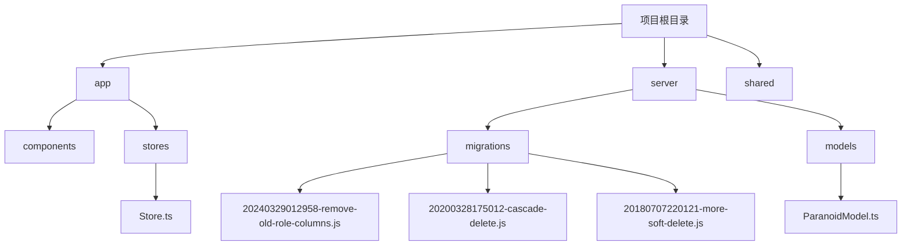
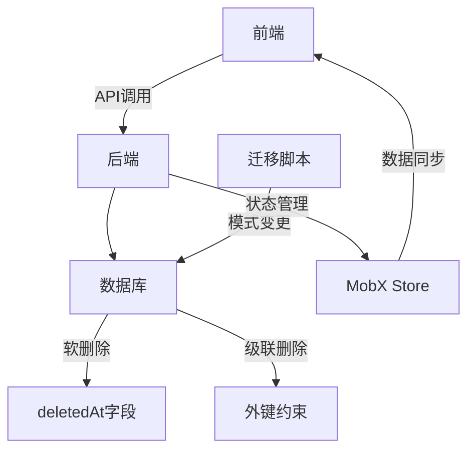
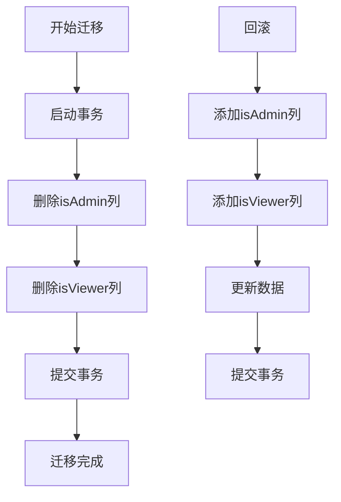
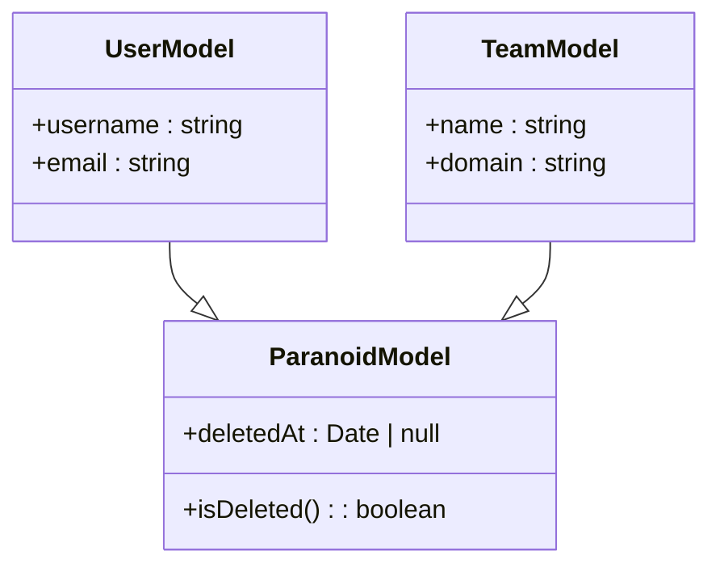
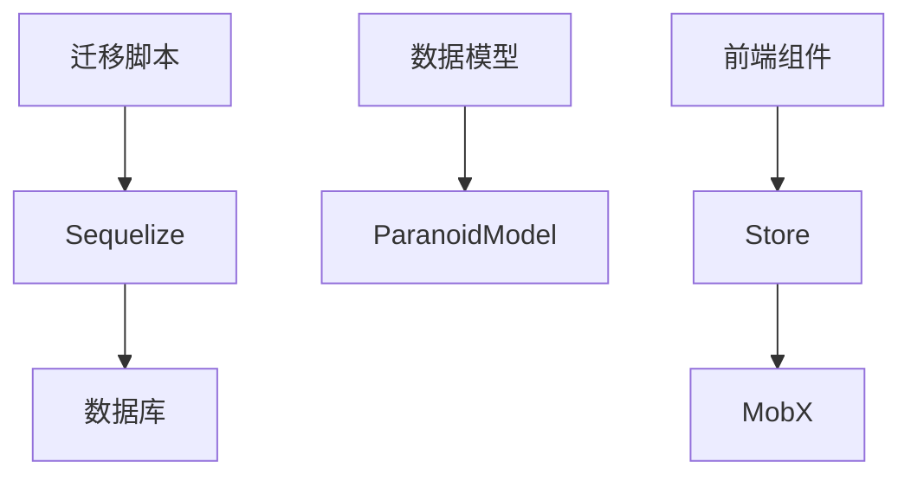

# 监控与验证

<cite>
**本文档引用的文件**
- [20240329012958-remove-old-role-columns.js](file://server/migrations/20240329012958-remove-old-role-columns.js)
- [20200328175012-cascade-delete.js](file://server/migrations/20200328175012-cascade-delete.js)
- [20180707220121-more-soft-delete.js](file://server/migrations/20180707220121-more-soft-delete.js)
- [ParanoidModel.ts](file://server/models/base/ParanoidModel.ts)
- [Store.ts](file://app/stores/base/Store.ts)
</cite>

## 目录
1. [引言](#引言)
2. [项目结构](#项目结构)
3. [核心组件](#核心组件)
4. [架构概述](#架构概述)
5. [详细组件分析](#详细组件分析)
6. [依赖分析](#依赖分析)
7. [性能考量](#性能考量)
8. [故障排查指南](#故障排查指南)
9. [结论](#结论)

## 引言
本文档旨在为baozi项目生产环境数据库迁移后的监控与验证提供全面指导。重点涵盖数据一致性验证、性能影响评估和系统稳定性监控三大核心领域。通过分析实际迁移文件，包括旧角色列移除、级联删除优化和软删除实现，为不同技术水平的开发者提供从概念到实践的完整解决方案。

## 项目结构
baozi项目采用分层架构，主要分为前端（app）、后端（server）和共享（shared）三个部分。数据库迁移脚本集中存放在server/migrations目录下，每个迁移文件按时间戳命名，确保执行顺序。核心数据模型定义在server/models目录，前端状态管理通过MobX实现，存放在app/stores目录。



**图示来源**
- [20240329012958-remove-old-role-columns.js](file://server/migrations/20240329012958-remove-old-role-columns.js)
- [20200328175012-cascade-delete.js](file://server/migrations/20200328175012-cascade-delete.js)
- [20180707220121-more-soft-delete.js](file://server/migrations/20180707220121-more-soft-delete.js)
- [ParanoidModel.ts](file://server/models/base/ParanoidModel.ts)
- [Store.ts](file://app/stores/base/Store.ts)

**章节来源**
- [server/migrations](file://server/migrations)
- [server/models](file://server/models)
- [app/stores](file://app/stores)

## 核心组件
本项目的核心组件包括数据库迁移系统、软删除机制和级联删除策略。迁移系统基于Sequelize CLI构建，确保数据库模式变更的可追溯性和可逆性。软删除通过ParanoidModel基类实现，为所有支持软删除的模型提供统一的deletedAt字段和isDeleted计算属性。级联删除通过数据库外键约束和应用层逻辑双重保障，确保数据完整性。

**章节来源**
- [20240329012958-remove-old-role-columns.js](file://server/migrations/20240329012958-remove-old-role-columns.js)
- [20200328175012-cascade-delete.js](file://server/migrations/20200328175012-cascade-delete.js)
- [20180707220121-more-soft-delete.js](file://server/migrations/20180707220121-more-soft-delete.js)
- [ParanoidModel.ts](file://server/models/base/ParanoidModel.ts)

## 架构概述
系统采用前后端分离架构，前端使用React和MobX进行状态管理，后端使用Node.js和Sequelize进行数据持久化。数据库迁移作为独立的部署步骤，在应用启动前执行。软删除和级联删除等数据操作策略在模型层和存储层双重实现，确保数据一致性和系统稳定性。



**图示来源**
- [20200328175012-cascade-delete.js](file://server/migrations/20200328175012-cascade-delete.js)
- [20180707220121-more-soft-delete.js](file://server/migrations/20180707220121-more-soft-delete.js)
- [ParanoidModel.ts](file://server/models/base/ParanoidModel.ts)
- [Store.ts](file://app/stores/base/Store.ts)

## 详细组件分析

### 旧角色列移除分析
20240329012958-remove-old-role-columns.js迁移文件移除了users表中的isAdmin和isViewer列，标志着权限系统从布尔标志向基于角色的访问控制（RBAC）的演进。该迁移通过事务确保原子性，先删除旧列，再通过role列重建权限映射。



**图示来源**
- [20240329012958-remove-old-role-columns.js](file://server/migrations/20240329012958-remove-old-role-columns.js)

**章节来源**
- [20240329012958-remove-old-role-columns.js](file://server/migrations/20240329012958-remove-old-role-columns.js)

### 级联删除优化分析
20200328175012-cascade-delete.js迁移文件为attachments表的documentId外键添加了级联删除约束。该迁移处理了Sequelize的约束命名不一致问题，通过尝试多个可能的约束名称来确保操作成功。

```mermaid
sequenceDiagram
participant Migration as 迁移脚本
participant DB as 数据库
Migration->>DB : 查询约束名称
loop 尝试每个可能的名称
Migration->>DB : 删除旧约束
Migration->>DB : 添加带CASCADE的约束
alt 成功
break
end
end
Migration->>DB : 提交更改
```

**图示来源**
- [20200328175012-cascade-delete.js](file://server/migrations/20200328175012-cascade-delete.js)

**章节来源**
- [20200328175012-cascade-delete.js](file://server/migrations/20200328175012-cascade-delete.js)

### 软删除实现分析
20180707220121-more-soft-delete.js迁移文件为users和teams表添加了deletedAt字段，实现了软删除功能。该功能在应用层通过ParanoidModel基类统一管理，确保所有查询默认排除已删除记录。



**图示来源**
- [20180707220121-more-soft-delete.js](file://server/migrations/20180707220121-more-soft-delete.js)
- [ParanoidModel.ts](file://server/models/base/ParanoidModel.ts)

**章节来源**
- [20180707220121-more-soft-delete.js](file://server/migrations/20180707220121-more-soft-delete.js)
- [ParanoidModel.ts](file://server/models/base/ParanoidModel.ts)

## 依赖分析
项目依赖关系清晰，迁移脚本依赖Sequelize ORM和数据库连接，数据模型依赖基础模型类，前端组件依赖状态管理Store。所有迁移操作都通过事务保证数据一致性，避免部分更新导致的数据不一致。



**图示来源**
- [20240329012958-remove-old-role-columns.js](file://server/migrations/20240329012958-remove-old-role-columns.js)
- [20200328175012-cascade-delete.js](file://server/migrations/20200328175012-cascade-delete.js)
- [20180707220121-more-soft-delete.js](file://server/migrations/20180707220121-more-soft-delete.js)
- [ParanoidModel.ts](file://server/models/base/ParanoidModel.ts)
- [Store.ts](file://app/stores/base/Store.ts)

**章节来源**
- [server/migrations](file://server/migrations)
- [server/models](file://server/models)
- [app/stores](file://app/stores)

## 性能考量
数据库迁移对性能有显著影响，特别是在生产环境。建议在低峰期执行迁移，并提前进行性能基准测试。软删除可能影响查询性能，需要为deletedAt字段创建适当索引。级联删除在删除父记录时可能触发大量子记录删除操作，应监控相关性能指标。

## 故障排查指南
当迁移后出现问题时，首先检查数据库日志和应用日志。验证数据一致性可以通过编写专用的验证脚本，对比迁移前后关键数据的状态。对于性能问题，使用数据库性能分析工具识别慢查询，并根据需要优化索引。

**章节来源**
- [20240329012958-remove-old-role-columns.js](file://server/migrations/20240329012958-remove-old-role-columns.js)
- [20200328175012-cascade-delete.js](file://server/migrations/20200328175012-cascade-delete.js)
- [20180707220121-more-soft-delete.js](file://server/migrations/20180707220121-more-soft-delete.js)

## 结论
通过系统化的监控与验证策略，可以确保baozi项目数据库迁移的平稳进行。关键在于理解每个迁移的业务含义，实施全面的数据一致性检查，并持续监控系统性能。文档中提供的分析框架和工具可帮助团队有效应对迁移过程中的各种挑战。