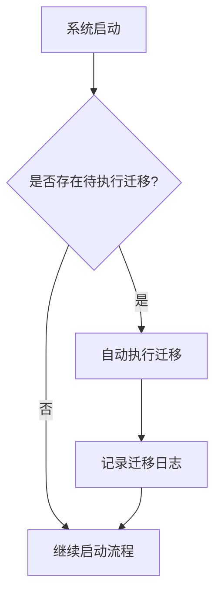
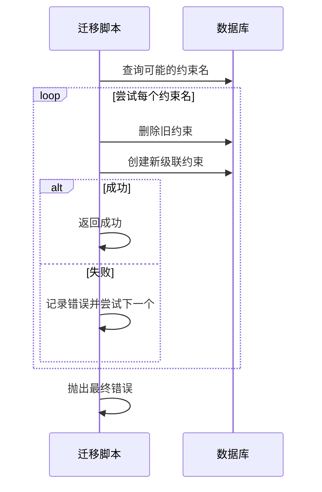

# 迁移前准备

<cite>
**本文档中引用的文件**  
- [20171017055026-remove-document-html.js](file://server/migrations/20171017055026-remove-document-html.js)
- [20180707220121-more-soft-delete.js](file://server/migrations/20180707220121-more-soft-delete.js)
- [20200328175012-cascade-delete.js](file://server/migrations/20200328175012-cascade-delete.js)
- [startup.ts](file://server/utils/startup.ts)
- [database.ts](file://server/storage/database.ts)
</cite>

## 目录
1. [引言](#引言)
2. [审批流程与风险评估](#审批流程与风险评估)
3. [备份策略](#备份策略)
4. [测试验证流程](#测试验证流程)
5. [软删除实现准备](#软删除实现准备)
6. [级联删除优化准备](#级联删除优化准备)
7. [回滚预案](#回滚预案)
8. [检查清单与最佳实践](#检查清单与最佳实践)
9. [结论](#结论)

## 引言
本文档旨在为 baozi 项目在生产环境中执行数据库迁移前的准备工作提供全面指导。重点涵盖迁移前的审批流程、风险评估、数据备份、测试验证、回滚机制等关键环节。通过分析项目中的实际迁移脚本，深入解释软删除和级联删除的实现原理与准备步骤，确保迁移过程安全、可控、可追溯。

## 审批流程与风险评估
在执行任何生产环境数据库迁移之前，必须建立严格的审批流程和全面的风险评估机制。

### 审批流程
所有数据库迁移脚本必须经过以下审批流程：
1. **代码审查**：由至少两名资深开发者对迁移脚本进行同行评审，重点关注 SQL 语句的正确性、性能影响和潜在副作用。
2. **架构评审**：由技术负责人或架构师评估迁移对系统整体架构的影响。
3. **运维审批**：由运维团队确认迁移窗口、资源需求和应急预案。
4. **最终确认**：在迁移执行前，所有相关方需在协作平台上进行最终确认。

### 风险评估
迁移前必须进行详细的风险评估，包括：
- **数据完整性风险**：评估迁移是否可能导致数据丢失或损坏。
- **服务中断风险**：评估迁移操作可能导致的服务不可用时间。
- **性能影响**：评估大型数据操作对数据库性能的长期和短期影响。
- **回滚复杂性**：评估 `down` 迁移脚本的可靠性和执行时间。

**Section sources**
- [20200328175012-cascade-delete.js](file://server/migrations/20200328175012-cascade-delete.js#L1-L48)

## 备份策略
数据安全是迁移工作的首要原则。必须在迁移前执行完整的数据备份。

### 备份方案
1. **全量数据库备份**：在迁移执行前，使用数据库原生工具（如 `pg_dump`）创建完整的数据库快照。
2. **增量备份暂停**：在迁移期间暂停常规的增量备份，以避免备份流中断。
3. **备份验证**：在迁移前，必须验证备份文件的完整性和可恢复性。
4. **异地存储**：将备份文件存储在与生产环境物理隔离的存储系统中。

### 自动化检查
系统在启动时会自动检查是否存在待执行的迁移，防止因遗漏迁移导致的数据不一致。

**Diagram sources**
- [startup.ts](file://server/utils/startup.ts#L0-L46)
- [database.ts](file://server/storage/database.ts#L129-L183)

**Section sources**
- [startup.ts](file://server/utils/startup.ts#L0-L46)

## 测试验证流程
所有迁移脚本必须在测试环境中经过充分验证后，才能应用于生产环境。

### 验证步骤
1. **单元测试**：为迁移脚本编写单元测试，验证 `up` 和 `down` 操作的正确性。
2. **集成测试**：在与生产环境配置一致的集成测试环境中执行迁移，验证应用功能是否正常。
3. **性能测试**：对涉及大量数据操作的迁移进行性能测试，确保执行时间在可接受范围内。
4. **回滚测试**：验证 `down` 脚本能够成功将数据库恢复到迁移前的状态。

## 软删除实现准备
软删除是一种通过标记而非物理删除来实现数据删除的技术，为数据恢复提供了安全保障。

### 实现原理
软删除通过在数据表中添加 `deletedAt` 字段来实现。当记录被“删除”时，系统会将当前时间戳写入 `deletedAt` 字段，而不是从数据库中移除该记录。

### 准备工作
以 `20180707220121-more-soft-delete.js` 脚本为例，其准备工作包括：

**Diagram sources**
- [20180707220121-more-soft-delete.js](file://server/migrations/20180707220121-more-soft-delete.js#L1-L16)

**Section sources**
- [20180707220121-more-soft-delete.js](file://server/migrations/20180707220121-more-soft-delete.js#L1-L16)

## 级联删除优化准备
级联删除确保在删除父记录时，相关的子记录也会被自动删除，维护了数据的引用完整性。

### 实现原理
级联删除通过数据库外键约束的 `ON DELETE CASCADE` 选项实现。当主表中的记录被删除时，数据库会自动删除所有引用该记录的外键表中的相关记录。

### 准备工作
以 `20200328175012-cascade-delete.js` 脚本为例，其准备工作包括：

1. **识别外键约束**：确定需要修改的外键约束名称，由于历史原因可能存在多个可能的名称。
2. **原子化操作**：在一个事务中先删除旧的外键约束，再创建带有 `ON DELETE CASCADE` 选项的新约束。
3. **错误处理**：脚本包含重试逻辑，尝试所有可能的约束名称，确保在不同环境下的兼容性。

**Diagram sources**
- [20200328175012-cascade-delete.js](file://server/migrations/20200328175012-cascade-delete.js#L1-L48)

**Section sources**
- [20200328175012-cascade-delete.js](file://server/migrations/20200328175012-cascade-delete.js#L1-L48)

## 回滚预案
任何迁移都必须具备可靠的回滚预案，以应对可能出现的问题。

### 回滚策略
1. **脚本化回滚**：每个 `up` 迁移必须有对应的 `down` 迁移脚本，能够将数据库恢复到迁移前的状态。
2. **备份恢复**：如果脚本回滚失败，应立即使用迁移前的完整备份进行恢复。
3. **时间窗口**：明确回滚操作的最大允许时间，并在超过该时间后启动灾难恢复流程。

### 回滚验证
在测试环境中必须验证回滚流程：
- 执行 `up` 迁移
- 验证数据状态
- 执行 `down` 迁移
- 验证数据库是否完全恢复到初始状态

## 检查清单与最佳实践
### 迁移前检查清单
- [ ] 已完成代码审查和审批流程
- [ ] 已在测试环境成功执行并验证
- [ ] 已创建完整的数据库备份
- [ ] 已通知所有相关方迁移窗口
- [ ] 已准备好回滚脚本和备份恢复方案
- [ ] 已安排在低峰期执行

### 最佳实践
1. **小步迭代**：将大型迁移拆分为多个小的、独立的迁移脚本。
2. **幂等性**：确保迁移脚本可以安全地重复执行。
3. **日志记录**：在迁移脚本中添加详细的日志输出，便于问题排查。
4. **监控告警**：在迁移期间加强数据库监控，设置关键指标告警。
5. **文档更新**：迁移成功后，及时更新相关技术文档。

## 结论
生产环境数据库迁移是一项高风险操作，必须通过严格的审批流程、全面的风险评估、可靠的备份策略、充分的测试验证和完善的回滚预案来确保其安全性。通过遵循本文档中的指导原则和最佳实践，可以最大限度地降低迁移风险，保障系统的稳定运行和数据的安全完整。