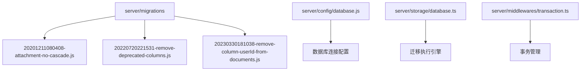
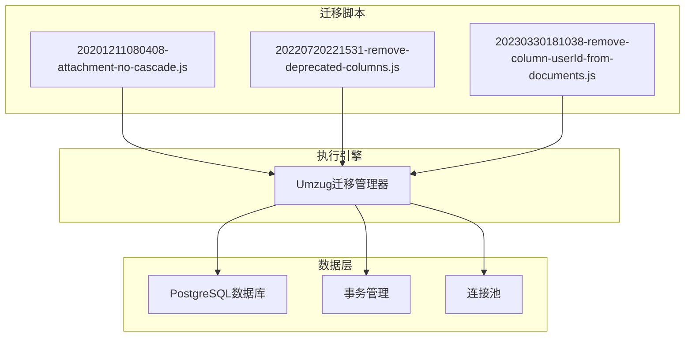
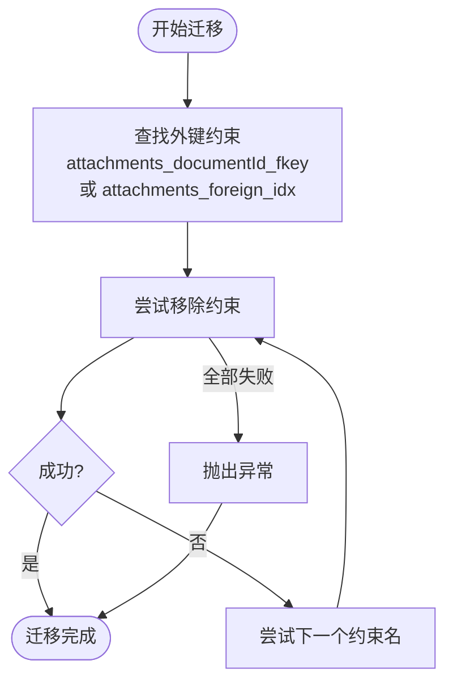
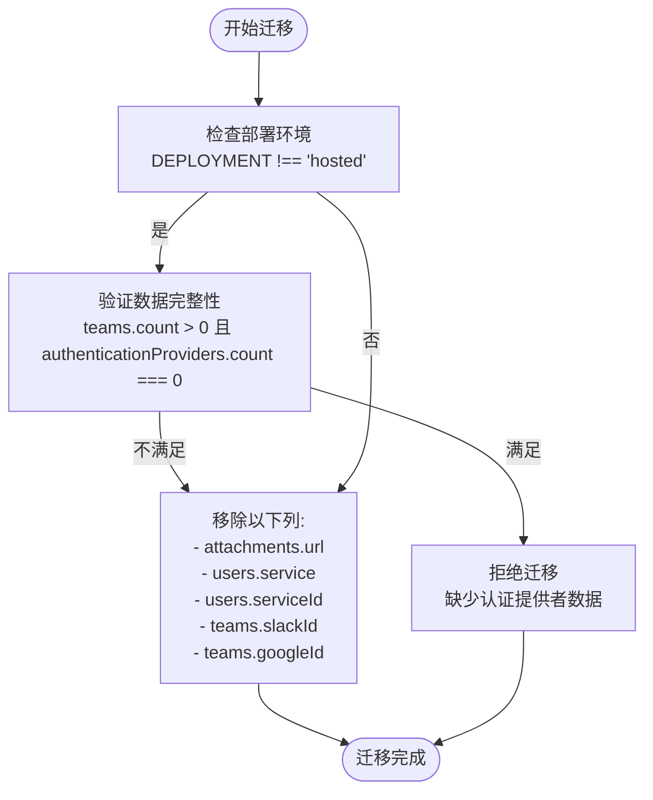
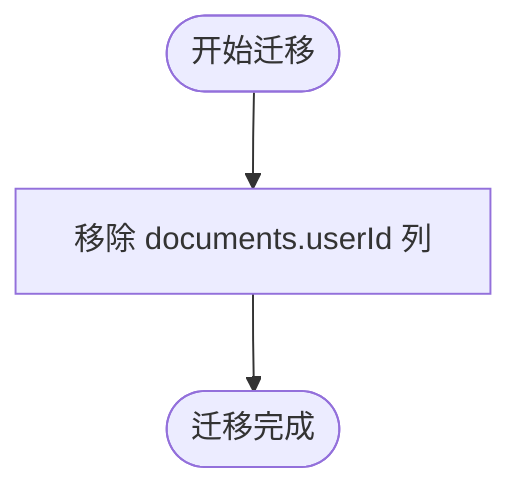
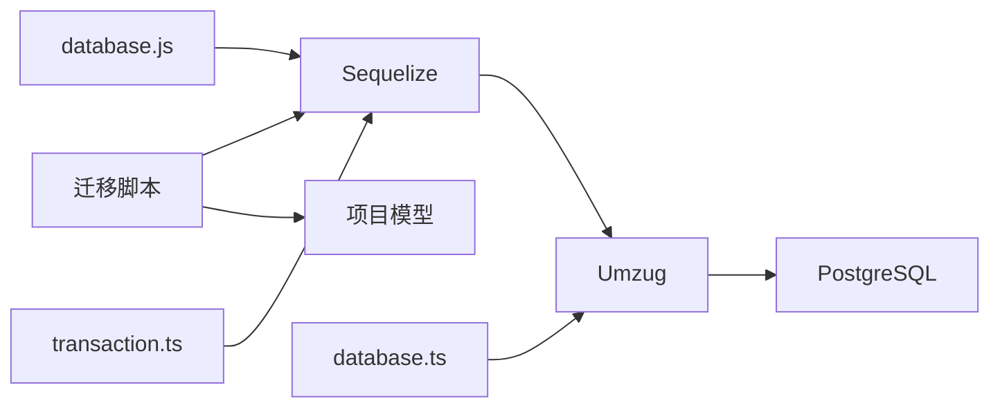

# 迁移执行流程

<cite>
**本文档中引用的文件**  
- [20201211080408-attachment-no-cascade.js](file://server/migrations/20201211080408-attachment-no-cascade.js)
- [20220720221531-remove-deprecated-columns.js](file://server/migrations/20220720221531-remove-deprecated-columns.js)
- [20230330181038-remove-column-userId-from-documents.js](file://server/migrations/20230330181038-remove-column-userId-from-documents.js)
- [database.js](file://server/config/database.js)
- [database.ts](file://server/storage/database.ts)
- [transaction.ts](file://server/middlewares/transaction.ts)
</cite>

## 目录
1. [简介](#简介)
2. [项目结构](#项目结构)
3. [核心组件](#核心组件)
4. [架构概述](#架构概述)
5. [详细组件分析](#详细组件分析)
6. [依赖分析](#依赖分析)
7. [性能考虑](#性能考虑)
8. [故障排除指南](#故障排除指南)
9. [结论](#结论)

## 简介
本文档详细介绍了baozi项目在生产环境中执行数据库迁移的完整流程，重点阐述了灰度发布策略、零停机迁移技术以及具体执行步骤。通过分析实际迁移文件，包括附件级联优化（20201211080408-attachment-no-cascade.js）、废弃字段清理（20220720221531-remove-deprecated-columns.js）和用户ID列移除（20230330181038-remove-column-userId-from-documents.js），为初学者提供概念性概述，同时为经验丰富的开发者提供技术细节。文档涵盖迁移窗口选择、执行顺序控制、事务管理、性能监控和异常处理等关键主题，并提供分步操作指南和最佳实践，确保迁移过程平稳进行。

## 项目结构
baozi项目的数据库迁移文件集中存放在`server/migrations`目录中，每个迁移文件以时间戳命名，确保执行顺序的确定性。这些迁移脚本使用Sequelize框架进行数据库模式变更管理，支持`up`和`down`两种操作，分别用于应用和回滚迁移。核心迁移逻辑与数据库配置、事务管理和执行引擎紧密集成，确保迁移过程的原子性和一致性。

**图示来源**
- [20201211080408-attachment-no-cascade.js](file://server/migrations/20201211080408-attachment-no-cascade.js)
- [20220720221531-remove-deprecated-columns.js](file://server/migrations/20220720221531-remove-deprecated-columns.js)
- [20230330181038-remove-column-userId-from-documents.js](file://server/migrations/20230330181038-remove-column-userId-from-documents.js)
- [database.js](file://server/config/database.js)
- [database.ts](file://server/storage/database.ts)
- [transaction.ts](file://server/middlewares/transaction.ts)

**本节来源**
- [server/migrations](file://server/migrations)
- [server/config/database.js](file://server/config/database.js)
- [server/storage/database.ts](file://server/storage/database.ts)

## 核心组件
baozi项目的数据库迁移系统由多个核心组件构成，包括迁移脚本、数据库配置、迁移执行引擎和事务管理中间件。迁移脚本定义了具体的数据库变更操作，数据库配置文件管理连接参数，迁移执行引擎负责按序执行迁移，事务管理中间件确保操作的原子性。这些组件协同工作，实现安全、可靠的数据库模式演进。

**本节来源**
- [20201211080408-attachment-no-cascade.js](file://server/migrations/20201211080408-attachment-no-cascade.js)
- [20220720221531-remove-deprecated-columns.js](file://server/migrations/20220720221531-remove-deprecated-columns.js)
- [20230330181038-remove-column-userId-from-documents.js](file://server/migrations/20230330181038-remove-column-userId-from-documents.js)
- [database.js](file://server/config/database.js)
- [database.ts](file://server/storage/database.ts)
- [transaction.ts](file://server/middlewares/transaction.ts)

## 架构概述
baozi项目的数据库迁移架构采用分层设计，上层为具体的迁移脚本，中层为迁移执行引擎，底层为数据库连接和事务管理。迁移执行引擎使用Umzug库管理迁移生命周期，确保迁移按时间戳顺序执行。每个迁移操作在数据库事务中运行，保证了变更的原子性。数据库连接配置支持SSL和连接池，确保生产环境的稳定性和安全性。

**图示来源**
- [20201211080408-attachment-no-cascade.js](file://server/migrations/20201211080408-attachment-no-cascade.js)
- [20220720221531-remove-deprecated-columns.js](file://server/migrations/20220720221531-remove-deprecated-columns.js)
- [20230330181038-remove-column-userId-from-documents.js](file://server/migrations/20230330181038-remove-column-userId-from-documents.js)
- [database.ts](file://server/storage/database.ts)
- [transaction.ts](file://server/middlewares/transaction.ts)

## 详细组件分析
本节深入分析baozi项目中三个关键的数据库迁移脚本，揭示其设计原理和执行细节。

### 附件级联优化分析
该迁移脚本旨在优化附件表的外键约束，移除级联删除行为，以提高数据完整性和删除操作的可控性。

**图示来源**
- [20201211080408-attachment-no-cascade.js](file://server/migrations/20201211080408-attachment-no-cascade.js)

**本节来源**
- [20201211080408-attachment-no-cascade.js](file://server/migrations/20201211080408-attachment-no-cascade.js)

### 废弃字段清理分析
该迁移脚本用于清理系统中已废弃的数据库字段，减少数据冗余并提高查询性能。

**图示来源**
- [20220720221531-remove-deprecated-columns.js](file://server/migrations/20220720221531-remove-deprecated-columns.js)

**本节来源**
- [20220720221531-remove-deprecated-columns.js](file://server/migrations/20220720221531-remove-deprecated-columns.js)

### 用户ID列移除分析
该迁移脚本从文档表中移除`userId`列，反映了系统权限模型的演进。

**图示来源**
- [20230330181038-remove-column-userId-from-documents.js](file://server/migrations/20230330181038-remove-column-userId-from-documents.js)

**本节来源**
- [20230330181038-remove-column-userId-from-documents.js](file://server/migrations/20230330181038-remove-column-userId-from-documents.js)

## 依赖分析
baozi项目的数据库迁移系统依赖于多个关键组件，包括Sequelize ORM框架、Umzug迁移管理库、PostgreSQL数据库以及项目内部的模型定义。迁移脚本的执行顺序由文件名中的时间戳严格控制，确保依赖关系的正确性。例如，移除外键约束的迁移必须在清理相关字段之前执行。

**图示来源**
- [database.js](file://server/config/database.js)
- [database.ts](file://server/storage/database.ts)
- [transaction.ts](file://server/middlewares/transaction.ts)

**本节来源**
- [server/config/database.js](file://server/config/database.js)
- [server/storage/database.ts](file://server/storage/database.ts)
- [server/middlewares/transaction.ts](file://server/middlewares/transaction.ts)

## 性能考虑
在执行数据库迁移时，必须考虑对生产系统性能的影响。建议在低峰时段执行大规模迁移，并使用分批处理技术避免长时间锁表。对于大型表的结构变更，应评估使用在线DDL工具的可能性。迁移过程中应密切监控数据库性能指标，如CPU使用率、I/O等待时间和查询延迟，确保迁移不会对用户体验造成显著影响。

## 故障排除指南
当数据库迁移失败时，应首先检查日志输出以确定错误原因。常见的问题包括外键约束冲突、数据完整性检查失败和数据库连接问题。对于可重试的错误，如死锁，系统会自动重试三次。对于数据完整性检查失败，如`remove-deprecated-columns.js`中的防护逻辑，需要手动验证数据状态后决定是否继续迁移。在极端情况下，可以使用`down`方法回滚迁移，恢复到之前的状态。

**本节来源**
- [20201211080408-attachment-no-cascade.js](file://server/migrations/20201211080408-attachment-no-cascade.js)
- [20220720221531-remove-deprecated-columns.js](file://server/migrations/20220720221531-remove-deprecated-columns.js)
- [20230330181038-remove-column-userId-from-documents.js](file://server/migrations/20230330181038-remove-column-userId-from-documents.js)
- [database.ts](file://server/storage/database.ts)

## 结论
baozi项目的数据库迁移流程设计严谨，通过灰度发布和零停机技术确保了生产环境的稳定性。通过对具体迁移脚本的分析，我们了解了其在优化数据结构、清理废弃字段和演进权限模型方面的实践。遵循本文档提供的最佳实践，可以安全、高效地执行数据库迁移，支持系统的持续发展。