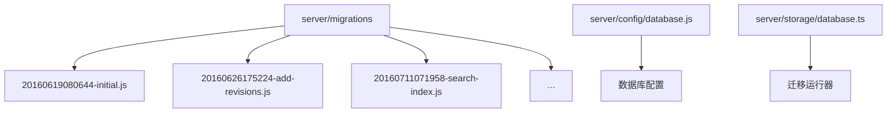
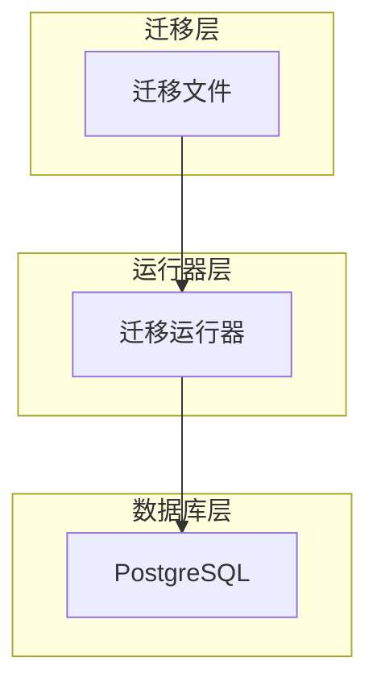
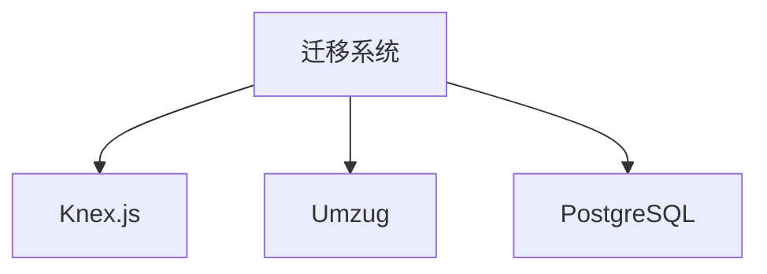

# 迁移管理

<cite>
**本文档引用的文件**
- [20160619080644-initial.js](file://server/migrations/20160619080644-initial.js)
- [20160626175224-add-revisions.js](file://server/migrations/20160626175224-add-revisions.js)
- [20160711071958-search-index.js](file://server/migrations/20160711071958-search-index.js)
- [20171017055026-remove-document-html.js](file://server/migrations/2017055026-remove-document-html.js)
- [20191118023010-cascade-delete.js](file://server/migrations/20191118023010-cascade-delete.js)
- [20220907132304-user-preferences.js](file://server/migrations/20220907132304-user-preferences.js)
- [20240617030911-add-apikey-expiry.js](file://server/migrations/20240617030911-add-apikey-expiry.js)
- [20241013080608-create-reactions.js](file://server/migrations/20241013080608-create-reactions.js)
- [database.js](file://server/config/database.js)
- [database.ts](file://server/storage/database.ts)
</cite>

## 目录
1. [简介](#简介)
2. [项目结构](#项目结构)
3. [核心组件](#核心组件)
4. [架构概述](#架构概述)
5. [详细组件分析](#详细组件分析)
6. [依赖分析](#依赖分析)
7. [性能考虑](#性能考虑)
8. [故障排除指南](#故障排除指南)
9. [结论](#结论)

## 简介
本文档全面介绍了baozi项目中基于Knex.js的数据库迁移管理系统。文档详细说明了迁移脚本的命名规范、版本控制策略和执行流程，并以项目中的实际迁移文件为例，解释如何创建表、修改表结构、添加索引、处理数据迁移和回滚策略。文档为初学者提供概念性概述，同时为经验丰富的开发者提供技术细节。

## 项目结构
baozi项目的数据库迁移文件位于`server/migrations`目录下，采用基于时间戳的命名规范。每个迁移文件都是一个JavaScript模块，导出包含`up`和`down`方法的对象，分别用于执行和回滚迁移。迁移系统基于Knex.js和Umzug库构建，确保数据库模式变更的可追溯性和一致性。

**Diagram sources**
- [server/migrations](file://server/migrations)
- [server/config/database.js](file://server/config/database.js#L1-L24)
- [server/storage/database.ts](file://server/storage/database.ts#L129-L183)

**Section sources**
- [server/migrations](file://server/migrations)
- [server/config/database.js](file://server/config/database.js#L1-L24)

## 核心组件
迁移系统的核心组件包括迁移文件、迁移运行器和数据库配置。迁移文件定义了数据库模式的变更，迁移运行器负责执行这些变更，数据库配置则提供了连接数据库所需的信息。

**Section sources**
- [server/migrations](file://server/migrations)
- [server/storage/database.ts](file://server/storage/database.ts#L129-L183)

## 架构概述
baozi项目的迁移系统采用分层架构，上层是迁移文件，中层是迁移运行器，底层是数据库。迁移运行器使用Umzug库来管理迁移文件的执行顺序，并确保每次迁移的原子性。

**Diagram sources**
- [server/storage/database.ts](file://server/storage/database.ts#L129-L183)
- [server/config/database.js](file://server/config/database.js#L1-L24)

## 详细组件分析

### 初始架构迁移分析
初始架构迁移文件`20160619080644-initial.js`创建了项目的核心表，包括`teams`、`atlases`、`users`和`documents`。该迁移定义了表的结构、主键、外键和索引。

**Section sources**
- [20160619080644-initial.js](file://server/migrations/20160619080644-initial.js#L1-L177)

### 添加修订版本迁移分析
添加修订版本迁移文件`20160626175224-add-revisions.js`创建了`revisions`表，并向`documents`表添加了`lastModifiedById`和`revisionCount`列。该迁移实现了文档的版本控制功能。

**Section sources**
- [20160626175224-add-revisions.js](file://server/migrations/20160626175224-add-revisions.js#L1-L67)

### 添加搜索索引迁移分析
添加搜索索引迁移文件`20160711071958-search-index.js`为`documents`和`atlases`表添加了全文搜索支持。该迁移使用PostgreSQL的tsvector类型和GIN索引，提高了搜索性能。

**Section sources**
- [20160711071958-search-index.js](file://server/migrations/20160711071958-search-index.js#L1-L42)

### 软删除实现迁移分析
软删除实现迁移文件`20171017055026-remove-document-html.js`从`documents`和`revisions`表中删除了`html`和`preview`列。该迁移优化了数据库结构，减少了冗余数据。

**Section sources**
- [20171017055026-remove-document-html.js](file://server/migrations/20171017055026-remove-document-html.js#L1-L23)

### 级联删除处理迁移分析
级联删除处理迁移文件`20191118023010-cascade-delete.js`修改了`revisions`表的外键约束，实现了级联删除。该迁移确保了数据的一致性，避免了孤儿记录。

**Section sources**
- [20191118023010-cascade-delete.js](file://server/migrations/20191118023010-cascade-delete.js#L1-L46)

### 用户偏好设置迁移分析
用户偏好设置迁移文件`20220907132304-user-preferences.js`向`users`表添加了`preferences`列。该迁移支持用户自定义设置，提高了用户体验。

**Section sources**
- [20220907132304-user-preferences.js](file://server/migrations/20220907132304-user-preferences.js#L1-L15)

### API密钥过期迁移分析
API密钥过期迁移文件`20240617030911-add-apikey-expiry.js`向`apiKeys`表添加了`expiresAt`列。该迁移增强了安全性，支持API密钥的自动过期。

**Section sources**
- [20240617030911-add-apikey-expiry.js](file://server/migrations/20240617030911-add-apikey-expiry.js#L1-L16)

### 反应功能迁移分析
反应功能迁移文件`20241013080608-create-reactions.js`创建了`reactions`表，并向`comments`表添加了`reactions`列。该迁移实现了用户对评论的反应功能。

**Section sources**
- [20241013080608-create-reactions.js](file://server/migrations/20241013080608-create-reactions.js#L1-L75)

## 依赖分析
迁移系统依赖于Knex.js、Umzug和PostgreSQL。Knex.js提供了数据库查询构建器，Umzug管理迁移文件的执行，PostgreSQL作为数据库存储数据。

**Diagram sources**
- [server/storage/database.ts](file://server/storage/database.ts#L129-L183)
- [package.json](file://package.json)

**Section sources**
- [server/storage/database.ts](file://server/storage/database.ts#L129-L183)
- [package.json](file://package.json)

## 性能考虑
迁移系统在执行大规模数据迁移时，应考虑性能影响。建议在低峰时段执行迁移，并使用事务确保数据一致性。

## 故障排除指南
如果迁移失败，应检查数据库连接配置和迁移文件的语法。可以使用`yarn db:migrate:status`命令查看迁移状态。

**Section sources**
- [server/utils/startup.ts](file://server/utils/startup.ts#L0-L46)
- [server/storage/database.ts](file://server/storage/database.ts#L129-L183)

## 结论
baozi项目的迁移系统基于Knex.js和Umzug构建，具有良好的可维护性和扩展性。通过遵循本文档中的最佳实践，可以确保数据库模式变更的安全性和一致性。