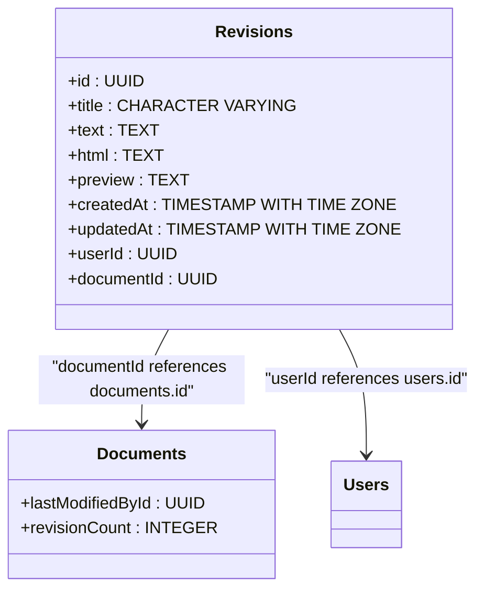
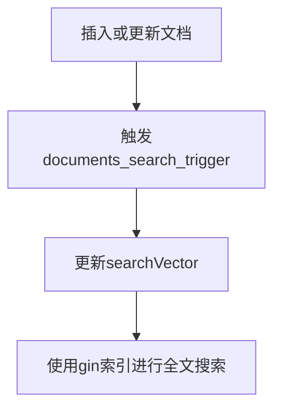
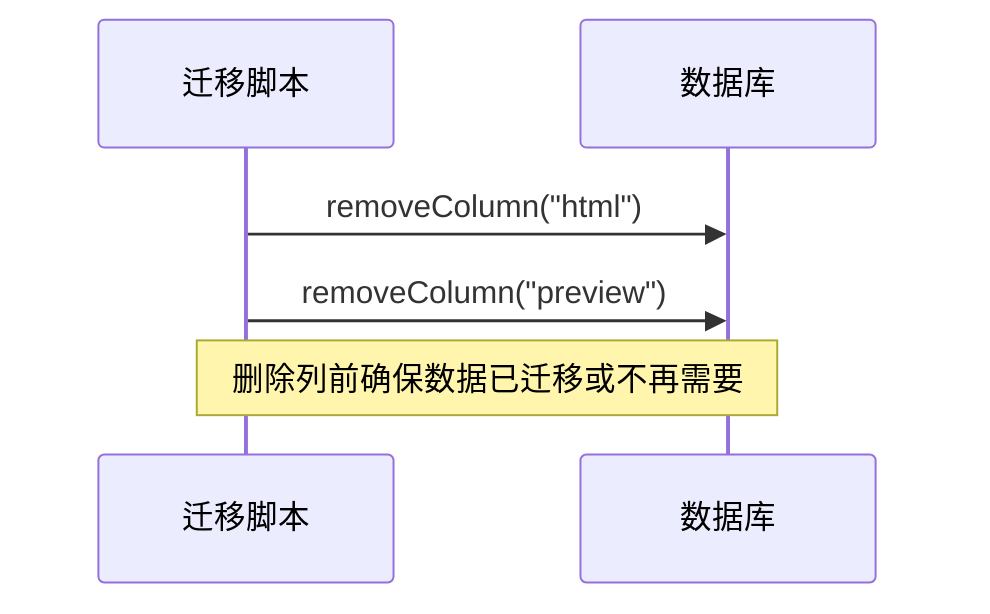
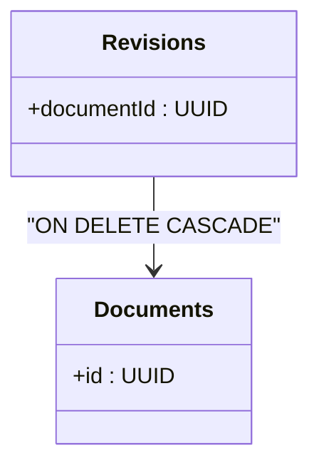
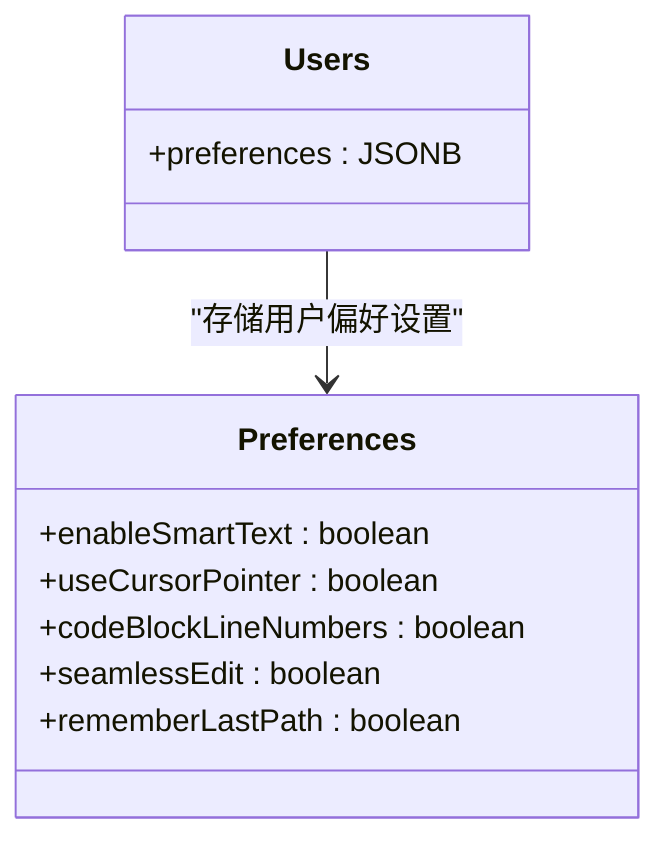

# 常见迁移操作模式

<cite>
**本文档中引用的文件**  
- [20160626175224-add-revisions.js](file://server/migrations/20160626175224-add-revisions.js)
- [20160711071958-search-index.js](file://server/migrations/20160711071958-search-index.js)
- [20171017055026-remove-document-html.js](file://server/migrations/20171017055026-remove-document-html.js)
- [20191118023010-cascade-delete.js](file://server/migrations/20191118023010-cascade-delete.js)
- [20220907132304-user-preferences.js](file://server/migrations/20220907132304-user-preferences.js)
- [User.ts](file://server/models/User.ts)
- [Document.ts](file://server/models/Document.ts)
- [Revision.ts](file://server/models/Revision.ts)
- [Collection.ts](file://server/models/Collection.ts)
- [Share.ts](file://server/models/Share.ts)
</cite>

## 目录
1. [引言](#引言)
2. [添加新表和字段](#添加新表和字段)
3. [索引创建最佳实践](#索引创建最佳实践)
4. [安全删除列和数据迁移](#安全删除列和数据迁移)
5. [外键约束和级联删除](#外键约束和级联删除)
6. [用户偏好设置存储设计](#用户偏好设置存储设计)
7. [总结](#总结)

## 引言
本文档系统性地分析了baozi项目中实施的各类数据库变更模式。通过分析具体的迁移文件，我们将深入探讨如何添加新表和字段、创建索引的最佳实践、安全删除列和数据迁移的策略、外键约束和级联删除的实现，以及用户偏好设置存储的设计模式。每个模式都提供了详细的代码示例、使用场景、潜在风险及规避方法，旨在为所有技术水平的开发者提供有价值的参考。

## 添加新表和字段
在baozi项目中，添加新表和字段是常见的数据库变更操作。以`20160626175224-add-revisions.js`为例，该迁移文件展示了如何创建新表和向现有表添加字段。

### 模式分析
该迁移文件通过`queryInterface.createTable`方法创建了一个名为`revisions`的新表，用于存储文档的修订历史。同时，使用`queryInterface.addColumn`方法向`documents`表添加了`lastModifiedById`和`revisionCount`两个字段。

**Diagram sources**
- [20160626175224-add-revisions.js](file://server/migrations/20160626175224-add-revisions.js#L1-L66)

**Section sources**
- [20160626175224-add-revisions.js](file://server/migrations/20160626175224-add-revisions.js#L1-L66)
- [Document.ts](file://server/models/Document.ts#L94-L1314)
- [Revision.ts](file://server/models/Revision.ts#L23-L232)

### 使用场景
此模式适用于需要记录实体变更历史的场景，如文档修订、订单状态变更等。通过创建独立的修订表，可以有效地分离当前状态和历史记录，提高查询性能。

### 潜在风险及规避方法
- **数据一致性风险**：在添加外键约束时，必须确保引用的记录存在。可以通过在迁移前验证数据完整性来规避此风险。
- **性能影响**：添加新字段和索引可能会影响写入性能。建议在低峰期执行此类迁移，并监控数据库性能。

## 索引创建最佳实践
索引是提高数据库查询性能的关键。`20160711071958-search-index.js`文件展示了如何为全文搜索创建索引。

### 模式分析
该迁移文件使用PostgreSQL的`tsvector`类型和`gin`索引，为`documents`和`atlases`表创建了全文搜索功能。通过`ALTER TABLE`语句添加`searchVector`列，并创建触发器在插入或更新时自动更新搜索向量。

**Diagram sources**
- [20160711071958-search-index.js](file://server/migrations/20160711071958-search-index.js#L1-L41)

**Section sources**
- [20160711071958-search-index.js](file://server/migrations/20160711071958-search-index.js#L1-L41)
- [Document.ts](file://server/models/Document.ts#L94-L1314)
- [Collection.ts](file://server/models/Collection.ts#L87-L1007)

### 使用场景
此模式适用于需要高效全文搜索功能的场景，如文档管理系统、内容平台等。通过预计算搜索向量，可以显著提高搜索查询的性能。

### 潜在风险及规避方法
- **存储开销**：`tsvector`列会增加存储空间。需要权衡搜索性能和存储成本。
- **维护复杂性**：触发器的维护可能增加数据库的复杂性。建议定期审查和优化触发器逻辑。

## 安全删除列和数据迁移
删除数据库列是一个高风险操作，必须谨慎处理。`20171017055026-remove-document-html.js`文件展示了如何安全地删除列。

### 模式分析
该迁移文件通过`queryInterface.removeColumn`方法删除了`documents`和`revisions`表中的`html`和`preview`列。在`down`方法中，使用`addColumn`恢复这些列，确保迁移的可逆性。

**Diagram sources**
- [20171017055026-remove-document-html.js](file://server/migrations/20171017055026-remove-document-html.js#L1-L22)

**Section sources**
- [20171017055026-remove-document-html.js](file://server/migrations/20171017055026-remove-document-html.js#L1-L22)
- [Document.ts](file://server/models/Document.ts#L94-L1314)
- [Revision.ts](file://server/models/Revision.ts#L23-L232)

### 使用场景
此模式适用于需要清理过时或冗余数据的场景。在删除列之前，应确保相关功能已更新，不再依赖这些列。

### 潜在风险及规避方法
- **数据丢失风险**：删除列会导致数据永久丢失。建议在删除前备份相关数据。
- **应用兼容性**：删除列可能影响现有应用代码。需要同步更新应用代码，确保兼容性。

## 外键约束和级联删除
外键约束是维护数据完整性的关键机制。`20191118023010-cascade-delete.js`文件展示了如何实现级联删除。

### 模式分析
该迁移文件通过修改外键约束，实现了当删除`documents`表中的记录时，自动删除`revisions`表中相关的记录。使用`ON DELETE CASCADE`选项，确保了数据的一致性。

**Diagram sources**
- [20191118023010-cascade-delete.js](file://server/migrations/20191118023010-cascade-delete.js#L1-L45)

**Section sources**
- [20191118023010-cascade-delete.js](file://server/migrations/20191118023010-cascade-delete.js#L1-L45)
- [Document.ts](file://server/models/Document.ts#L94-L1314)
- [Revision.ts](file://server/models/Revision.ts#L23-L232)

### 使用场景
此模式适用于存在父子关系的实体，如订单与订单项、文章与评论等。通过级联删除，可以简化数据清理操作，避免孤儿记录。

### 潜在风险及规避方法
- **意外数据删除**：级联删除可能导致意外删除大量数据。建议在执行删除操作前进行充分的测试。
- **性能影响**：级联删除可能影响删除操作的性能。对于大量数据的删除，考虑分批处理。

## 用户偏好设置存储设计
用户偏好设置的存储设计需要平衡灵活性和性能。`20220907132304-user-preferences.js`文件展示了如何使用JSONB字段存储用户偏好。

### 模式分析
该迁移文件通过`queryInterface.addColumn`方法向`users`表添加了`preferences`字段，类型为`Sequelize.JSONB`。JSONB类型允许存储半结构化数据，支持高效的查询和索引。

**Diagram sources**
- [20220907132304-user-preferences.js](file://server/migrations/20220907132304-user-preferences.js#L1-L14)
- [User.ts](file://server/models/User.ts#L81-L856)

**Section sources**
- [20220907132304-user-preferences.js](file://server/migrations/20220907132304-user-preferences.js#L1-L14)
- [User.ts](file://server/models/User.ts#L81-L856)
- [Preferences.tsx](file://app/scenes/Settings/Preferences.tsx#L41-L124)

### 使用场景
此模式适用于需要存储用户个性化设置的场景，如界面主题、语言偏好、功能开关等。JSONB字段提供了灵活的数据结构，便于扩展。

### 潜在风险及规避方法
- **查询性能**：复杂的JSON查询可能影响性能。建议对常用查询字段创建索引。
- **数据验证**：JSONB字段缺乏严格的模式验证。需要在应用层实现数据验证逻辑，确保数据完整性。

## 总结
本文档通过分析baozi项目中的具体迁移文件，系统性地介绍了五种常见的数据库变更模式。每种模式都提供了详细的实现方法、使用场景和风险规避策略。理解这些模式有助于开发者在实际项目中做出更明智的数据库设计决策，确保系统的稳定性和可维护性。