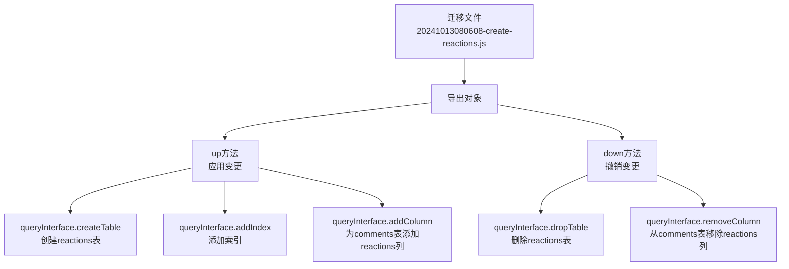
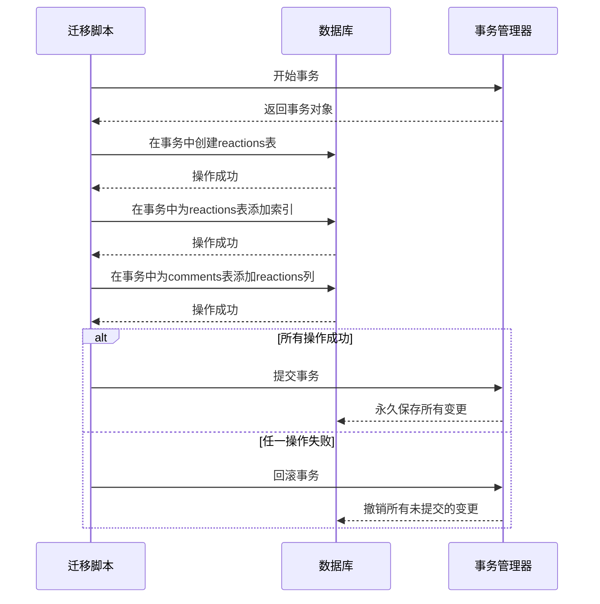

# 迁移脚本命名与结构规范

<cite>
**Referenced Files in This Document**   
- [20160619080644-initial.js](file://server/migrations/20160619080644-initial.js)
- [20240617030911-add-apikey-expiry.js](file://server/migrations/20240617030911-add-apikey-expiry.js)
- [20241013080608-create-reactions.js](file://server/migrations/20241013080608-create-reactions.js)
- [database.js](file://server/config/database.js)
- [database.ts](file://server/storage/database.ts)
</cite>

## 目录
1. [引言](#引言)
2. [迁移脚本命名规范](#迁移脚本命名规范)
3. [迁移文件结构分析](#迁移文件结构分析)
4. [up/down方法实现模式](#updown方法实现模式)
5. [Knex.js API使用方式](#knexjs-api使用方式)
6. [事务管理机制](#事务管理机制)
7. [错误处理策略](#错误处理策略)
8. [最佳实践](#最佳实践)
9. [结论](#结论)

## 引言
本文档旨在详细阐述baozi项目中迁移脚本的命名与结构规范。数据库迁移是软件开发过程中确保数据结构演进和版本控制的关键环节。在baozi项目中，通过严格的命名约定和标准化的文件结构，实现了迁移脚本的有序管理和可靠执行。本指南将深入分析项目中实际存在的迁移文件，解释基于时间戳的命名约定的重要性，并详细说明迁移文件的标准结构，包括up/down方法的实现模式、Knex.js API的使用方式、事务管理机制以及错误处理策略。这些规范不仅有助于避免冲突和确保执行顺序，还为团队协作提供了坚实的基础。

## 迁移脚本命名规范
baozi项目中的迁移脚本采用基于时间戳的命名约定 `YYYYMMDDHHMMSS-description`，这种命名方式具有重要的工程意义。时间戳部分精确到秒，确保了每个迁移文件的唯一性，从根本上避免了文件名冲突的问题。更重要的是，这种命名方式天然地定义了迁移脚本的执行顺序。数据库迁移工具会按照文件名的字典序（即时间顺序）来执行脚本，从而保证了数据库模式的演进是线性且可预测的。

项目中的示例文件清晰地展示了这一规范的应用。`20160619080644-initial.js` 是项目的初始架构迁移脚本，创建了核心的 `teams`、`users`、`documents` 等表。`20240617030911-add-apikey-expiry.js` 是一个功能扩展脚本，在较晚的时间点为 `apiKeys` 表添加了 `expiresAt` 列。`20241013080608-create-reactions.js` 则是一个新功能创建脚本，它在 `comments` 表的基础上引入了 `reactions` 表。这些文件名不仅记录了变更发生的时间，也清晰地表明了它们在项目生命周期中的位置和依赖关系，为数据库的版本管理和回滚操作提供了可靠的依据。

**Section sources**
- [20160619080644-initial.js](file://server/migrations/20160619080644-initial.js#L1-L177)
- [20240617030911-add-apikey-expiry.js](file://server/migrations/20240617030911-add-apikey-expiry.js#L1-L16)
- [20241013080608-create-reactions.js](file://server/migrations/20241013080608-create-reactions.js#L1-L75)

## 迁移文件结构分析
baozi项目的迁移文件遵循一个高度标准化的结构，每个文件都导出一个包含 `up` 和 `down` 两个异步方法的对象。`up` 方法定义了应用迁移时需要执行的数据库变更操作，而 `down` 方法则定义了撤销这些变更的操作，为回滚提供了可能。这种双向操作的设计是数据库迁移的核心原则，确保了系统的可逆性。

迁移文件的头部通常包含 `"use strict";` 指令和一个 JSDoc 注释 `/** @type {import('sequelize-cli').Migration} */`，这为开发工具提供了类型信息，增强了代码的可维护性。`up` 和 `down` 方法接收两个参数：`queryInterface` 和 `Sequelize`。`queryInterface` 是执行数据库操作的主要接口，提供了如 `createTable`、`addColumn`、`addIndex` 等方法。`Sequelize` 构造函数则用于定义数据类型（如 `Sequelize.UUID`、`Sequelize.STRING`）。这种结构清晰地分离了迁移的定义和执行，使得每个变更都是一个独立、可测试的单元。

**Diagram sources**
- [20241013080608-create-reactions.js](file://server/migrations/20241013080608-create-reactions.js#L1-L75)

**Section sources**
- [20241013080608-create-reactions.js](file://server/migrations/20241013080608-create-reactions.js#L1-L75)

## up/down方法实现模式
`up` 和 `down` 方法的实现遵循严格的原子性原则，即一个迁移脚本应尽可能地完成一个单一、内聚的数据库变更。在 `20240617030911-add-apikey-expiry.js` 中，`up` 方法仅执行一个操作：为 `apiKeys` 表添加 `expiresAt` 列；其对应的 `down` 方法也仅执行一个逆向操作：移除该列。这种单一职责的设计简化了逻辑，降低了出错的风险。

对于更复杂的变更，如 `20241013080608-create-reactions.js`，多个操作被封装在一个数据库事务中。该脚本的 `up` 方法在一个事务内依次执行了创建 `reactions` 表、为新表添加索引、以及为 `comments` 表添加 `reactions` JSONB 列这三个操作。如果其中任何一个操作失败，整个事务将被回滚，保证了数据库状态的一致性。`down` 方法同样在一个事务中执行所有撤销操作。这种模式确保了复杂变更的完整性，是处理多步数据库操作的最佳实践。

**Section sources**
- [20240617030911-add-apikey-expiry.js](file://server/migrations/20240617030911-add-apikey-expiry.js#L5-L15)
- [20241013080608-create-reactions.js](file://server/migrations/20241013080608-create-reactions.js#L5-L72)

## Knex.js API使用方式
虽然项目使用的是 Sequelize 框架，但其迁移机制与 Knex.js 在概念上高度相似，都提供了声明式的数据库操作API。`queryInterface` 对象提供了丰富的链式调用方法来定义数据库变更。例如，`createTable` 方法接收表名和一个包含列定义的对象，每个列定义都指定了类型、是否允许为空、默认值、主键、外键等约束。

在 `20241013080608-create-reactions.js` 脚本中，可以看到如何使用这些API。`reactions` 表的 `userId` 和 `commentId` 列都定义了 `onDelete: "cascade"` 约束，这确保了当关联的用户或评论被删除时，相关的反应也会被自动删除，维护了数据的参照完整性。`addIndex` 方法用于创建数据库索引，以提高查询性能。这些API的使用方式简洁明了，使得数据库模式的变更可以像编写JavaScript代码一样进行版本控制和协作。

**Section sources**
- [20241013080608-create-reactions.js](file://server/migrations/20241013080608-create-reactions.js#L5-L72)

## 事务管理机制
事务是确保数据库操作原子性和一致性的核心机制。在baozi项目的迁移脚本中，对于涉及多个操作的复杂变更，必须使用事务来包裹所有操作。`20241013080608-create-reactions.js` 脚本是这一机制的典范。其 `up` 方法首先调用 `queryInterface.sequelize.transaction` 创建一个事务，然后将所有 `queryInterface` 操作的 `transaction` 选项设置为该事务对象。

**Diagram sources**
- [20241013080608-create-reactions.js](file://server/migrations/20241013080608-create-reactions.js#L5-L72)

**Section sources**
- [20241013080608-create-reactions.js](file://server/migrations/20241013080608-create-reactions.js#L5-L72)

## 错误处理策略
迁移脚本的错误处理主要依赖于底层数据库和ORM框架。当 `up` 方法中的某个操作失败时（例如，试图添加一个已存在的列），Sequelize会抛出异常。由于迁移是在一个事务中执行的，未提交的变更会被自动回滚，数据库状态将恢复到迁移前的状态。这种内置的回滚机制是 `down` 方法的重要补充。

项目通过 `server/storage/database.ts` 中的 `Umzug` 迁移运行器来管理迁移的执行流程。该运行器配置了日志记录器，能够捕获并记录迁移过程中的 `info`、`warn` 和 `error` 事件。这为排查迁移失败的原因提供了宝贵的调试信息。最佳实践要求开发者在编写迁移脚本时，充分考虑潜在的失败场景，并确保 `down` 方法能够正确地、幂等地撤销 `up` 方法所做的所有变更，从而形成一个健壮的、可恢复的变更流程。

**Section sources**
- [database.ts](file://server/storage/database.ts#L129-L183)

## 最佳实践
为初学者和经验丰富的开发者总结以下最佳实践：
1.  **原子性操作**：每个迁移脚本应专注于一个单一的、明确的变更目标。
2.  **数据完整性保护**：在添加外键时，务必定义适当的 `onDelete` 和 `onUpdate` 约束，以维护参照完整性。
3.  **回滚策略**：`down` 方法必须是 `up` 方法的精确逆操作，且应具有幂等性（多次执行效果相同）。
4.  **事务使用**：任何涉及多个数据库操作的迁移都必须使用事务来包裹。
5.  **测试**：在生产环境执行前，务必在测试和预发布环境中充分测试迁移脚本。
6.  **命名清晰**：描述部分应简洁明了地概括迁移的目的，便于团队成员理解。

## 结论
baozi项目通过严格的基于时间戳的命名规范和标准化的迁移文件结构，建立了一套高效、可靠的数据库变更管理流程。`up` 和 `down` 方法的实现模式、对事务的合理运用以及清晰的错误处理策略，共同确保了数据库模式演进的安全性和可逆性。遵循本文档中阐述的最佳实践，无论是初学者还是资深开发者，都能为项目的数据库健康和稳定性做出贡献。这套规范不仅是技术实现的指南，更是团队协作和工程卓越的体现。