# 迁移脚本开发

<cite>
**本文档引用的文件**  
- [20160619080644-initial.js](file://server/migrations/20160619080644-initial.js)
- [20160626175224-add-revisions.js](file://server/migrations/20160626175224-add-revisions.js)
- [20160711071958-search-index.js](file://server/migrations/20160711071958-search-index.js)
- [20171017055026-remove-document-html.js](file://server/migrations/20171017055026-remove-document-html.js)
- [20191118023010-cascade-delete.js](file://server/migrations/20191118023010-cascade-delete.js)
- [20220907132304-user-preferences.js](file://server/migrations/20220907132304-user-preferences.js)
- [20240617030911-add-apikey-expiry.js](file://server/migrations/20240617030911-add-apikey-expiry.js)
- [20241013080608-create-reactions.js](file://server/migrations/20241013080608-create-reactions.js)
- [database.js](file://server/config/database.js)
</cite>

## 目录
1. [简介](#简介)
2. [项目结构](#项目结构)
3. [核心组件](#核心组件)
4. [架构概述](#架构概述)
5. [详细组件分析](#详细组件分析)
6. [依赖分析](#依赖分析)
7. [性能考虑](#性能考虑)
8. [故障排除指南](#故障排除指南)
9. [结论](#结论)

## 简介
本文档详细介绍了 baozi 项目中基于 Knex.js 的数据库迁移脚本实现。重点涵盖迁移脚本的命名规范、目录结构、执行机制以及实际应用示例。通过分析项目中的具体迁移文件，展示如何安全、可靠地管理数据库模式变更，包括创建表、添加字段、创建索引、修改表结构、实现级联删除等功能。

## 项目结构
baozi 项目的迁移脚本集中存放在 `server/migrations` 目录下，采用基于时间戳的命名规范，确保迁移脚本按正确顺序执行。每个迁移文件均为 JavaScript 模块，导出包含 `up` 和 `down` 方法的对象，分别用于应用和回滚数据库变更。

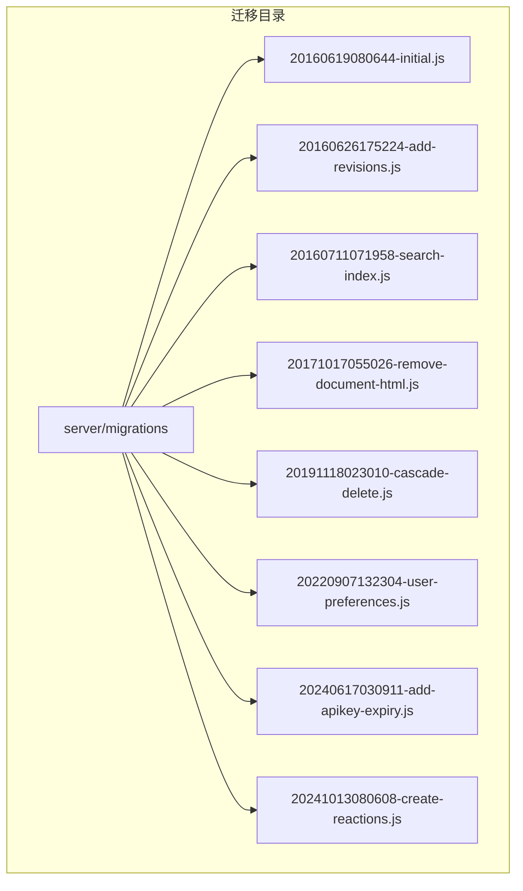

**图示来源**  
- [20160619080644-initial.js](file://server/migrations/20160619080644-initial.js)
- [20160626175224-add-revisions.js](file://server/migrations/20160626175224-add-revisions.js)
- [20160711071958-search-index.js](file://server/migrations/20160711071958-search-index.js)
- [20171017055026-remove-document-html.js](file://server/migrations/20171017055026-remove-document-html.js)
- [20191118023010-cascade-delete.js](file://server/migrations/20191118023010-cascade-delete.js)
- [20220907132304-user-preferences.js](file://server/migrations/20220907132304-user-preferences.js)
- [20240617030911-add-apikey-expiry.js](file://server/migrations/20240617030911-add-apikey-expiry.js)
- [20241013080608-create-reactions.js](file://server/migrations/20241013080608-create-reactions.js)

**章节来源**  
- [server/migrations](file://server/migrations)

## 核心组件
迁移脚本的核心是 `up` 和 `down` 方法的实现，它们定义了数据库变更的正向和反向操作。`queryInterface` 提供了创建表、添加列、创建索引等数据库操作的抽象接口，而 `Sequelize` 提供了数据类型定义。

**章节来源**  
- [20160619080644-initial.js](file://server/migrations/20160619080644-initial.js)
- [20160626175224-add-revisions.js](file://server/migrations/20160626175224-add-revisions.js)

## 架构概述
baozi 项目使用 Sequelize CLI 管理数据库迁移，结合 Umzug 库执行迁移任务。迁移脚本通过 `database.js` 配置文件连接到 PostgreSQL 数据库，并在事务中执行以确保数据一致性。

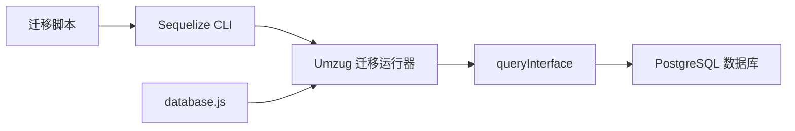

**图示来源**  
- [database.js](file://server/config/database.js)
- [20160619080644-initial.js](file://server/migrations/20160619080644-initial.js)

## 详细组件分析

### 初始表创建分析
`20160619080644-initial.js` 脚本创建了项目的核心表，包括 `teams`、`atlases`、`users` 和 `documents`。每个表都定义了主键、外键、索引和时间戳字段。

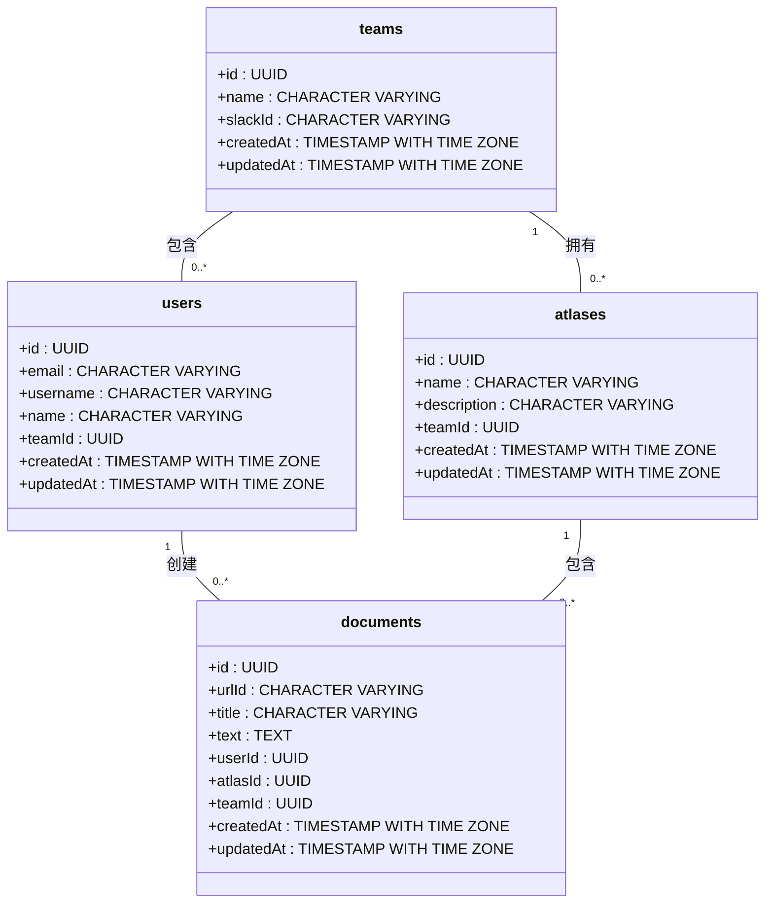

**图示来源**  
- [20160619080644-initial.js](file://server/migrations/20160619080644-initial.js)

**章节来源**  
- [20160619080644-initial.js](file://server/migrations/20160619080644-initial.js)

### 添加新字段分析
`20160626175224-add-revisions.js` 脚本展示了如何向现有表添加新字段。它创建了 `revisions` 表，并向 `documents` 表添加了 `lastModifiedById` 和 `revisionCount` 字段。

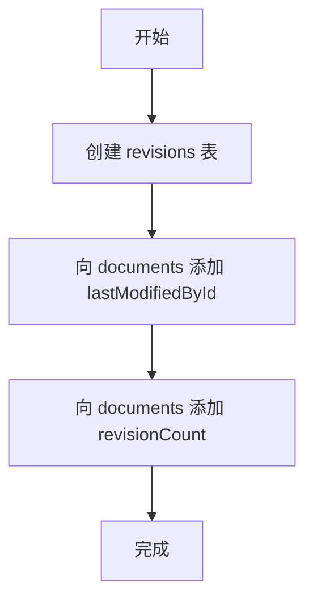

**图示来源**  
- [20160626175224-add-revisions.js](file://server/migrations/20160626175224-add-revisions.js)

**章节来源**  
- [20160626175224-add-revisions.js](file://server/migrations/20160626175224-add-revisions.js)

### 创建索引分析
`20160711071958-search-index.js` 脚本通过创建 PostgreSQL 的 `tsvector` 列和 GIN 索引来实现全文搜索功能。它还定义了触发器函数，在插入或更新记录时自动更新搜索向量。

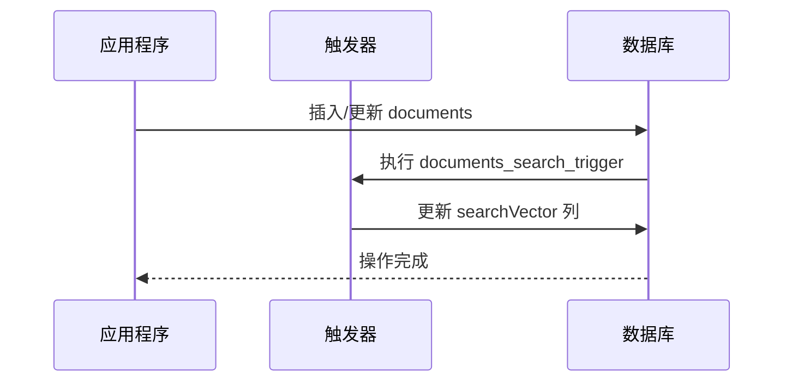

**图示来源**  
- [20160711071958-search-index.js](file://server/migrations/20160711071958-search-index.js)

**章节来源**  
- [20160711071958-search-index.js](file://server/migrations/20160711071958-search-index.js)

### 修改表结构分析
`20171017055026-remove-document-html.js` 脚本展示了如何安全地移除不再需要的列。它在 `up` 方法中移除 `html` 和 `preview` 列，在 `down` 方法中重新添加它们以支持回滚。

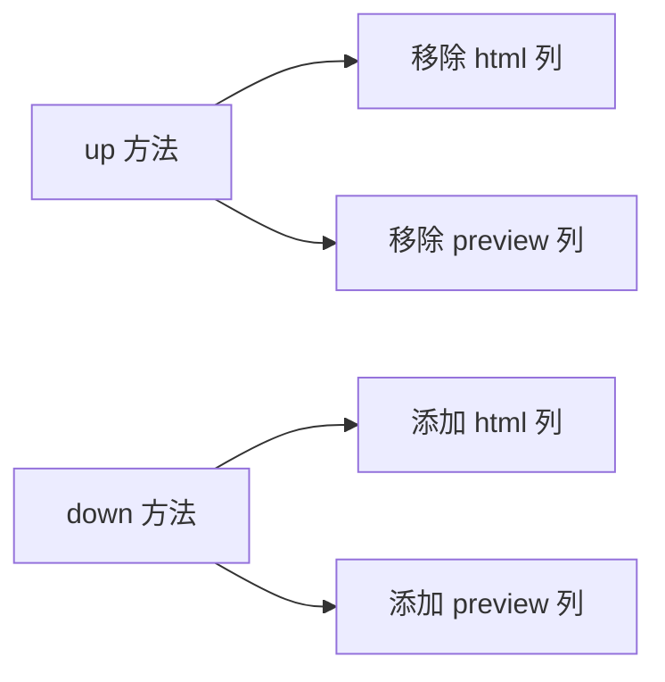

**图示来源**  
- [20171017055026-remove-document-html.js](file://server/migrations/20171017055026-remove-document-html.js)

**章节来源**  
- [20171017055026-remove-document-html.js](file://server/migrations/20171017055026-remove-document-html.js)

### 实现级联删除分析
`20191118023010-cascade-delete.js` 脚本通过修改外键约束来实现级联删除。它尝试多个可能的约束名称，确保在不同环境下都能正确修改。

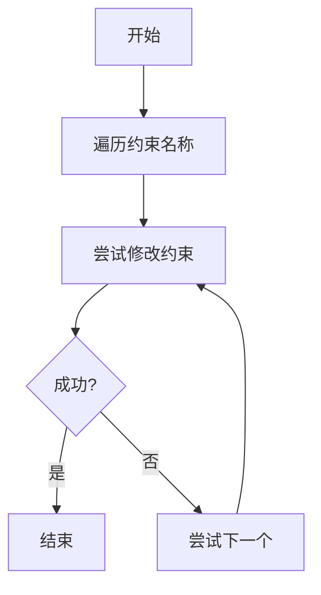

**图示来源**  
- [20191118023010-cascade-delete.js](file://server/migrations/20191118023010-cascade-delete.js)

**章节来源**  
- [20191118023010-cascade-delete.js](file://server/migrations/20191118023010-cascade-delete.js)

### 添加用户偏好设置分析
`20220907132304-user-preferences.js` 脚本展示了如何添加灵活的数据结构。它向 `users` 表添加了一个 `JSONB` 类型的 `preferences` 列，可以存储任意的用户偏好数据。

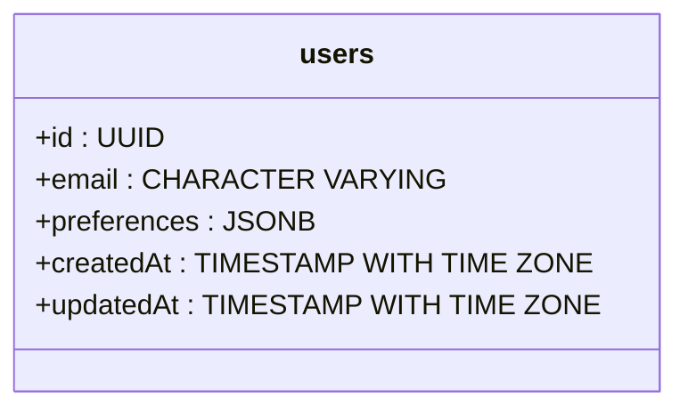

**图示来源**  
- [20220907132304-user-preferences.js](file://server/migrations/20220907132304-user-preferences.js)

**章节来源**  
- [20220907132304-user-preferences.js](file://server/migrations/20220907132304-user-preferences.js)

### 添加API密钥过期功能分析
`20240617030911-add-apikey-expiry.js` 脚本向 `apiKeys` 表添加了 `expiresAt` 字段，用于管理 API 密钥的有效期。

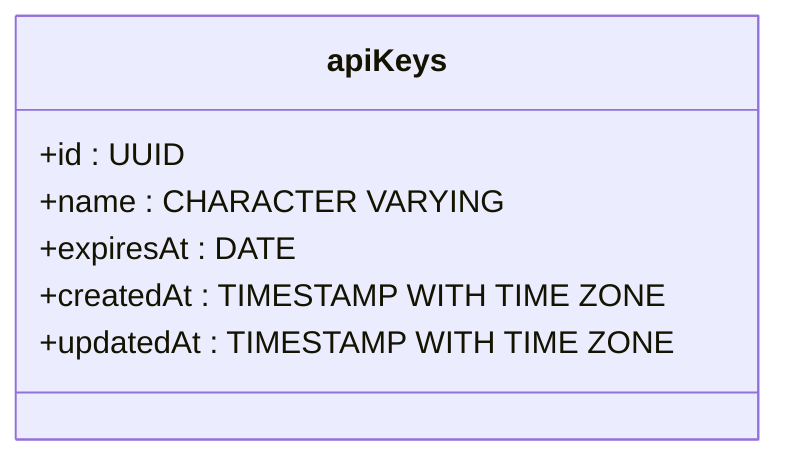

**图示来源**  
- [20240617030911-add-apikey-expiry.js](file://server/migrations/20240617030911-add-apikey-expiry.js)

**章节来源**  
- [20240617030911-add-apikey-expiry.js](file://server/migrations/20240617030911-add-apikey-expiry.js)

### 创建反应功能分析
`20241013080608-create-reactions.js` 脚本展示了复杂的迁移操作，包括在事务中创建表、添加索引和修改现有表。

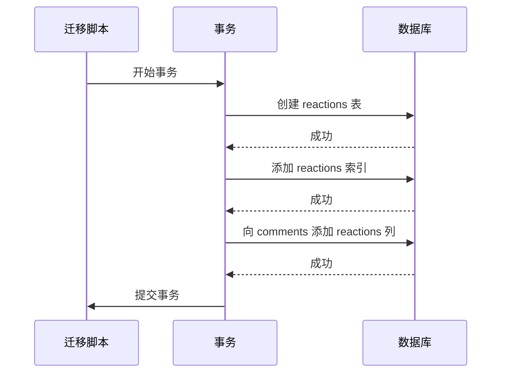

**图示来源**  
- [20241013080608-create-reactions.js](file://server/migrations/20241013080608-create-reactions.js)

**章节来源**  
- [20241013080608-create-reactions.js](file://server/migrations/20241013080608-create-reactions.js)

## 依赖分析
迁移脚本依赖于 Sequelize ORM 和 PostgreSQL 数据库。`database.js` 配置文件定义了数据库连接参数，而 `Umzug` 库负责迁移的执行和状态管理。

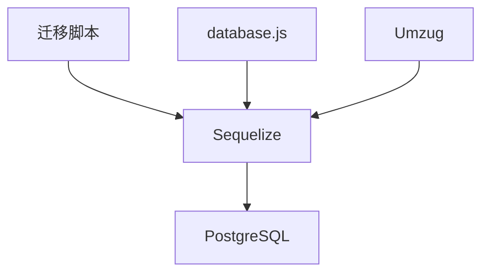

**图示来源**  
- [database.js](file://server/config/database.js)
- [20160619080644-initial.js](file://server/migrations/20160619080644-initial.js)

**章节来源**  
- [database.js](file://server/config/database.js)

## 性能考虑
在设计迁移脚本时，应考虑以下性能因素：
- 大型表的模式变更应在低峰期执行
- 使用事务确保数据一致性
- 为频繁查询的列创建适当的索引
- 避免在单个迁移中执行过多操作

## 故障排除指南
常见迁移问题及解决方案：
- **约束名称不匹配**：如 `20191118023010-cascade-delete.js` 所示，尝试多个可能的名称
- **数据丢失风险**：在 `down` 方法中正确实现回滚逻辑
- **事务失败**：确保所有操作在事务中执行，失败时自动回滚

**章节来源**  
- [20191118023010-cascade-delete.js](file://server/migrations/20191118023010-cascade-delete.js)
- [20241013080608-create-reactions.js](file://server/migrations/20241013080608-create-reactions.js)

## 结论
baozi 项目的迁移脚本实现展示了如何使用 Knex.js（通过 Sequelize）安全、可靠地管理数据库模式变更。通过遵循时间戳命名规范、使用事务、实现完整的 `up/down` 方法，项目能够有效地管理数据库演化，同时保持数据完整性和可回滚性。