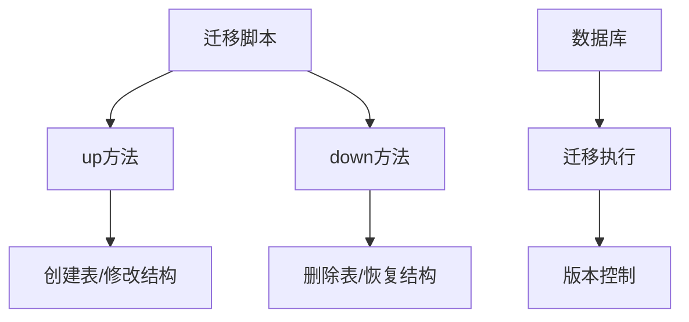
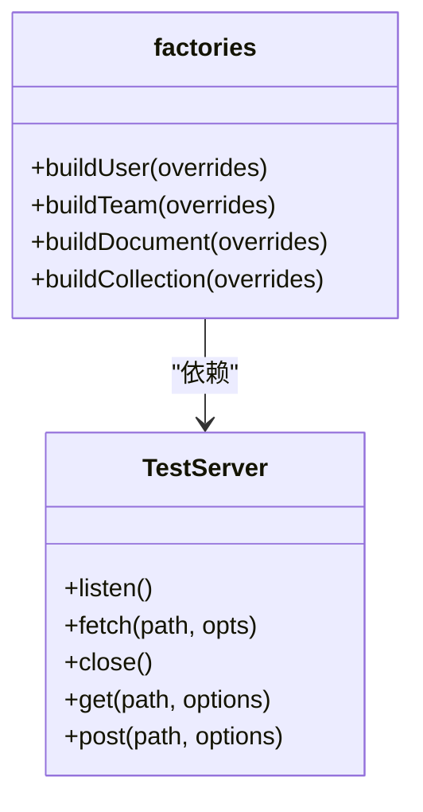
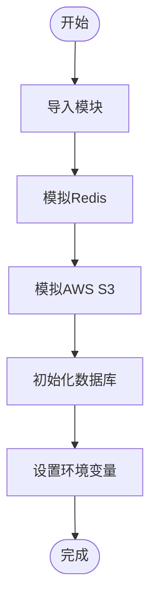
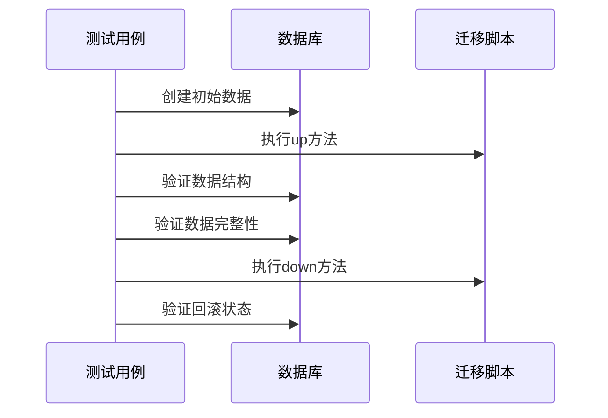
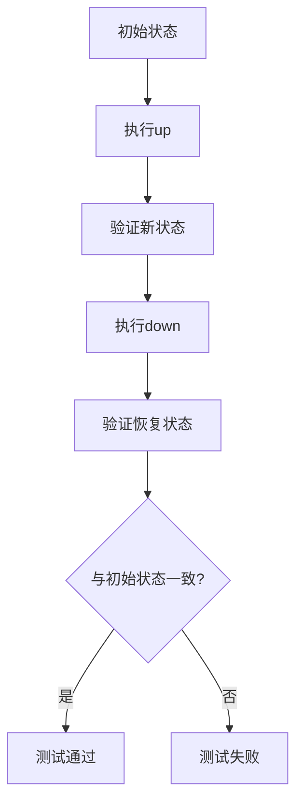
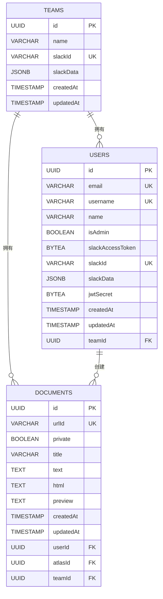
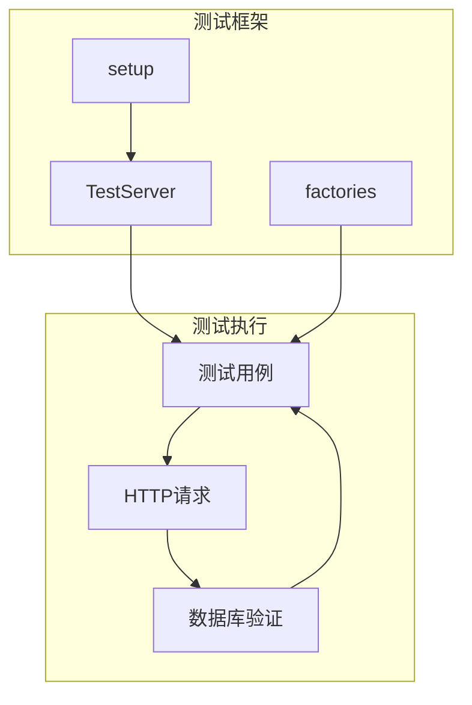
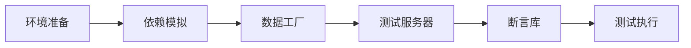
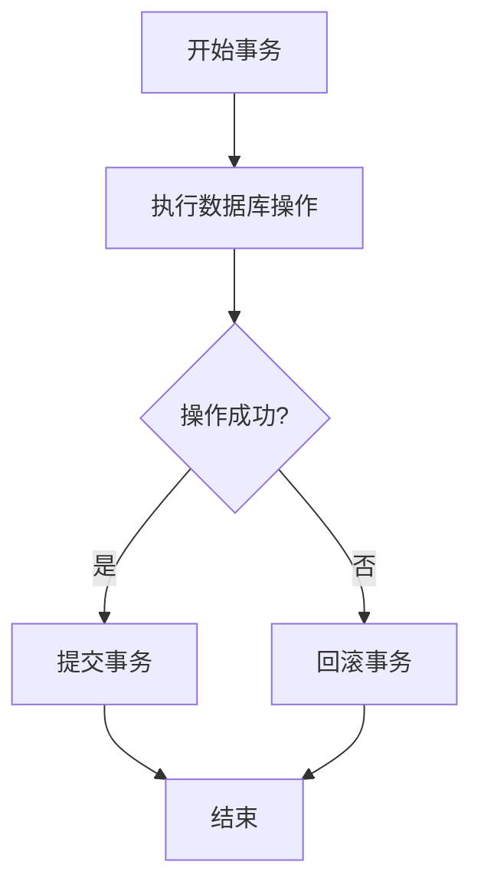
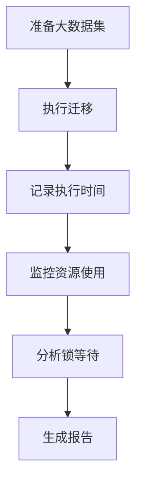

# 迁移脚本测试策略

<cite>
**本文档中引用的文件**  
- [20160619080644-initial.js](file://server/migrations/20160619080644-initial.js)
- [factories.ts](file://server/test/factories.ts)
- [TestServer.ts](file://server/test/TestServer.ts)
- [setup.ts](file://server/test/setup.ts)
- [support.ts](file://server/test/support.ts)
- [database.ts](file://server/storage/database.ts)
</cite>

## 目录
1. [引言](#引言)
2. [项目结构与迁移机制](#项目结构与迁移机制)
3. [核心测试组件分析](#核心测试组件分析)
4. [测试环境构建](#测试环境构建)
5. [迁移前后数据验证](#迁移前后数据验证)
6. [up/down方法可逆性测试](#updown方法可逆性测试)
7. [数据完整性验证](#数据完整性验证)
8. [集成测试实现](#集成测试实现)
9. [测试框架搭建指南](#测试框架搭建指南)
10. [常见陷阱规避策略](#常见陷阱规避策略)
11. [性能影响评估](#性能影响评估)
12. [结论](#结论)

## 引言
本文档详细阐述了baozi项目中数据库迁移脚本的测试策略，重点介绍如何确保迁移过程的安全性和可靠性。通过分析项目中的实际迁移文件（如20160619080644-initial.js）和测试工具（factories.ts, TestServer.ts），为开发者提供了一套完整的测试框架搭建指南。

## 项目结构与迁移机制
baozi项目的数据库迁移脚本位于`server/migrations/`目录下，采用Sequelize的迁移机制进行管理。每个迁移文件包含`up`和`down`两个方法，分别用于执行和回滚数据库变更。

**Diagram sources**
- [20160619080644-initial.js](file://server/migrations/20160619080644-initial.js)
- [database.ts](file://server/storage/database.ts#L180-L183)

**Section sources**
- [20160619080644-initial.js](file://server/migrations/20160619080644-initial.js)
- [database.ts](file://server/storage/database.ts#L180-L183)

## 核心测试组件分析
项目中的测试工具主要包含三个核心组件：factories.ts用于创建测试数据，TestServer.ts用于创建测试服务器，setup.ts用于初始化测试环境。

### 测试工厂模式
factories.ts文件实现了工厂模式，提供了创建各种测试实体的便捷方法，如`buildUser`、`buildTeam`、`buildDocument`等。

**Diagram sources**
- [factories.ts](file://server/test/factories.ts#L193-L234)
- [TestServer.ts](file://server/test/TestServer.ts#L6-L79)

**Section sources**
- [factories.ts](file://server/test/factories.ts)
- [TestServer.ts](file://server/test/TestServer.ts)

## 测试环境构建
测试环境的构建主要通过setup.ts和support.ts文件完成，包括数据库连接、Redis缓存、AWS S3客户端等的模拟。

### 测试环境初始化流程

**Diagram sources**
- [setup.ts](file://server/test/setup.ts)
- [support.ts](file://server/test/support.ts)

**Section sources**
- [setup.ts](file://server/test/setup.ts)
- [support.ts](file://server/test/support.ts)

## 迁移前后数据验证
迁移前后的数据验证是确保迁移脚本正确性的关键步骤，主要通过比较迁移前后数据库状态来实现。

### 数据验证流程

**Diagram sources**
- [20160619080644-initial.js](file://server/migrations/20160619080644-initial.js)
- [factories.ts](file://server/test/factories.ts)

**Section sources**
- [20160619080644-initial.js](file://server/migrations/20160619080644-initial.js)
- [factories.ts](file://server/test/factories.ts)

## up/down方法可逆性测试
确保up和down方法的可逆性是迁移脚本测试的重要组成部分，需要验证执行up后再执行down能够完全恢复到原始状态。

### 可逆性测试策略

**Diagram sources**
- [20160619080644-initial.js](file://server/migrations/20160619080644-initial.js)

**Section sources**
- [20160619080644-initial.js](file://server/migrations/20160619080644-initial.js)

## 数据完整性验证
数据完整性验证确保迁移过程中数据不会丢失或损坏，包括外键约束、唯一性约束等的验证。

### 完整性验证要点
- 外键约束验证
- 唯一性约束验证
- 数据类型验证
- 索引验证
- 默认值验证

**Diagram sources**
- [20160619080644-initial.js](file://server/migrations/20160619080644-initial.js)

**Section sources**
- [20160619080644-initial.js](file://server/migrations/20160619080644-initial.js)

## 集成测试实现
集成测试通过TestServer.ts创建测试服务器，结合factories.ts创建测试数据，实现完整的端到端测试。

### 集成测试架构

**Diagram sources**
- [TestServer.ts](file://server/test/TestServer.ts)
- [factories.ts](file://server/test/factories.ts)
- [setup.ts](file://server/test/setup.ts)

**Section sources**
- [TestServer.ts](file://server/test/TestServer.ts)
- [factories.ts](file://server/test/factories.ts)
- [setup.ts](file://server/test/setup.ts)

## 测试框架搭建指南
搭建迁移脚本测试框架需要遵循以下步骤：

1. **环境准备**：配置测试数据库和测试环境变量
2. **依赖模拟**：使用jest.mock模拟外部依赖
3. **数据工厂**：创建测试数据生成器
4. **测试服务器**：搭建可编程的测试服务器
5. **断言库**：选择合适的断言库进行验证

### 测试框架搭建流程

**Section sources**
- [setup.ts](file://server/test/setup.ts)
- [factories.ts](file://server/test/factories.ts)
- [TestServer.ts](file://server/test/TestServer.ts)

## 常见陷阱规避策略
在迁移脚本测试中，需要注意以下常见陷阱：

### 生产数据丢失风险
- **策略**：在down方法中避免使用`dropAllTables`
- **替代方案**：逐个删除表或使用软删除

### 迁移脚本幂等性
- **策略**：确保up方法可以多次执行而不产生错误
- **实现**：在创建表或索引前检查是否存在

### 事务处理
- **策略**：将相关操作放在同一个事务中
- **实现**：使用Sequelize的事务机制

**Diagram sources**
- [transaction.ts](file://server/middlewares/transaction.ts)
- [20160619080644-initial.js](file://server/migrations/20160619080644-initial.js)

**Section sources**
- [transaction.ts](file://server/middlewares/transaction.ts)
- [20160619080644-initial.js](file://server/migrations/20160619080644-initial.js)

## 性能影响评估
迁移脚本的性能影响需要在测试环境中进行评估，主要包括：

### 性能评估指标
- **执行时间**：迁移脚本的执行耗时
- **资源消耗**：CPU、内存使用情况
- **锁等待**：数据库锁的等待时间
- **影响范围**：受影响的行数和表数

### 性能测试策略

**Section sources**
- [20160619080644-initial.js](file://server/migrations/20160619080644-initial.js)

## 结论
通过本文档介绍的测试策略，开发者可以构建一个安全可靠的迁移脚本测试框架。关键要点包括：使用工厂模式创建测试数据、通过TestServer实现集成测试、验证up/down方法的可逆性、确保数据完整性，以及规避常见的生产风险。这些实践将帮助团队在数据库变更时保持系统的稳定性和数据的安全性。