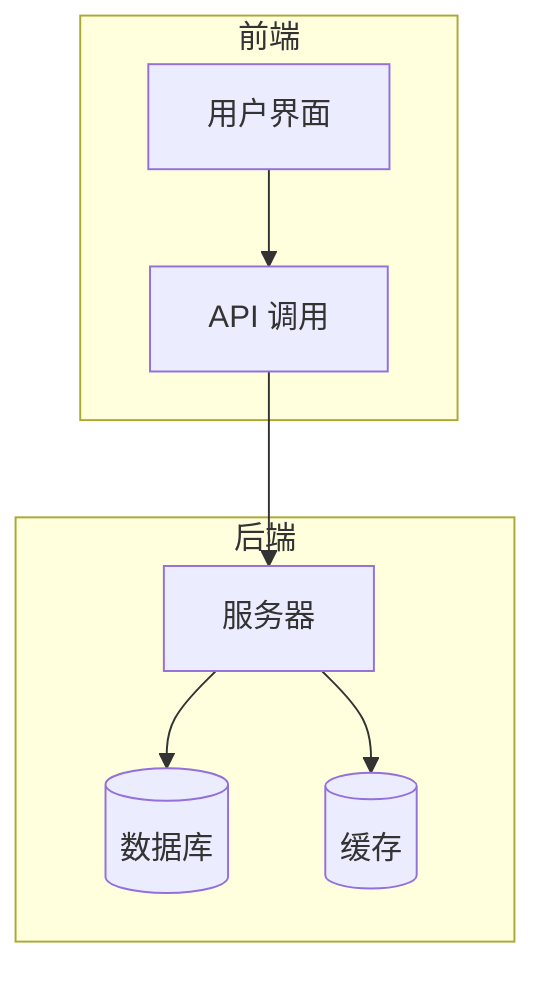
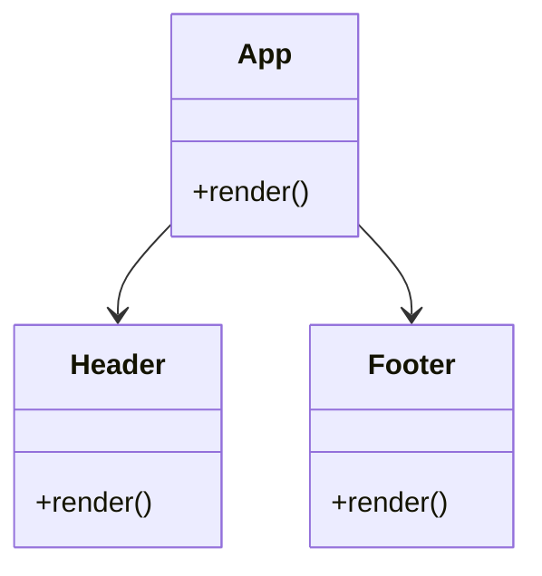
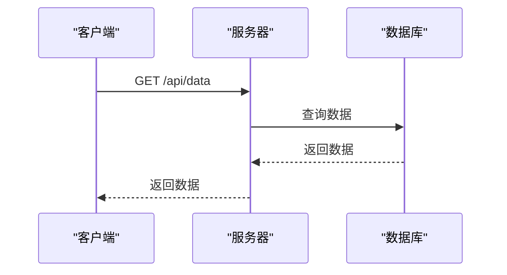
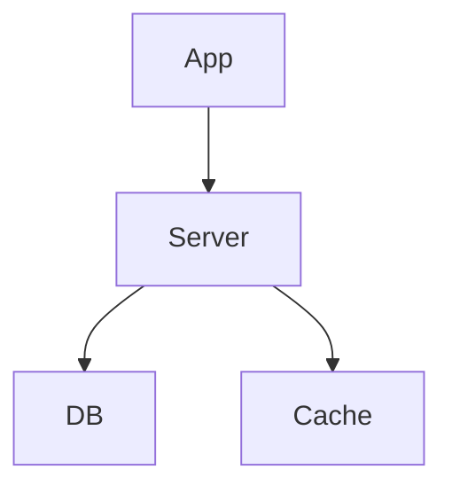

# 部署指南

<cite>
**本文档中引用的文件**  
- [docker-compose.yml](file://docker-compose.yml)
- [Dockerfile](file://Dockerfile)
- [.env.development](file://.env.development)
- [server/config/database.js](file://server/config/database.js)
- [server/env.ts](file://server/env.ts)
- [build_docker.sh](file://build_docker.sh)
- [Makefile](file://Makefile)
</cite>

## 目录
1. [简介](#简介)
2. [项目结构](#项目结构)
3. [核心组件](#核心组件)
4. [架构概述](#架构概述)
5. [详细组件分析](#详细组件分析)
6. [依赖分析](#依赖分析)
7. [性能考虑](#性能考虑)
8. [故障排除指南](#故障排除指南)
9. [结论](#结论)

## 简介
本指南旨在为 baozi 项目提供全面的生产环境部署和运维说明。重点介绍基于 Docker 的容器化部署流程，包括镜像构建、服务编排和网络配置。提供环境变量配置、数据库迁移、备份策略和监控设置的完整指导。使用项目中的实际配置文件（如 docker-compose.yml）作为示例，解释关键配置项的含义和最佳实践。为初学者提供分步操作指南，同时为经验丰富的运维人员提供高可用性、可扩展性和安全性的部署方案，确保内容能够帮助用户成功将应用部署到生产环境。

## 项目结构
baozi 项目的目录结构清晰，主要分为以下几个部分：
- `app/`：前端应用代码，包含组件、模型、路由等。
- `server/`：后端服务代码，包含配置、模型、脚本等。
- `shared/`：前后端共享的代码，如协作、组件、工具等。
- `outline-docker/`：Docker 配置文件，用于容器化部署。
- 根目录下的 `Dockerfile` 和 `docker-compose.yml` 文件用于构建和运行容器。

```mermaid
graph TD
subgraph "前端"
App[app/]
end
subgraph "后端"
Server[server/]
end
subgraph "共享"
Shared[shared/]
end
subgraph "Docker"
Docker[outline-docker/]
end
App --> Server
Shared --> App
Shared --> Server
Docker --> Server
```

**Diagram sources**
- [app/](file://app/)
- [server/](file://server/)
- [shared/](file://shared/)
- [outline-docker/](file://outline-docker/)

**Section sources**
- [app/](file://app/)
- [server/](file://server/)
- [shared/](file://shared/)
- [outline-docker/](file://outline-docker/)

## 核心组件
baozi 项目的核心组件包括前端应用、后端服务和共享代码。前端应用使用 React 构建，后端服务使用 Node.js 和 Koa 框架，共享代码包含协作、组件、工具等。

**Section sources**
- [app/](file://app/)
- [server/](file://server/)
- [shared/](file://shared/)

## 架构概述
baozi 项目的架构采用前后端分离的设计，前端应用通过 API 与后端服务通信。后端服务使用 PostgreSQL 作为数据库，Redis 作为缓存和消息队列。Docker 容器化部署确保了环境的一致性和可移植性。



**Diagram sources**
- [server/](file://server/)
- [app/](file://app/)

## 详细组件分析
### 前端应用分析
前端应用使用 React 构建，包含多个组件和路由。主要功能包括用户界面、API 调用和状态管理。

#### 组件分析


**Diagram sources**
- [app/components/Header.tsx](file://app/components/Header.tsx)
- [app/components/Footer.tsx](file://app/components/Footer.tsx)

### 后端服务分析
后端服务使用 Node.js 和 Koa 框架，主要功能包括 API 路由、数据库操作和缓存管理。

#### API 路由分析


**Diagram sources**
- [server/routes/index.ts](file://server/routes/index.ts)
- [server/models/Document.ts](file://server/models/Document.ts)

## 依赖分析
baozi 项目的依赖关系包括前端应用依赖后端服务，后端服务依赖数据库和缓存。Docker 容器化部署确保了依赖的一致性和可移植性。



**Diagram sources**
- [package.json](file://package.json)
- [server/config/database.js](file://server/config/database.js)

**Section sources**
- [package.json](file://package.json)
- [server/config/database.js](file://server/config/database.js)

## 性能考虑
在生产环境中，性能是关键因素。baozi 项目通过以下方式优化性能：
- 使用 Redis 缓存频繁访问的数据。
- 使用 PostgreSQL 的索引优化查询性能。
- 使用 Docker 容器化部署，确保环境一致性。

## 故障排除指南
在部署和运维过程中，可能会遇到各种问题。以下是一些常见的故障排除方法：
- 检查日志文件，查找错误信息。
- 检查环境变量配置，确保正确无误。
- 检查数据库连接，确保数据库服务正常运行。

**Section sources**
- [server/logging/Logger.ts](file://server/logging/Logger.ts)
- [server/env.ts](file://server/env.ts)

## 结论
通过本指南，用户可以全面了解 baozi 项目的部署和运维流程。从容器化部署到环境变量配置，再到数据库迁移和监控设置，本指南提供了详细的指导和最佳实践。希望这些内容能够帮助用户成功将应用部署到生产环境，确保系统的高可用性、可扩展性和安全性。