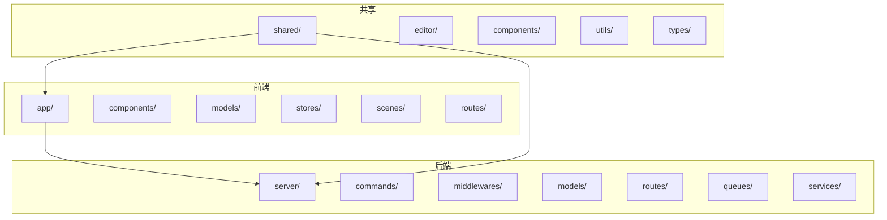
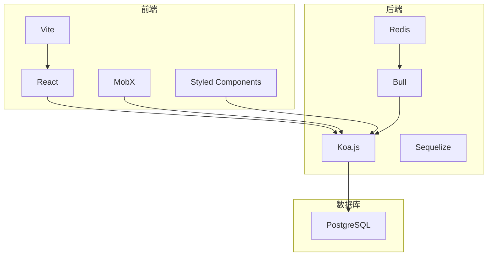
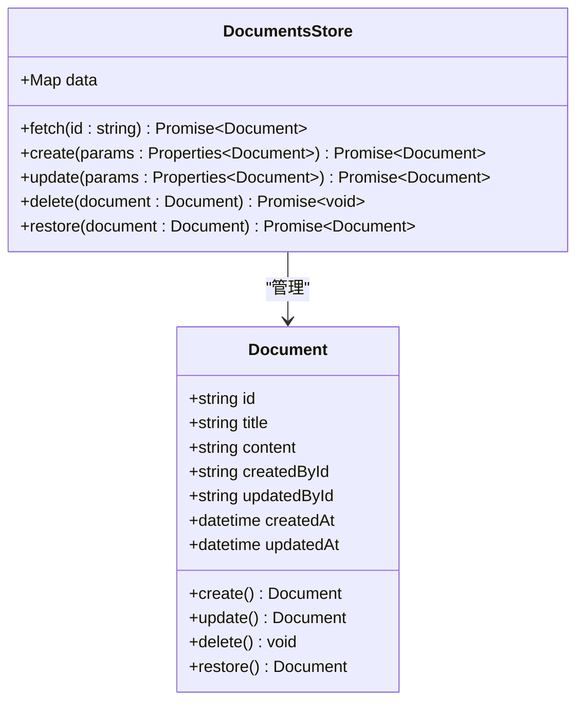
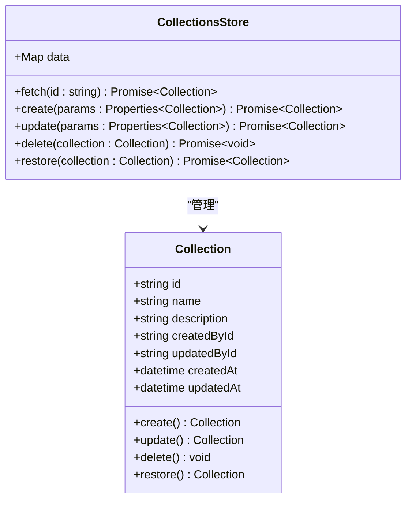
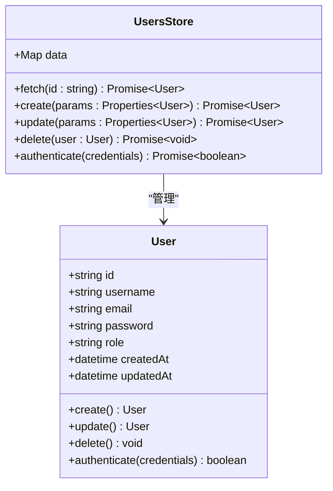
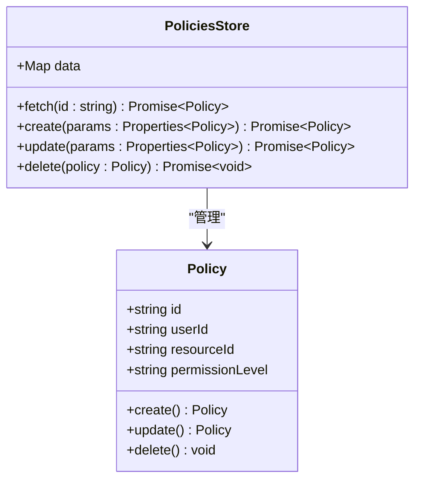
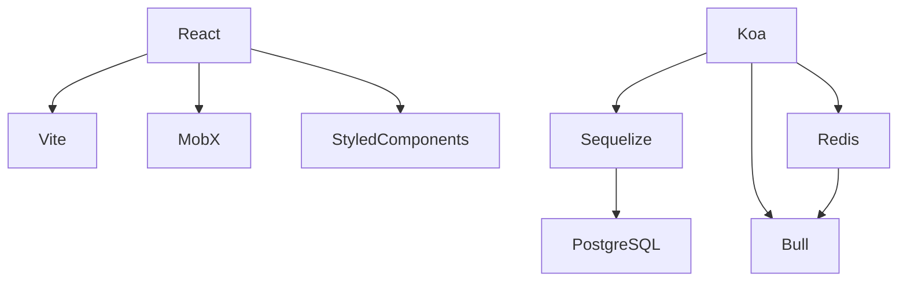

# 项目概述

<cite>
**本文档中引用的文件**  
- [README.md](file://README.md)
- [package.json](file://package.json)
- [ARCHITECTURE.md](file://docs/ARCHITECTURE.md)
- [Document.ts](file://app/models/Document.ts)
- [Collection.ts](file://app/models/Collection.ts)
- [Team.ts](file://app/models/Team.ts)
- [User.ts](file://app/models/User.ts)
- [DocumentsStore.ts](file://app/stores/DocumentsStore.ts)
- [CollectionsStore.ts](file://app/stores/CollectionsStore.ts)
- [RootStore.ts](file://app/stores/RootStore.ts)
- [ApiClient.ts](file://app/utils/ApiClient.ts)
- [Document.ts](file://server/models/Document.ts)
- [Collection.ts](file://server/models/Collection.ts)
- [Team.ts](file://server/models/Team.ts)
- [User.ts](file://server/models/User.ts)
</cite>

## 目录
1. [简介](#简介)
2. [项目结构](#项目结构)
3. [核心组件](#核心组件)
4. [架构概述](#架构概述)
5. [详细组件分析](#详细组件分析)
6. [依赖分析](#依赖分析)
7. [性能考虑](#性能考虑)
8. [故障排除指南](#故障排除指南)
9. [结论](#结论)

## 简介
baozi项目是一个快速、协作的团队知识库系统，旨在为团队提供一个高效的知识管理和共享平台。该项目基于React和Node.js构建，结合了现代前端和后端技术栈，支持文档管理、实时协作、权限控制和插件系统等核心功能。通过使用TypeScript、MobX、Koa.js和Sequelize等技术，baozi项目实现了高性能和可扩展性，适用于各种规模的团队和组织。

## 项目结构
baozi项目的目录结构清晰，分为前端、后端和共享代码三个主要部分。前端代码位于`app`目录下，包含组件、模型、存储、路由和场景等子目录。后端代码位于`server`目录下，包含命令、中间件、模型、路由、队列和服务等子目录。共享代码位于`shared`目录下，包含编辑器、组件、工具和类型定义等子目录。此外，项目还包括插件、配置文件和构建脚本等辅助文件。

**Diagram sources**
- [app](file://app)
- [server](file://server)
- [shared](file://shared)

**Section sources**
- [README.md](file://README.md)
- [package.json](file://package.json)

## 核心组件
baozi项目的核心组件包括文档管理、集合管理、用户管理和权限控制。文档管理模块负责文档的创建、编辑、删除和版本控制。集合管理模块负责文档的分类和组织。用户管理模块负责用户的注册、登录和权限分配。权限控制模块负责确保只有授权用户才能访问特定资源。

**Section sources**
- [Document.ts](file://app/models/Document.ts)
- [Collection.ts](file://app/models/Collection.ts)
- [User.ts](file://app/models/User.ts)
- [Team.ts](file://app/models/Team.ts)

## 架构概述
baozi项目的架构分为前端和后端两大部分。前端使用React框架构建用户界面，采用MobX进行状态管理，Styled Components进行样式管理。后端使用Koa.js框架构建API服务器，采用Sequelize作为ORM，Redis和Bull用于异步任务和事件管理。前后端通过RESTful API进行通信，数据流通过API客户端进行管理。

**Diagram sources**
- [ARCHITECTURE.md](file://docs/ARCHITECTURE.md)
- [package.json](file://package.json)

## 详细组件分析
### 文档管理分析
文档管理模块是baozi项目的核心功能之一，负责文档的创建、编辑、删除和版本控制。文档模型包含标题、内容、创建者、更新者、创建时间和更新时间等属性。文档存储通过DocumentsStore类进行管理，支持文档的增删改查操作。

#### 对象导向组件

**Diagram sources**
- [Document.ts](file://app/models/Document.ts)
- [DocumentsStore.ts](file://app/stores/DocumentsStore.ts)

### 集合管理分析
集合管理模块负责文档的分类和组织。集合模型包含名称、描述、创建者、更新者、创建时间和更新时间等属性。集合存储通过CollectionsStore类进行管理，支持集合的增删改查操作。

#### 对象导向组件

**Diagram sources**
- [Collection.ts](file://app/models/Collection.ts)
- [CollectionsStore.ts](file://app/stores/CollectionsStore.ts)

### 用户管理分析
用户管理模块负责用户的注册、登录和权限分配。用户模型包含用户名、邮箱、密码、角色、创建时间和更新时间等属性。用户存储通过UsersStore类进行管理，支持用户的增删改查操作。

#### 对象导向组件

**Diagram sources**
- [User.ts](file://app/models/User.ts)
- [UsersStore.ts](file://app/stores/UsersStore.ts)

### 权限控制分析
权限控制模块负责确保只有授权用户才能访问特定资源。权限模型包含用户ID、资源ID、权限级别等属性。权限存储通过PoliciesStore类进行管理，支持权限的增删改查操作。

#### 对象导向组件

**Diagram sources**
- [Policy.ts](file://app/models/Policy.ts)
- [PoliciesStore.ts](file://app/stores/PoliciesStore.ts)

## 依赖分析
baozi项目依赖于多个第三方库和框架，包括React、Koa.js、Sequelize、MobX、Styled Components、Vite、PostgreSQL、Redis和Bull等。这些依赖项提供了项目所需的核心功能，如前端渲染、后端API、数据库操作、状态管理、样式管理和构建工具。

**Diagram sources**
- [package.json](file://package.json)

**Section sources**
- [package.json](file://package.json)

## 性能考虑
baozi项目在设计时充分考虑了性能优化。前端使用Vite进行快速构建和热更新，减少开发时间。后端使用Koa.js和Sequelize进行高效的API处理和数据库操作。Redis和Bull用于异步任务和事件管理，提高系统的响应速度。此外，项目还采用了缓存机制和懒加载技术，进一步提升用户体验。

## 故障排除指南
在使用baozi项目时，可能会遇到一些常见问题。以下是一些故障排除建议：
- **网络问题**：检查网络连接是否正常，确保前端和后端能够正常通信。
- **数据库问题**：检查数据库连接是否正常，确保PostgreSQL服务正在运行。
- **权限问题**：检查用户权限设置是否正确，确保用户具有访问特定资源的权限。
- **构建问题**：检查构建脚本是否正确，确保Vite和Webpack配置无误。

**Section sources**
- [README.md](file://README.md)
- [package.json](file://package.json)

## 结论
baozi项目是一个功能强大、性能优越的团队知识库系统。通过结合现代前端和后端技术栈，项目实现了高效的知识管理和共享。文档管理、集合管理、用户管理和权限控制等核心功能为团队提供了全面的支持。未来，项目将继续优化性能，增加更多实用功能，为用户提供更好的体验。