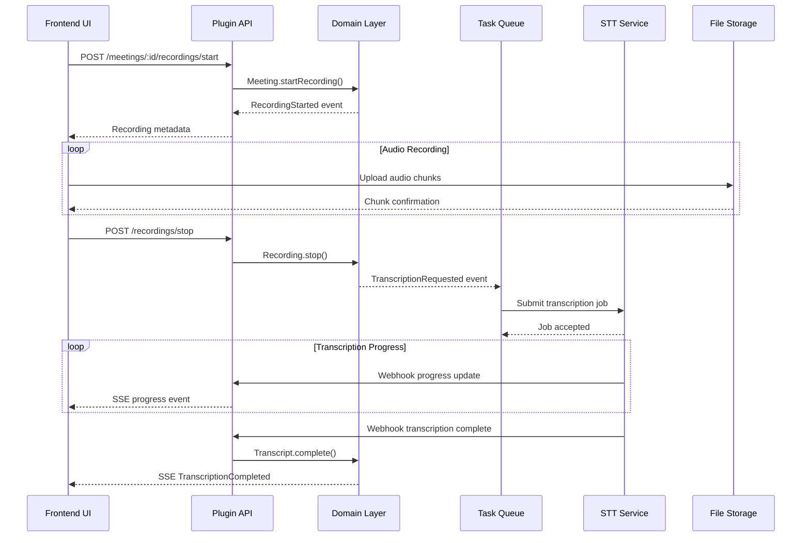

# 02 - 系统架构设计

## 整体架构

### 分层架构
```
┌─────────────────────────────────────────────────────┐
│                 用户界面层 (UI)                      │
│  - Meeting Control Panel                           │
│  - Recording Widget                                 │
│  - Transcript Editor                                │
│  - Progress Indicators                              │
└─────────────────────────────────────────────────────┘
                             ↓
┌─────────────────────────────────────────────────────┐
│              应用服务层 (Application)                │
│  - MeetingApplicationService                        │
│  - RecordingApplicationService                      │
│  - TranscriptionApplicationService                  │
│  - DocumentIntegrationService                      │
└─────────────────────────────────────────────────────┘
                             ↓
┌─────────────────────────────────────────────────────┐
│               领域层 (Domain)                       │
│  - Meeting Aggregate                                │
│  - Recording Aggregate                              │
│  - Transcript Aggregate                             │
│  - Domain Services                                  │
└─────────────────────────────────────────────────────┘
                             ↓
┌─────────────────────────────────────────────────────┐
│              基础设施层 (Infrastructure)             │
│  - Sequelize Repositories                           │
│  - STT Provider Adapters                           │
│  - Storage Service                                  │
│  - Event Outbox                                     │
└─────────────────────────────────────────────────────┘
```

### 插件集成架构

```
Outline Core Application
├── Document System (不变)
└── Plugin System
    └── meeting-minutes Plugin
        ├── Client Side
        │   ├── React Components
        │   ├── MobX Stores
        │   ├── Editor Extensions
        │   └── Koa API Client
        ├── Server Side
        │   ├── Koa Routes
        │   ├── Domain Layer
        │   ├── Application Services
        │   └── Infrastructure
        └── Shared
            ├── Types
            ├── Utilities
            └── Domain Objects
```

## 技术选型

### 前端技术栈
- **React + TypeScript**：与Outline现有技术栈保持一致
- **MobX**：状态管理，支持响应式数据流
- **ProseMirror**：富文本编辑，扩展节点和插件
- **Web Audio API**：浏览器录音功能
- **Server-Sent Events (SSE)**：实时进度推送
- **Styled Components**：样式管理

### 后端技术栈
- **Node.js + TypeScript**：与Outline核心保持一致
- **Koa.js**：HTTP路由和中间件
- **Sequelize**：ORM和数据库访问
- **Bull Queue**：异步任务处理
- **Redis**：缓存和队列存储
- **AWS S3 / GCS**：音频文件存储
- **Server-Sent Events**：实时通信

### 外部服务集成
- **语音转文字**：
  - OpenAI Whisper (主要)
  - Azure Cognitive Services Speech
  - Google Cloud Speech-to-Text
- **存储服务**：
  - AWS S3 (主要)
  - Google Cloud Storage
  - Azure Blob Storage

## 数据模型

### 数据库表设计

```sql
-- 会议表
CREATE TABLE meetings (
    id UUID PRIMARY KEY,
    team_id UUID NOT NULL REFERENCES teams(id),
    title VARCHAR(200) NOT NULL,
    description TEXT,
    scheduled_at TIMESTAMP,
    started_at TIMESTAMP,
    ended_at TIMESTAMP,
    status VARCHAR(20) NOT NULL DEFAULT 'scheduled',
    document_id UUID REFERENCES documents(id),
    created_by_id UUID NOT NULL REFERENCES users(id),
    created_at TIMESTAMP NOT NULL DEFAULT NOW(),
    updated_at TIMESTAMP NOT NULL DEFAULT NOW()
);

-- 会议参与者表
CREATE TABLE meeting_participants (
    id UUID PRIMARY KEY,
    meeting_id UUID NOT NULL REFERENCES meetings(id) ON DELETE CASCADE,
    user_id UUID REFERENCES users(id),
    display_name VARCHAR(100) NOT NULL,
    is_organizer BOOLEAN DEFAULT FALSE,
    created_at TIMESTAMP NOT NULL DEFAULT NOW()
);

-- 录音表
CREATE TABLE recordings (
    id UUID PRIMARY KEY,
    meeting_id UUID NOT NULL REFERENCES meetings(id) ON DELETE CASCADE,
    storage_uri TEXT NOT NULL,
    duration_ms INTEGER DEFAULT 0,
    file_size BIGINT DEFAULT 0,
    chunk_count INTEGER DEFAULT 0,
    mime_type VARCHAR(100) DEFAULT 'audio/webm',
    state VARCHAR(20) NOT NULL DEFAULT 'recording',
    started_at TIMESTAMP NOT NULL,
    stopped_at TIMESTAMP,
    created_at TIMESTAMP NOT NULL DEFAULT NOW(),
    updated_at TIMESTAMP NOT NULL DEFAULT NOW()
);

-- 转写表
CREATE TABLE transcripts (
    id UUID PRIMARY KEY,
    meeting_id UUID NOT NULL REFERENCES meetings(id) ON DELETE CASCADE,
    recording_id UUID NOT NULL REFERENCES recordings(id),
    language_code VARCHAR(10) NOT NULL DEFAULT 'en-US',
    status VARCHAR(20) NOT NULL DEFAULT 'pending',
    provider VARCHAR(50) NOT NULL,
    provider_job_id VARCHAR(255),
    confidence_score DECIMAL(3,2),
    word_count INTEGER DEFAULT 0,
    created_at TIMESTAMP NOT NULL DEFAULT NOW(),
    updated_at TIMESTAMP NOT NULL DEFAULT NOW(),
    completed_at TIMESTAMP
);

-- 转写片段表
CREATE TABLE transcript_segments (
    id UUID PRIMARY KEY,
    transcript_id UUID NOT NULL REFERENCES transcripts(id) ON DELETE CASCADE,
    sequence_number INTEGER NOT NULL,
    start_time_ms INTEGER NOT NULL,
    end_time_ms INTEGER NOT NULL,
    text TEXT NOT NULL,
    speaker_label VARCHAR(50),
    confidence_score DECIMAL(3,2),
    is_edited BOOLEAN DEFAULT FALSE,
    created_at TIMESTAMP NOT NULL DEFAULT NOW(),
    updated_at TIMESTAMP NOT NULL DEFAULT NOW()
);

-- 事件出站表 (Event Outbox Pattern)
CREATE TABLE event_outbox (
    id UUID PRIMARY KEY,
    aggregate_type VARCHAR(50) NOT NULL,
    aggregate_id UUID NOT NULL,
    event_type VARCHAR(100) NOT NULL,
    event_data JSONB NOT NULL,
    occurred_at TIMESTAMP NOT NULL,
    processed_at TIMESTAMP,
    retry_count INTEGER DEFAULT 0,
    created_at TIMESTAMP NOT NULL DEFAULT NOW()
);

-- 索引
CREATE INDEX idx_meetings_team_id ON meetings(team_id);
CREATE INDEX idx_meetings_status ON meetings(status);
CREATE INDEX idx_meetings_scheduled_at ON meetings(scheduled_at);
CREATE INDEX idx_transcript_segments_transcript_id ON transcript_segments(transcript_id);
CREATE INDEX idx_transcript_segments_time ON transcript_segments(start_time_ms, end_time_ms);
CREATE INDEX idx_event_outbox_processed ON event_outbox(processed_at) WHERE processed_at IS NULL;
```

### Document.sourceMetadata扩展

利用现有Document模型的`sourceMetadata`字段标识会议纪要类型：

```typescript
interface MeetingMinutesMetadata {
  type: 'meeting_minutes';
  meetingId: string;
  recordingId?: string;
  transcriptId?: string;
  generatedAt: string;
  participants: {
    id: string;
    name: string;
    role?: string;
  }[];
  duration?: number; // 会议时长（分钟）
}

// 在文档创建时设置
document.sourceMetadata = {
  type: 'meeting_minutes',
  meetingId: meeting.id,
  participants: meeting.participants,
  // ... 其他元数据
};
```

## API设计

### RESTful API端点

```typescript
// 会议管理
POST   /api/plugins/meeting-minutes/meetings          // 创建会议
GET    /api/plugins/meeting-minutes/meetings          // 列出会议
GET    /api/plugins/meeting-minutes/meetings/:id      // 获取会议详情
PUT    /api/plugins/meeting-minutes/meetings/:id      // 更新会议信息
DELETE /api/plugins/meeting-minutes/meetings/:id      // 删除会议

// 录音控制
POST   /api/plugins/meeting-minutes/meetings/:id/recordings/start   // 开始录音
POST   /api/plugins/meeting-minutes/meetings/:id/recordings/pause   // 暂停录音
POST   /api/plugins/meeting-minutes/meetings/:id/recordings/resume  // 恢复录音
POST   /api/plugins/meeting-minutes/meetings/:id/recordings/stop    // 停止录音

// 音频上传
POST   /api/plugins/meeting-minutes/recordings/:id/chunks           // 上传音频片段
POST   /api/plugins/meeting-minutes/recordings/:id/complete         // 完成上传

// 转写管理
POST   /api/plugins/meeting-minutes/transcriptions                  // 请求转写
GET    /api/plugins/meeting-minutes/transcriptions/:id              // 获取转写状态
PUT    /api/plugins/meeting-minutes/transcriptions/:id/segments/:segmentId // 编辑转写片段

// 实时通信
GET    /api/plugins/meeting-minutes/meetings/:id/events             // SSE事件流

// Webhook回调
POST   /api/plugins/meeting-minutes/webhooks/transcription          // STT服务回调
```

### API请求/响应示例

```typescript
// 创建会议
POST /api/plugins/meeting-minutes/meetings
{
  "title": "Weekly Standup",
  "scheduledAt": "2024-01-15T10:00:00Z",
  "participants": [
    { "userId": "user-1", "displayName": "Alice" },
    { "displayName": "Bob (External)" }
  ]
}

// 响应
{
  "data": {
    "id": "meeting-123",
    "title": "Weekly Standup",
    "status": "scheduled",
    "participants": [...],
    "createdAt": "2024-01-15T09:00:00Z"
  }
}

// 开始录音
POST /api/plugins/meeting-minutes/meetings/meeting-123/recordings/start
{
  "mimeType": "audio/webm;codecs=opus"
}

// 响应
{
  "data": {
    "recordingId": "recording-456",
    "uploadUrl": "https://...",
    "chunkSize": 1048576
  }
}
```

## 事件驱动架构

### 事件流设计



### Event Outbox模式

确保领域事件的可靠投递：

```typescript
class EventOutboxService {
  async publishDomainEvents(events: DomainEvent[]): Promise<void> {
    const transaction = await this.db.transaction();
    
    try {
      // 1. 保存聚合状态
      await this.repository.save(aggregate, { transaction });
      
      // 2. 保存事件到outbox
      for (const event of events) {
        await this.eventOutbox.add({
          aggregateType: aggregate.constructor.name,
          aggregateId: aggregate.id,
          eventType: event.constructor.name,
          eventData: event,
          occurredAt: event.occurredAt
        }, { transaction });
      }
      
      await transaction.commit();
    } catch (error) {
      await transaction.rollback();
      throw error;
    }
  }

  // 后台处理未发送的事件
  async processOutboxEvents(): Promise<void> {
    const unprocessedEvents = await this.eventOutbox.findUnprocessed();
    
    for (const event of unprocessedEvents) {
      try {
        await this.eventDispatcher.dispatch(event.eventData);
        await this.eventOutbox.markAsProcessed(event.id);
      } catch (error) {
        await this.eventOutbox.incrementRetryCount(event.id);
        Logger.error('Event processing failed', error, { eventId: event.id });
      }
    }
  }
}
```

## 外部集成

### STT提供商适配器

```typescript
// 抽象适配器接口
interface STTProvider {
  readonly name: string;
  
  createJob(options: TranscriptionOptions): Promise<TranscriptionJob>;
  getJobStatus(jobId: string): Promise<JobStatus>;
  cancelJob(jobId: string): Promise<void>;
  
  // Webhook验证
  validateWebhook(signature: string, payload: string): boolean;
}

// OpenAI Whisper适配器
class WhisperSTTAdapter implements STTProvider {
  name = 'whisper';

  async createJob(options: TranscriptionOptions): Promise<TranscriptionJob> {
    const response = await this.httpClient.post('/v1/audio/transcriptions', {
      file: options.audioUri,
      model: 'whisper-1',
      language: options.language,
      response_format: 'verbose_json',
      timestamp_granularities: ['segment']
    });

    return new TranscriptionJob(response.data.id, this.name);
  }

  async getJobStatus(jobId: string): Promise<JobStatus> {
    const response = await this.httpClient.get(`/v1/jobs/${jobId}`);
    return this.mapStatus(response.data.status);
  }

  validateWebhook(signature: string, payload: string): boolean {
    const expectedSignature = crypto
      .createHmac('sha256', this.webhookSecret)
      .update(payload)
      .digest('hex');
    
    return crypto.timingSafeEqual(
      Buffer.from(signature),
      Buffer.from(expectedSignature)
    );
  }
}
```

### 存储服务适配器

```typescript
interface StorageService {
  generateSignedUploadUrl(key: string, contentType: string): Promise<string>;
  generateSignedDownloadUrl(key: string, expiresIn?: number): Promise<string>;
  uploadChunk(key: string, chunk: Buffer, chunkNumber: number): Promise<void>;
  completeMultipartUpload(key: string, chunks: ChunkInfo[]): Promise<string>;
  deleteFile(key: string): Promise<void>;
}

class S3StorageAdapter implements StorageService {
  constructor(private s3Client: S3Client, private bucketName: string) {}

  async generateSignedUploadUrl(key: string, contentType: string): Promise<string> {
    const command = new PutObjectCommand({
      Bucket: this.bucketName,
      Key: key,
      ContentType: contentType
    });

    return await getSignedUrl(this.s3Client, command, { expiresIn: 3600 });
  }

  async uploadChunk(key: string, chunk: Buffer, chunkNumber: number): Promise<void> {
    const uploadId = await this.initializeMultipartUpload(key);
    
    await this.s3Client.send(new UploadPartCommand({
      Bucket: this.bucketName,
      Key: key,
      PartNumber: chunkNumber,
      UploadId: uploadId,
      Body: chunk
    }));
  }
}
```

## 性能优化

### 流式处理

```typescript
// 音频流式上传
class AudioStreamUploader {
  private chunks: AudioChunk[] = [];
  private uploadPromises: Promise<void>[] = [];

  async addChunk(audioData: Blob): Promise<void> {
    const chunk = new AudioChunk(audioData, this.chunks.length);
    this.chunks.push(chunk);

    // 异步上传，不阻塞录音
    const uploadPromise = this.uploadChunk(chunk);
    this.uploadPromises.push(uploadPromise);

    // 限制并发上传数量
    if (this.uploadPromises.length > 3) {
      await Promise.race(this.uploadPromises);
      this.uploadPromises = this.uploadPromises.filter(p => p !== uploadPromise);
    }
  }

  private async uploadChunk(chunk: AudioChunk): Promise<void> {
    const formData = new FormData();
    formData.append('chunk', chunk.data);
    formData.append('sequence', chunk.sequence.toString());

    await fetch(`/api/recordings/${this.recordingId}/chunks`, {
      method: 'POST',
      body: formData
    });
  }
}
```

### 转写结果缓存

```typescript
class TranscriptCache {
  private cache = new Map<string, CachedTranscript>();
  
  async getSegments(transcriptId: string, from: number, to: number): Promise<TranscriptSegment[]> {
    const cacheKey = `${transcriptId}:${from}:${to}`;
    
    if (this.cache.has(cacheKey)) {
      const cached = this.cache.get(cacheKey)!;
      if (Date.now() - cached.timestamp < 60000) { // 1分钟缓存
        return cached.segments;
      }
    }

    const segments = await this.repository.findSegments(transcriptId, from, to);
    this.cache.set(cacheKey, {
      segments,
      timestamp: Date.now()
    });

    return segments;
  }
}
```

## 监控与日志

### 结构化日志

```typescript
class MeetingLogger {
  private logger = Logger.child({ service: 'meeting-minutes' });

  logMeetingStarted(meetingId: string, userId: string): void {
    this.logger.info('Meeting started', {
      meetingId,
      userId,
      event: 'meeting_started',
      timestamp: new Date().toISOString()
    });
  }

  logTranscriptionProgress(transcriptId: string, progress: number): void {
    this.logger.info('Transcription progress', {
      transcriptId,
      progress,
      event: 'transcription_progress'
    });
  }

  logError(error: Error, context: Record<string, any>): void {
    this.logger.error('Meeting minutes error', {
      error: error.message,
      stack: error.stack,
      ...context
    });
  }
}
```

### 指标收集

```typescript
class MeetingMetrics {
  async recordMeetingDuration(duration: number): Promise<void> {
    await this.metricsClient.histogram('meeting_duration_minutes', duration);
  }

  async recordTranscriptionLatency(latency: number): Promise<void> {
    await this.metricsClient.histogram('transcription_latency_seconds', latency);
  }

  async incrementTranscriptionError(provider: string): Promise<void> {
    await this.metricsClient.counter('transcription_errors_total', 1, { provider });
  }
}
```

这个架构设计确保了Meeting Minutes功能与Outline现有系统的无缝集成，同时保持了高度的可扩展性和可维护性。