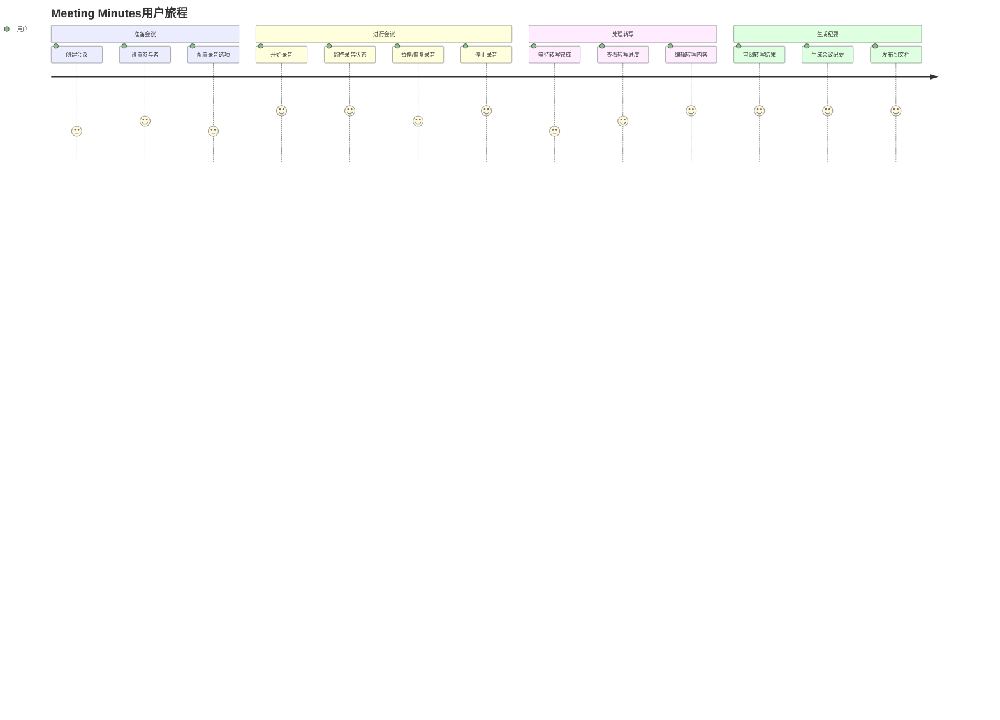

# 04 - 前端交互与用户体验设计

## 用户旅程 (User Journey)

### 主要用户流程



## 界面布局设计

### 主界面结构

```
┌─────────────────────────────────────────────────────────┐
│                  会议录音控制栏                          │
│  [●] [⏸] [⏹] [Timer: 05:23]  [Participants: 3]        │
│                                            [Settings]    │
└─────────────────────────────────────────────────────────┘
┌───────────────────┬─────────────────────────────────────┐
│                   │                                     │
│   转写实时预览     │           富文本编辑区               │
│                   │                                     │
│  [Speaker A]      │  # Weekly Standup Meeting          │
│  00:23 - Let's... │  **Date:** Jan 15, 2024           │
│                   │  **Participants:** Alice, Bob...   │
│  [Speaker B]      │                                     │
│  01:45 - I think..│  ## Discussion Points              │
│                   │                                     │
│  [进度: 78%]      │  - Sprint progress review          │
│  [重试] [设置]    │  - Blocked items discussion        │
│                   │                                     │
└───────────────────┴─────────────────────────────────────┘
```

### 响应式设计

#### 桌面端 (>1200px)
- 双栏布局：左侧转写预览，右侧编辑器
- 顶部固定录音控制栏
- 支持拖拽调整面板大小

#### 平板端 (768px-1200px)
- 可切换的标签页布局
- 折叠式录音控制栏
- 自适应字体大小

#### 移动端 (<768px)
- 单栏垂直布局
- 浮动录音控制按钮
- 触屏优化的交互元素

## 核心组件设计

### 1. 录音控制组件 (RecordingControls)

```typescript
interface RecordingControlsProps {
  meeting: Meeting;
  recording?: Recording;
  isRecording: boolean;
  isPaused: boolean;
  duration: number;
  audioLevel: number;
  onStart: () => void;
  onPause: () => void;
  onResume: () => void;
  onStop: () => void;
  onSettingsClick: () => void;
}

const RecordingControls: React.FC<RecordingControlsProps> = ({
  meeting,
  isRecording,
  isPaused,
  duration,
  audioLevel,
  ...handlers
}) => {
  return (
    <ControlsContainer>
      <RecordingButtonGroup>
        {!isRecording && (
          <RecordButton onClick={handlers.onStart} disabled={!hasPermission}>
            <RecordIcon />
            开始录音
          </RecordButton>
        )}
        
        {isRecording && !isPaused && (
          <PauseButton onClick={handlers.onPause}>
            <PauseIcon />
            暂停
          </PauseButton>
        )}
        
        {isRecording && isPaused && (
          <ResumeButton onClick={handlers.onResume}>
            <PlayIcon />
            继续
          </ResumeButton>
        )}
        
        {isRecording && (
          <StopButton onClick={handlers.onStop}>
            <StopIcon />
            停止
          </StopButton>
        )}
      </RecordingButtonGroup>

      <RecordingStatus>
        <TimerDisplay>{formatDuration(duration)}</TimerDisplay>
        <AudioLevelIndicator level={audioLevel} />
        <ParticipantCount>
          <UsersIcon />
          {meeting.participants.length}
        </ParticipantCount>
      </RecordingStatus>

      <SettingsButton onClick={handlers.onSettingsClick}>
        <SettingsIcon />
      </SettingsButton>
    </ControlsContainer>
  );
};
```

### 2. 转写预览组件 (TranscriptPreview)

```typescript
interface TranscriptPreviewProps {
  transcript?: Transcript;
  isLoading: boolean;
  progress: number;
  onSegmentEdit: (segmentId: string, newText: string) => void;
  onSpeakerRename: (oldName: string, newName: string) => void;
  onTimestampClick: (timestamp: number) => void;
}

const TranscriptPreview: React.FC<TranscriptPreviewProps> = ({
  transcript,
  isLoading,
  progress,
  onSegmentEdit,
  onSpeakerRename,
  onTimestampClick
}) => {
  const [editingSegment, setEditingSegment] = useState<string | null>(null);

  return (
    <PreviewContainer>
      <PreviewHeader>
        <Title>转写内容</Title>
        {isLoading && (
          <ProgressIndicator>
            <ProgressBar value={progress} />
            <ProgressText>{Math.round(progress)}%</ProgressText>
          </ProgressIndicator>
        )}
      </PreviewHeader>

      <SegmentsList>
        {transcript?.segments.map((segment) => (
          <TranscriptSegment
            key={segment.id}
            segment={segment}
            isEditing={editingSegment === segment.id}
            onEdit={(text) => {
              onSegmentEdit(segment.id, text);
              setEditingSegment(null);
            }}
            onStartEdit={() => setEditingSegment(segment.id)}
            onCancelEdit={() => setEditingSegment(null)}
            onTimestampClick={() => onTimestampClick(segment.startTime)}
            onSpeakerRename={onSpeakerRename}
          />
        ))}
      </SegmentsList>

      {isLoading && (
        <LoadingIndicator>
          <SpinnerIcon />
          正在转写音频...
        </LoadingIndicator>
      )}
    </PreviewContainer>
  );
};
```

### 3. 转写片段组件 (TranscriptSegment)

```typescript
interface TranscriptSegmentProps {
  segment: TranscriptSegment;
  isEditing: boolean;
  onEdit: (text: string) => void;
  onStartEdit: () => void;
  onCancelEdit: () => void;
  onTimestampClick: () => void;
  onSpeakerRename: (oldName: string, newName: string) => void;
}

const TranscriptSegment: React.FC<TranscriptSegmentProps> = ({
  segment,
  isEditing,
  onEdit,
  onStartEdit,
  onCancelEdit,
  onTimestampClick,
  onSpeakerRename
}) => {
  const [editText, setEditText] = useState(segment.text);
  const [editingSpeaker, setEditingSpeaker] = useState(false);

  return (
    <SegmentContainer isEdited={segment.isEdited}>
      <SegmentHeader>
        <SpeakerLabel
          isEditing={editingSpeaker}
          onDoubleClick={() => setEditingSpeaker(true)}
          onBlur={(newName) => {
            onSpeakerRename(segment.speakerLabel, newName);
            setEditingSpeaker(false);
          }}
        >
          {segment.speakerLabel || 'Unknown'}
        </SpeakerLabel>
        
        <TimestampButton onClick={onTimestampClick}>
          {formatTimestamp(segment.startTime)}
        </TimestampButton>
        
        <ConfidenceIndicator confidence={segment.confidence}>
          {Math.round(segment.confidence * 100)}%
        </ConfidenceIndicator>
      </SegmentHeader>

      <SegmentContent>
        {isEditing ? (
          <EditTextArea
            value={editText}
            onChange={(e) => setEditText(e.target.value)}
            onKeyDown={(e) => {
              if (e.key === 'Enter' && e.ctrlKey) {
                onEdit(editText);
              } else if (e.key === 'Escape') {
                onCancelEdit();
                setEditText(segment.text);
              }
            }}
            autoFocus
          />
        ) : (
          <SegmentText
            onDoubleClick={onStartEdit}
            isLowConfidence={segment.confidence < 0.8}
          >
            {segment.text}
            {segment.isEdited && <EditedIndicator />}
          </SegmentText>
        )}
      </SegmentContent>

      <SegmentActions>
        {isEditing ? (
          <>
            <SaveButton onClick={() => onEdit(editText)}>
              保存
            </SaveButton>
            <CancelButton onClick={onCancelEdit}>
              取消
            </CancelButton>
          </>
        ) : (
          <EditButton onClick={onStartEdit}>
            <EditIcon />
          </EditButton>
        )}
      </SegmentActions>
    </SegmentContainer>
  );
};
```

### 4. 会议设置组件 (MeetingSettings)

```typescript
interface MeetingSettingsProps {
  meeting: Meeting;
  isOpen: boolean;
  onClose: () => void;
  onUpdate: (updates: Partial<Meeting>) => void;
}

const MeetingSettings: React.FC<MeetingSettingsProps> = ({
  meeting,
  isOpen,
  onClose,
  onUpdate
}) => {
  const [settings, setSettings] = useState({
    language: meeting.language || 'zh-CN',
    enableSpeakerRecognition: true,
    audioQuality: 'high',
    autoSave: true,
    transcriptionProvider: 'whisper'
  });

  return (
    <Modal isOpen={isOpen} onClose={onClose}>
      <ModalHeader>
        <Title>录音设置</Title>
        <CloseButton onClick={onClose}>×</CloseButton>
      </ModalHeader>

      <ModalBody>
        <SettingGroup>
          <Label>转写语言</Label>
          <Select
            value={settings.language}
            onChange={(value) => setSettings({...settings, language: value})}
          >
            <Option value="zh-CN">中文（简体）</Option>
            <Option value="en-US">English (US)</Option>
            <Option value="ja-JP">日本語</Option>
          </Select>
        </SettingGroup>

        <SettingGroup>
          <Label>音频质量</Label>
          <RadioGroup
            value={settings.audioQuality}
            onChange={(value) => setSettings({...settings, audioQuality: value})}
          >
            <RadioOption value="standard">标准 (16kHz)</RadioOption>
            <RadioOption value="high">高质量 (48kHz)</RadioOption>
          </RadioGroup>
        </SettingGroup>

        <SettingGroup>
          <Checkbox
            checked={settings.enableSpeakerRecognition}
            onChange={(checked) => 
              setSettings({...settings, enableSpeakerRecognition: checked})
            }
          >
            启用说话人识别
          </Checkbox>
        </SettingGroup>

        <SettingGroup>
          <Checkbox
            checked={settings.autoSave}
            onChange={(checked) => 
              setSettings({...settings, autoSave: checked})
            }
          >
            自动保存转写内容
          </Checkbox>
        </SettingGroup>
      </ModalBody>

      <ModalFooter>
        <Button variant="secondary" onClick={onClose}>
          取消
        </Button>
        <Button
          variant="primary"
          onClick={() => {
            onUpdate(settings);
            onClose();
          }}
        >
          保存设置
        </Button>
      </ModalFooter>
    </Modal>
  );
};
```

## 编辑器集成

### MeetingMinutes节点

```typescript
class MeetingMinutesNode extends Node {
  get name() {
    return 'meeting_minutes';
  }

  get schema(): NodeSpec {
    return {
      attrs: {
        meetingId: { default: null },
        title: { default: '' },
        participants: { default: [] },
        duration: { default: 0 },
        recordingId: { default: null },
        transcriptId: { default: null }
      },
      content: 'block*',
      group: 'block',
      defining: true,
      draggable: false,
      parseDOM: [{
        tag: 'div[data-meeting-minutes]',
        getAttrs: (dom: HTMLElement) => ({
          meetingId: dom.getAttribute('data-meeting-id'),
          title: dom.getAttribute('data-title'),
          participants: JSON.parse(dom.getAttribute('data-participants') || '[]'),
          duration: parseInt(dom.getAttribute('data-duration') || '0')
        })
      }],
      toDOM: (node) => [
        'div',
        {
          'data-meeting-minutes': 'true',
          'data-meeting-id': node.attrs.meetingId,
          'data-title': node.attrs.title,
          'data-participants': JSON.stringify(node.attrs.participants),
          'data-duration': node.attrs.duration.toString(),
          class: 'meeting-minutes-container'
        },
        ['div', { class: 'meeting-header' }, [
          ['h2', node.attrs.title],
          ['div', { class: 'meeting-meta' }, 
            `参与者: ${node.attrs.participants.length} | 时长: ${formatDuration(node.attrs.duration)}`
          ]
        ]],
        ['div', { class: 'meeting-content' }, 0]
      ]
    };
  }

  widget = ({ node }: { node: ProsemirrorNode }) => (
    <MeetingMinutesWidget
      meetingId={node.attrs.meetingId}
      title={node.attrs.title}
      participants={node.attrs.participants}
      duration={node.attrs.duration}
      recordingId={node.attrs.recordingId}
      transcriptId={node.attrs.transcriptId}
    />
  );

  commands({ type }: { type: NodeType }) {
    return {
      insertMeetingMinutes: (attrs: any) => (state: EditorState, dispatch?: any) => {
        const node = type.create(attrs);
        dispatch?.(state.tr.replaceSelectionWith(node));
        return true;
      }
    };
  }

  inputRules({ type }: { type: NodeType }) {
    return [
      textblockTypeInputRule(/^\/meeting-minutes\s$/, type, (match) => ({
        title: '新建会议纪要',
        meetingId: uuidv4(),
        participants: [],
        duration: 0
      }))
    ];
  }
}
```

### 录音控制扩展

```typescript
class RecordingControlsExtension extends Extension {
  get name() {
    return 'recording-controls';
  }

  get plugins() {
    return [
      new Plugin({
        key: new PluginKey('recording-controls'),
        view: (editorView) => new RecordingControlsView(editorView, this.editor)
      })
    ];
  }

  widget = () => {
    const meetingStore = this.editor.props.meetingStore;
    
    if (!meetingStore?.currentMeeting) {
      return null;
    }

    return (
      <FloatingRecordingControls
        meeting={meetingStore.currentMeeting}
        recording={meetingStore.currentRecording}
        isRecording={meetingStore.isRecording}
        onStart={() => meetingStore.startRecording()}
        onPause={() => meetingStore.pauseRecording()}
        onStop={() => meetingStore.stopRecording()}
      />
    );
  };
}

class RecordingControlsView {
  dom: HTMLElement;

  constructor(
    private view: EditorView,
    private editor: Editor
  ) {
    this.dom = document.createElement('div');
    this.dom.className = 'recording-controls-container';
    
    // 只在meeting minutes文档中显示
    this.update();
  }

  update() {
    const isMeetingDocument = this.checkIsMeetingDocument();
    this.dom.style.display = isMeetingDocument ? 'block' : 'none';
  }

  private checkIsMeetingDocument(): boolean {
    const { doc } = this.view.state;
    let isMeetingDocument = false;
    
    doc.descendants((node) => {
      if (node.type.name === 'meeting_minutes') {
        isMeetingDocument = true;
        return false; // 停止遍历
      }
    });
    
    return isMeetingDocument;
  }
}
```

## 状态管理

### MobX Store设计

```typescript
class MeetingStore {
  @observable meetings: Meeting[] = [];
  @observable currentMeeting: Meeting | null = null;
  @observable currentRecording: Recording | null = null;
  @observable isRecording = false;
  @observable recordingDuration = 0;
  @observable audioLevel = 0;

  private recordingTimer?: NodeJS.Timeout;
  private audioRecorder?: MediaRecorder;
  private eventSource?: EventSource;

  constructor(private apiClient: ApiClient) {
    makeObservable(this);
  }

  @action
  async createMeeting(data: CreateMeetingData): Promise<Meeting> {
    const meeting = await this.apiClient.post('/meetings', data);
    this.meetings.push(meeting);
    return meeting;
  }

  @action
  async startRecording(): Promise<void> {
    if (!this.currentMeeting) {
      throw new Error('No active meeting');
    }

    // 获取用户媒体权限
    const stream = await navigator.mediaDevices.getUserMedia({
      audio: {
        echoCancellation: true,
        noiseSuppression: true,
        sampleRate: 48000
      }
    });

    // 初始化录音器
    this.audioRecorder = new MediaRecorder(stream, {
      mimeType: 'audio/webm;codecs=opus'
    });

    this.audioRecorder.ondataavailable = (event) => {
      if (event.data.size > 0) {
        this.uploadAudioChunk(event.data);
      }
    };

    // 开始录音
    const recording = await this.apiClient.post(
      `/meetings/${this.currentMeeting.id}/recordings/start`
    );

    this.currentRecording = recording;
    this.isRecording = true;
    this.recordingDuration = 0;

    this.audioRecorder.start(5000); // 每5秒一个片段
    this.startTimer();
    this.startAudioLevelMonitoring(stream);
    this.subscribeToEvents();
  }

  @action
  async pauseRecording(): Promise<void> {
    if (!this.isRecording || !this.audioRecorder) return;

    this.audioRecorder.pause();
    await this.apiClient.post(`/recordings/${this.currentRecording?.id}/pause`);
    this.stopTimer();
  }

  @action
  async stopRecording(): Promise<void> {
    if (!this.isRecording || !this.audioRecorder) return;

    this.audioRecorder.stop();
    await this.apiClient.post(`/recordings/${this.currentRecording?.id}/stop`);
    
    this.isRecording = false;
    this.stopTimer();
    this.unsubscribeFromEvents();
  }

  private async uploadAudioChunk(chunk: Blob): Promise<void> {
    const formData = new FormData();
    formData.append('chunk', chunk);
    
    await this.apiClient.post(
      `/recordings/${this.currentRecording?.id}/chunks`,
      formData
    );
  }

  private startTimer(): void {
    this.recordingTimer = setInterval(() => {
      this.recordingDuration += 1000; // 每秒更新
    }, 1000);
  }

  private stopTimer(): void {
    if (this.recordingTimer) {
      clearInterval(this.recordingTimer);
      this.recordingTimer = undefined;
    }
  }

  private subscribeToEvents(): void {
    if (!this.currentMeeting) return;

    this.eventSource = new EventSource(
      `/api/plugins/meeting-minutes/meetings/${this.currentMeeting.id}/events`
    );

    this.eventSource.onmessage = (event) => {
      const data = JSON.parse(event.data);
      this.handleRealtimeEvent(data);
    };
  }

  @action
  private handleRealtimeEvent(event: any): void {
    switch (event.type) {
      case 'transcription_progress':
        // 更新转写进度
        if (this.transcriptStore) {
          this.transcriptStore.updateProgress(event.progress);
        }
        break;
      case 'transcription_completed':
        // 转写完成，刷新数据
        this.transcriptStore?.loadTranscript(event.transcriptId);
        break;
    }
  }
}
```

### TranscriptStore

```typescript
class TranscriptStore {
  @observable transcript: Transcript | null = null;
  @observable isLoading = false;
  @observable progress = 0;
  @observable segments: TranscriptSegment[] = [];

  constructor(private apiClient: ApiClient) {
    makeObservable(this);
  }

  @action
  async loadTranscript(transcriptId: string): Promise<void> {
    this.isLoading = true;
    try {
      const transcript = await this.apiClient.get(`/transcriptions/${transcriptId}`);
      this.transcript = transcript;
      this.segments = transcript.segments;
    } finally {
      this.isLoading = false;
    }
  }

  @action
  updateProgress(progress: number): void {
    this.progress = progress;
  }

  @action
  async editSegment(segmentId: string, newText: string): Promise<void> {
    const segmentIndex = this.segments.findIndex(s => s.id === segmentId);
    if (segmentIndex === -1) return;

    // 乐观更新UI
    this.segments[segmentIndex] = {
      ...this.segments[segmentIndex],
      text: newText,
      isEdited: true
    };

    // 同步到服务器
    await this.apiClient.put(
      `/transcriptions/${this.transcript?.id}/segments/${segmentId}`,
      { text: newText }
    );
  }

  @action
  async renameSpeaker(oldName: string, newName: string): Promise<void> {
    this.segments = this.segments.map(segment => ({
      ...segment,
      speakerLabel: segment.speakerLabel === oldName ? newName : segment.speakerLabel
    }));

    // 批量更新服务器
    await this.apiClient.post(
      `/transcriptions/${this.transcript?.id}/speakers/rename`,
      { oldName, newName }
    );
  }
}
```

## 实时功能

### Server-Sent Events集成

```typescript
class RealtimeEventManager {
  private eventSource?: EventSource;
  private reconnectDelay = 1000;
  private maxReconnectDelay = 30000;

  constructor(
    private meetingId: string,
    private onEvent: (event: RealtimeEvent) => void
  ) {}

  connect(): void {
    this.eventSource = new EventSource(
      `/api/plugins/meeting-minutes/meetings/${this.meetingId}/events`
    );

    this.eventSource.onopen = () => {
      console.log('SSE connection established');
      this.reconnectDelay = 1000;
    };

    this.eventSource.onmessage = (event) => {
      try {
        const data = JSON.parse(event.data);
        this.onEvent(data);
      } catch (error) {
        console.error('Failed to parse SSE event:', error);
      }
    };

    this.eventSource.onerror = () => {
      console.warn('SSE connection error, attempting to reconnect...');
      this.scheduleReconnect();
    };
  }

  disconnect(): void {
    if (this.eventSource) {
      this.eventSource.close();
      this.eventSource = undefined;
    }
  }

  private scheduleReconnect(): void {
    setTimeout(() => {
      this.connect();
      this.reconnectDelay = Math.min(this.reconnectDelay * 2, this.maxReconnectDelay);
    }, this.reconnectDelay);
  }
}
```

## 性能优化

### 虚拟化长列表

```typescript
const VirtualizedTranscriptList: React.FC<{
  segments: TranscriptSegment[];
  onSegmentEdit: (id: string, text: string) => void;
}> = ({ segments, onSegmentEdit }) => {
  const listRef = useRef<FixedSizeList>(null);
  const [visibleRange, setVisibleRange] = useState({ start: 0, end: 50 });

  const renderSegment = useCallback(({ index, style }: ListChildComponentProps) => {
    const segment = segments[index];
    
    return (
      <div style={style}>
        <TranscriptSegment
          segment={segment}
          onEdit={(text) => onSegmentEdit(segment.id, text)}
        />
      </div>
    );
  }, [segments, onSegmentEdit]);

  return (
    <FixedSizeList
      ref={listRef}
      height={600}
      itemCount={segments.length}
      itemSize={120}
      onItemsRendered={({ visibleStartIndex, visibleStopIndex }) => {
        setVisibleRange({ start: visibleStartIndex, end: visibleStopIndex });
      }}
    >
      {renderSegment}
    </FixedSizeList>
  );
};
```

### 防抖和节流

```typescript
// 音频上传防抖
const debouncedUpload = useMemo(
  () => debounce((chunk: Blob) => {
    uploadAudioChunk(chunk);
  }, 100),
  []
);

// 文本编辑节流
const throttledTextSave = useMemo(
  () => throttle((segmentId: string, text: string) => {
    transcriptStore.editSegment(segmentId, text);
  }, 500),
  []
);
```

这个前端设计确保了用户体验的流畅性和功能的完整性，同时保持了与Outline现有UI风格的一致性。