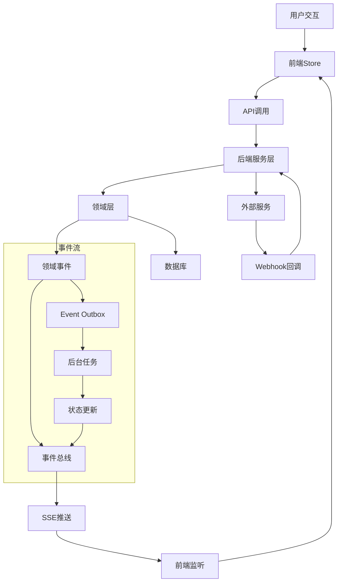

# 05 - 数据流与状态管理

## 数据流架构概览

Meeting Minutes功能采用事件驱动的数据流架构，确保前后端状态的一致性和实时性。



## 前端状态管理

### MobX Store架构

```typescript
// 状态管理架构
interface StoreArchitecture {
  // 主Store
  MeetingStore: {
    meetings: Map<string, Meeting>;
    activeMeetings: Meeting[];
    isLoading: boolean;
    error: Error | null;
  };
  
  RecordingStore: {
    recordings: Map<string, Recording>;
    activeRecording: Recording | null;
    audioLevel: number;
    uploadProgress: Map<string, number>;
  };
  
  TranscriptStore: {
    transcripts: Map<string, Transcript>;
    segments: Map<string, TranscriptSegment[]>;
    editingSegment: string | null;
    transcriptionProgress: Map<string, number>;
  };
}
```

### 状态同步机制

```typescript
// stores/SyncManager.ts
export class SyncManager {
  private stores: {
    meeting: MeetingStore;
    recording: RecordingStore;
    transcript: TranscriptStore;
  };
  
  private eventSources: Map<string, EventSource> = new Map();
  private syncQueue: SyncOperation[] = [];
  private isOnline = navigator.onLine;

  constructor(stores: any) {
    this.stores = stores;
    this.initializeEventListeners();
    this.setupOfflineSync();
  }

  // 实时事件监听
  subscribeToMeetingEvents(meetingId: string) {
    const eventSource = new EventSource(
      `/api/plugins/meeting-minutes/meetings/${meetingId}/events`,
      { withCredentials: true }
    );

    eventSource.onmessage = (event) => {
      const data = JSON.parse(event.data);
      this.handleRealtimeEvent(data);
    };

    eventSource.onerror = (error) => {
      console.warn('SSE connection error:', error);
      this.scheduleReconnection(meetingId);
    };

    this.eventSources.set(meetingId, eventSource);
  }

  private handleRealtimeEvent(event: RealtimeEvent) {
    switch (event.type) {
      case 'meeting_status_changed':
        this.stores.meeting.updateMeetingStatus(event.meetingId, event.status);
        break;
        
      case 'recording_started':
        this.stores.recording.setActiveRecording(event.recordingId);
        break;
        
      case 'recording_chunk_uploaded':
        this.stores.recording.updateUploadProgress(
          event.recordingId, 
          event.progress
        );
        break;
        
      case 'transcription_progress':
        this.stores.transcript.updateTranscriptionProgress(
          event.transcriptId,
          event.progress,
          event.estimatedTimeRemaining
        );
        break;
        
      case 'transcription_segment_added':
        this.stores.transcript.addSegment(
          event.transcriptId,
          event.segment
        );
        break;
        
      case 'transcription_completed':
        this.stores.transcript.markTranscriptionComplete(event.transcriptId);
        this.stores.meeting.linkTranscript(event.meetingId, event.transcriptId);
        break;
        
      case 'participant_joined':
        this.stores.meeting.addParticipant(event.meetingId, event.participant);
        break;
        
      case 'error_occurred':
        this.stores.meeting.setError(new Error(event.message));
        break;
    }
  }

  // 离线同步机制
  private setupOfflineSync() {
    window.addEventListener('online', () => {
      this.isOnline = true;
      this.processSyncQueue();
    });

    window.addEventListener('offline', () => {
      this.isOnline = false;
    });
  }

  async syncOperation(operation: SyncOperation) {
    if (this.isOnline) {
      try {
        await this.executeOperation(operation);
      } catch (error) {
        this.addToSyncQueue(operation);
        throw error;
      }
    } else {
      this.addToSyncQueue(operation);
    }
  }

  private async processSyncQueue() {
    while (this.syncQueue.length > 0 && this.isOnline) {
      const operation = this.syncQueue.shift()!;
      try {
        await this.executeOperation(operation);
      } catch (error) {
        // 重新加入队列，稍后重试
        this.syncQueue.unshift(operation);
        break;
      }
    }
  }
}
```

### 乐观更新策略

```typescript
// stores/OptimisticUpdates.ts
export class OptimisticUpdateManager {
  private pendingUpdates: Map<string, PendingUpdate> = new Map();
  private rollbackStack: RollbackOperation[] = [];

  // 乐观更新转写片段
  @action
  optimisticEditSegment(
    transcriptId: string,
    segmentId: string,
    newText: string
  ) {
    const originalSegment = this.getSegment(transcriptId, segmentId);
    
    // 立即更新UI
    this.updateSegmentText(segmentId, newText);
    
    // 记录原始状态用于回滚
    this.rollbackStack.push({
      type: 'segment_edit',
      segmentId,
      originalText: originalSegment.text,
      timestamp: Date.now()
    });

    // 异步同步到服务器
    const updateId = `${transcriptId}_${segmentId}_${Date.now()}`;
    this.pendingUpdates.set(updateId, {
      operation: 'edit_segment',
      payload: { transcriptId, segmentId, newText },
      retries: 0,
      maxRetries: 3
    });

    this.syncToServer(updateId)
      .then(() => {
        this.pendingUpdates.delete(updateId);
        this.removeFromRollbackStack('segment_edit', segmentId);
      })
      .catch((error) => {
        this.handleSyncError(updateId, error);
      });
  }

  // 处理同步错误
  private async handleSyncError(updateId: string, error: Error) {
    const update = this.pendingUpdates.get(updateId);
    if (!update) return;

    update.retries++;
    
    if (update.retries < update.maxRetries) {
      // 指数退避重试
      const delay = Math.pow(2, update.retries) * 1000;
      setTimeout(() => this.syncToServer(updateId), delay);
    } else {
      // 达到最大重试次数，回滚更改
      this.rollbackUpdate(update);
      this.pendingUpdates.delete(updateId);
      
      // 通知用户
      this.showSyncError('Failed to save changes. Your edits have been reverted.');
    }
  }

  // 回滚操作
  private rollbackUpdate(update: PendingUpdate) {
    const rollbackOp = this.rollbackStack.find(op => 
      op.type === 'segment_edit' && 
      op.timestamp >= Date.now() - 60000 // 1分钟内的操作
    );
    
    if (rollbackOp && rollbackOp.type === 'segment_edit') {
      this.updateSegmentText(rollbackOp.segmentId, rollbackOp.originalText);
    }
  }
}
```

## 后端数据流

### 事件驱动架构

```typescript
// server/events/EventBus.ts
export class EventBus {
  private handlers: Map<string, EventHandler[]> = new Map();
  private eventStore: EventStore;
  private outbox: EventOutbox;

  constructor(eventStore: EventStore, outbox: EventOutbox) {
    this.eventStore = eventStore;
    this.outbox = outbox;
  }

  // 发布领域事件
  async publish(event: DomainEvent): Promise<void> {
    // 1. 持久化事件
    await this.eventStore.save(event);
    
    // 2. 添加到发件箱
    await this.outbox.add({
      aggregateType: event.aggregateType,
      aggregateId: event.aggregateId,
      eventType: event.constructor.name,
      eventData: event,
      occurredAt: event.occurredAt
    });

    // 3. 同步处理事件处理器
    const handlers = this.handlers.get(event.constructor.name) || [];
    
    for (const handler of handlers) {
      try {
        await handler.handle(event);
      } catch (error) {
        console.error(`Event handler failed for ${event.constructor.name}:`, error);
        // 事件处理失败不应该影响主流程
      }
    }
  }

  // 注册事件处理器
  subscribe<T extends DomainEvent>(
    eventType: new (...args: any[]) => T,
    handler: EventHandler<T>
  ): void {
    const eventName = eventType.name;
    const handlers = this.handlers.get(eventName) || [];
    handlers.push(handler as EventHandler);
    this.handlers.set(eventName, handlers);
  }
}
```

### 状态机管理

```typescript
// server/stateMachines/MeetingStateMachine.ts
export class MeetingStateMachine {
  private static transitions: Record<MeetingStatus, MeetingStatus[]> = {
    'scheduled': ['in_progress', 'cancelled'],
    'in_progress': ['completed', 'cancelled'],
    'completed': [], // 终态
    'cancelled': [] // 终态
  };

  static canTransition(from: MeetingStatus, to: MeetingStatus): boolean {
    return this.transitions[from].includes(to);
  }

  static async transition(
    meeting: Meeting,
    targetStatus: MeetingStatus,
    context?: any
  ): Promise<DomainEvent[]> {
    if (!this.canTransition(meeting.status, targetStatus)) {
      throw new InvalidStateTransitionError(
        `Cannot transition from ${meeting.status} to ${targetStatus}`
      );
    }

    const events: DomainEvent[] = [];
    const oldStatus = meeting.status;
    meeting.status = targetStatus;

    // 根据状态转换触发相应的领域事件
    switch (targetStatus) {
      case 'in_progress':
        meeting.startedAt = new Date();
        events.push(new MeetingStarted(meeting.id, meeting.startedAt));
        break;
        
      case 'completed':
        meeting.endedAt = new Date();
        events.push(new MeetingCompleted(meeting.id, meeting.endedAt));
        
        // 如果有录音，自动开始转写
        if (meeting.recordingId) {
          events.push(new TranscriptionRequested(
            meeting.recordingId,
            context?.transcriptionOptions || {}
          ));
        }
        break;
        
      case 'cancelled':
        events.push(new MeetingCancelled(meeting.id, new Date()));
        break;
    }

    // 状态变更事件
    events.push(new MeetingStatusChanged(
      meeting.id,
      oldStatus,
      targetStatus,
      new Date()
    ));

    await meeting.save();
    return events;
  }
}
```

### 转写流程状态管理

```typescript
// server/stateMachines/TranscriptionStateMachine.ts
export class TranscriptionStateMachine {
  private static states = {
    'pending': {
      transitions: ['processing', 'failed'],
      actions: ['start_transcription']
    },
    'processing': {
      transitions: ['completed', 'failed'],
      actions: ['update_progress', 'add_segment']
    },
    'completed': {
      transitions: ['editing'],
      actions: ['finalize_transcript']
    },
    'editing': {
      transitions: ['completed'],
      actions: ['save_edits']
    },
    'failed': {
      transitions: ['pending'], // 允许重试
      actions: ['retry_transcription']
    }
  };

  static async processTranscription(transcriptId: string): Promise<void> {
    const transcript = await Transcript.findByPk(transcriptId);
    if (!transcript) return;

    const stateMachine = new TranscriptionProcessManager(transcript);
    await stateMachine.start();
  }
}

class TranscriptionProcessManager {
  private transcript: Transcript;
  private sttService: STTService;
  private eventBus: EventBus;

  constructor(transcript: Transcript) {
    this.transcript = transcript;
    this.sttService = new STTService();
    this.eventBus = EventBus.getInstance();
  }

  async start(): Promise<void> {
    try {
      await this.transitionToProcessing();
      
      // 开始转写任务
      const job = await this.sttService.createTranscriptionJob({
        audioUri: this.transcript.recording.storageUri,
        language: this.transcript.languageCode,
        webhookUrl: `/api/plugins/meeting-minutes/webhooks/transcription`
      });

      await this.transcript.update({ 
        providerJobId: job.id,
        status: 'processing'
      });

      await this.eventBus.publish(
        new TranscriptionStarted(this.transcript.id, job.id)
      );

    } catch (error) {
      await this.transitionToFailed(error);
    }
  }

  // 处理转写进度更新
  async updateProgress(progress: number, segments?: TranscriptSegment[]): Promise<void> {
    await this.eventBus.publish(
      new TranscriptionProgressed(this.transcript.id, progress)
    );

    if (segments && segments.length > 0) {
      // 批量添加新的转写片段
      for (const segment of segments) {
        await TranscriptSegment.create({
          transcriptId: this.transcript.id,
          ...segment
        });

        await this.eventBus.publish(
          new TranscriptionSegmentAdded(this.transcript.id, segment)
        );
      }
    }
  }

  // 完成转写
  async complete(): Promise<void> {
    await this.transcript.update({ 
      status: 'completed',
      completedAt: new Date()
    });

    // 计算平均置信度
    const segments = await this.transcript.getSegments();
    const avgConfidence = segments.reduce((sum, seg) => sum + seg.confidence, 0) / segments.length;
    
    await this.transcript.update({ confidenceScore: avgConfidence });

    await this.eventBus.publish(
      new TranscriptionCompleted(this.transcript.id, segments.length, avgConfidence)
    );

    // 自动生成会议纪要文档
    const documentService = new DocumentIntegrationService();
    await documentService.createMeetingDocument(
      this.transcript.meeting,
      this.transcript
    );
  }

  private async transitionToProcessing(): Promise<void> {
    if (this.transcript.status !== 'pending') {
      throw new InvalidStateTransitionError('Can only start processing from pending state');
    }
    
    await this.transcript.update({ status: 'processing' });
  }

  private async transitionToFailed(error: Error): Promise<void> {
    await this.transcript.update({ 
      status: 'failed',
      errorMessage: error.message
    });

    await this.eventBus.publish(
      new TranscriptionFailed(this.transcript.id, error.message)
    );
  }
}
```

## 实时数据同步

### Server-Sent Events (SSE)

```typescript
// server/api/events.ts
export class EventStreamController {
  private activeConnections: Map<string, EventStreamConnection> = new Map();

  // 建立SSE连接
  async streamMeetingEvents(ctx: Context) {
    const { meetingId } = ctx.params;
    const userId = ctx.state.auth.user.id;
    
    // 验证权限
    const meeting = await Meeting.findByPk(meetingId);
    if (!meeting || !(await meeting.hasAccess(userId))) {
      ctx.throw(403, 'Access denied');
    }

    // 设置SSE响应头
    ctx.set({
      'Content-Type': 'text/event-stream',
      'Cache-Control': 'no-cache',
      'Connection': 'keep-alive',
      'Access-Control-Allow-Origin': '*',
      'Access-Control-Allow-Headers': 'Cache-Control'
    });

    const connectionId = `${meetingId}_${userId}_${Date.now()}`;
    const connection = new EventStreamConnection(ctx.res, connectionId);
    
    this.activeConnections.set(connectionId, connection);

    // 发送连接建立确认
    connection.send('connected', {
      meetingId,
      connectionId,
      timestamp: new Date().toISOString()
    });

    // 监听连接关闭
    ctx.req.on('close', () => {
      this.activeConnections.delete(connectionId);
      connection.close();
    });

    // 订阅会议相关事件
    EventBus.getInstance().subscribeToMeetingEvents(meetingId, (event) => {
      connection.send(event.type, event);
    });
  }

  // 广播事件到相关连接
  broadcastToMeeting(meetingId: string, event: RealtimeEvent): void {
    const connections = Array.from(this.activeConnections.values())
      .filter(conn => conn.meetingId === meetingId);

    connections.forEach(connection => {
      try {
        connection.send(event.type, event);
      } catch (error) {
        console.error('Failed to send SSE event:', error);
        this.activeConnections.delete(connection.id);
      }
    });
  }
}

class EventStreamConnection {
  constructor(
    private response: Response,
    public readonly id: string,
    public readonly meetingId?: string
  ) {}

  send(eventType: string, data: any): void {
    const sseData = `event: ${eventType}\ndata: ${JSON.stringify(data)}\n\n`;
    
    try {
      this.response.write(sseData);
    } catch (error) {
      throw new Error(`Failed to write SSE data: ${error.message}`);
    }
  }

  close(): void {
    try {
      this.response.end();
    } catch (error) {
      // Connection might already be closed
    }
  }
}
```

### WebSocket集成 (备选方案)

```typescript
// server/websocket/MeetingWebSocketHandler.ts
export class MeetingWebSocketHandler {
  private connections: Map<string, WebSocket> = new Map();
  private meetingSubscriptions: Map<string, Set<string>> = new Map();

  handleConnection(ws: WebSocket, request: IncomingMessage): void {
    const url = new URL(request.url!, `http://${request.headers.host}`);
    const meetingId = url.searchParams.get('meetingId');
    const userId = url.searchParams.get('userId');
    
    if (!meetingId || !userId) {
      ws.close(1000, 'Missing required parameters');
      return;
    }

    const connectionId = `${meetingId}_${userId}_${Date.now()}`;
    this.connections.set(connectionId, ws);

    // 订阅会议事件
    this.subscribeToMeeting(connectionId, meetingId);

    ws.on('message', (message) => {
      this.handleMessage(connectionId, message.toString());
    });

    ws.on('close', () => {
      this.unsubscribeFromMeeting(connectionId, meetingId);
      this.connections.delete(connectionId);
    });

    // 发送连接确认
    ws.send(JSON.stringify({
      type: 'connection_established',
      connectionId,
      meetingId
    }));
  }

  private subscribeToMeeting(connectionId: string, meetingId: string): void {
    if (!this.meetingSubscriptions.has(meetingId)) {
      this.meetingSubscriptions.set(meetingId, new Set());
    }
    this.meetingSubscriptions.get(meetingId)!.add(connectionId);
  }

  broadcastToMeeting(meetingId: string, event: any): void {
    const connections = this.meetingSubscriptions.get(meetingId);
    if (!connections) return;

    const message = JSON.stringify(event);
    
    connections.forEach(connectionId => {
      const ws = this.connections.get(connectionId);
      if (ws && ws.readyState === WebSocket.OPEN) {
        try {
          ws.send(message);
        } catch (error) {
          console.error('WebSocket send error:', error);
          this.connections.delete(connectionId);
          connections.delete(connectionId);
        }
      }
    });
  }
}
```

## 数据一致性保证

### 事务管理

```typescript
// server/transactions/TransactionManager.ts
export class TransactionManager {
  private sequelize: Sequelize;

  constructor(sequelize: Sequelize) {
    this.sequelize = sequelize;
  }

  // 分布式事务处理
  async executeInTransaction<T>(
    operations: TransactionOperation[],
    options?: TransactionOptions
  ): Promise<T> {
    const transaction = await this.sequelize.transaction(options);

    try {
      let result: any;

      for (const operation of operations) {
        switch (operation.type) {
          case 'database':
            result = await operation.execute({ transaction });
            break;
            
          case 'external_service':
            // 外部服务调用记录，用于补偿
            const compensationRecord = await this.recordExternalOperation(
              operation,
              { transaction }
            );
            
            try {
              result = await operation.execute();
              await compensationRecord.markSuccess({ transaction });
            } catch (error) {
              await compensationRecord.markFailed(error.message, { transaction });
              throw error;
            }
            break;
            
          case 'event_publish':
            // 事件发布通过outbox模式保证
            result = await this.publishEventInTransaction(
              operation.event,
              { transaction }
            );
            break;
        }
      }

      await transaction.commit();
      return result;

    } catch (error) {
      await transaction.rollback();
      
      // 执行补偿操作
      await this.executeCompensation(operations);
      
      throw error;
    }
  }

  // 记录外部服务操作用于补偿
  private async recordExternalOperation(
    operation: ExternalServiceOperation,
    options: { transaction: Transaction }
  ) {
    return await ExternalOperationLog.create({
      operationType: operation.type,
      serviceEndpoint: operation.endpoint,
      requestData: operation.data,
      status: 'pending',
      compensationData: operation.compensationData
    }, options);
  }

  // 执行补偿操作
  private async executeCompensation(operations: TransactionOperation[]) {
    const externalOps = operations.filter(op => op.type === 'external_service');
    
    for (const op of externalOps.reverse()) {
      if (op.compensation) {
        try {
          await op.compensation.execute();
        } catch (error) {
          console.error('Compensation failed:', error);
          // 记录补偿失败，需要人工干预
        }
      }
    }
  }
}
```

### 最终一致性

```typescript
// server/consistency/EventualConsistencyManager.ts
export class EventualConsistencyManager {
  private reconciliationJobs: Map<string, ReconciliationJob> = new Map();

  // 数据对账
  async scheduleReconciliation(
    aggregateId: string,
    aggregateType: string,
    delay: number = 30000
  ): Promise<void> {
    const jobId = `${aggregateType}_${aggregateId}`;
    
    // 取消现有的对账任务
    const existingJob = this.reconciliationJobs.get(jobId);
    if (existingJob) {
      clearTimeout(existingJob.timeoutId);
    }

    // 安排新的对账任务
    const timeoutId = setTimeout(async () => {
      await this.performReconciliation(aggregateId, aggregateType);
      this.reconciliationJobs.delete(jobId);
    }, delay);

    this.reconciliationJobs.set(jobId, {
      aggregateId,
      aggregateType,
      timeoutId,
      scheduledAt: new Date()
    });
  }

  private async performReconciliation(aggregateId: string, aggregateType: string) {
    try {
      switch (aggregateType) {
        case 'Meeting':
          await this.reconcileMeeting(aggregateId);
          break;
          
        case 'Recording':
          await this.reconcileRecording(aggregateId);
          break;
          
        case 'Transcript':
          await this.reconcileTranscript(aggregateId);
          break;
      }
    } catch (error) {
      console.error(`Reconciliation failed for ${aggregateType} ${aggregateId}:`, error);
      
      // 重新安排对账，使用指数退避
      setTimeout(() => {
        this.scheduleReconciliation(aggregateId, aggregateType, 60000);
      }, Math.pow(2, this.getRetryCount(aggregateId)) * 1000);
    }
  }

  private async reconcileMeeting(meetingId: string) {
    const meeting = await Meeting.findByPk(meetingId, {
      include: ['recording', 'transcript', 'participants']
    });

    if (!meeting) return;

    // 检查状态一致性
    if (meeting.recording && meeting.status === 'scheduled') {
      // 有录音但状态还是scheduled，可能是状态更新丢失
      await meeting.update({ status: 'in_progress' });
      
      await EventBus.getInstance().publish(
        new MeetingStatusChanged(meetingId, 'scheduled', 'in_progress', new Date())
      );
    }

    // 检查录音和转写的关联
    if (meeting.recording && !meeting.transcript && meeting.recording.state === 'completed') {
      // 录音完成但没有转写，可能转写请求丢失
      await EventBus.getInstance().publish(
        new TranscriptionRequested(meeting.recording.id, {})
      );
    }
  }

  private async reconcileRecording(recordingId: string) {
    const recording = await Recording.findByPk(recordingId);
    if (!recording) return;

    // 检查文件存储状态
    const storageService = new StorageService();
    const exists = await storageService.fileExists(recording.storageUri);
    
    if (!exists && recording.state === 'completed') {
      // 文件不存在但状态是completed，可能上传失败
      await recording.update({ state: 'failed' });
      
      await EventBus.getInstance().publish(
        new RecordingFailed(recordingId, 'Audio file not found in storage')
      );
    }
  }

  private async reconcileTranscript(transcriptId: string) {
    const transcript = await Transcript.findByPk(transcriptId, {
      include: ['segments']
    });
    
    if (!transcript) return;

    // 检查转写状态与片段数量的一致性
    if (transcript.status === 'completed' && transcript.segments.length === 0) {
      // 状态是完成但没有片段，可能数据不一致
      await transcript.update({ status: 'failed' });
      
      await EventBus.getInstance().publish(
        new TranscriptionFailed(transcriptId, 'No segments found for completed transcription')
      );
    }
  }
}
```

## 错误处理与重试机制

### 重试策略

```typescript
// utils/RetryManager.ts
export class RetryManager {
  private static readonly DEFAULT_CONFIG: RetryConfig = {
    maxRetries: 3,
    baseDelay: 1000,
    maxDelay: 30000,
    backoffFactor: 2,
    jitter: true
  };

  static async withRetry<T>(
    operation: () => Promise<T>,
    config: Partial<RetryConfig> = {}
  ): Promise<T> {
    const finalConfig = { ...this.DEFAULT_CONFIG, ...config };
    let lastError: Error;

    for (let attempt = 0; attempt <= finalConfig.maxRetries; attempt++) {
      try {
        return await operation();
      } catch (error) {
        lastError = error as Error;
        
        if (attempt === finalConfig.maxRetries) {
          break;
        }

        if (!this.isRetriableError(error)) {
          throw error;
        }

        const delay = this.calculateDelay(attempt, finalConfig);
        await this.sleep(delay);
      }
    }

    throw new MaxRetriesExceededError(
      `Operation failed after ${finalConfig.maxRetries + 1} attempts`,
      lastError
    );
  }

  private static isRetriableError(error: any): boolean {
    // 网络错误
    if (error.code === 'ECONNRESET' || error.code === 'ETIMEDOUT') {
      return true;
    }

    // HTTP 5xx错误
    if (error.status && error.status >= 500 && error.status < 600) {
      return true;
    }

    // 速率限制
    if (error.status === 429) {
      return true;
    }

    return false;
  }

  private static calculateDelay(attempt: number, config: RetryConfig): number {
    let delay = config.baseDelay * Math.pow(config.backoffFactor, attempt);
    delay = Math.min(delay, config.maxDelay);
    
    if (config.jitter) {
      delay = delay * (0.5 + Math.random() * 0.5);
    }
    
    return Math.floor(delay);
  }

  private static sleep(ms: number): Promise<void> {
    return new Promise(resolve => setTimeout(resolve, ms));
  }
}
```

这个数据流设计确保了Meeting Minutes功能中的数据在前后端之间保持一致性和实时性，同时提供了强大的错误处理和恢复机制。