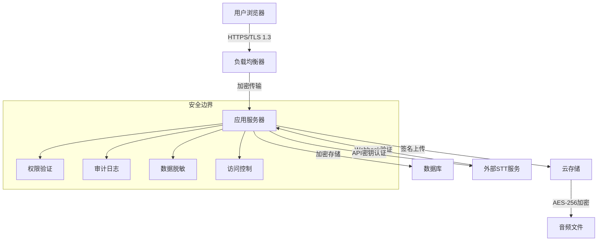

# 06 - 安全与隐私设计

## 安全架构概览

Meeting Minutes功能处理敏感的音频数据和会议内容，必须实施端到端的安全保护措施，确保数据在传输、存储和处理过程中的安全性。



## 数据分类与保护等级

### 数据敏感度分级

```typescript
enum DataSensitivityLevel {
  PUBLIC = 'public',           // 公开数据（会议标题、参与者姓名）
  INTERNAL = 'internal',       // 内部数据（会议元数据、统计信息）
  CONFIDENTIAL = 'confidential', // 机密数据（转写内容、录音片段）
  RESTRICTED = 'restricted'    // 限制数据（完整录音文件、原始音频）
}

interface DataClassification {
  level: DataSensitivityLevel;
  retentionPeriod: number; // 保留期限（天）
  encryptionRequired: boolean;
  accessLogging: boolean;
  piiScrubbing: boolean;
  geolocationRestriction?: string[];
}

const dataClassificationRules: Record<string, DataClassification> = {
  'meeting_metadata': {
    level: DataSensitivityLevel.INTERNAL,
    retentionPeriod: 2555, // 7年
    encryptionRequired: false,
    accessLogging: true,
    piiScrubbing: false
  },
  'audio_recording': {
    level: DataSensitivityLevel.RESTRICTED,
    retentionPeriod: 90, // 3个月
    encryptionRequired: true,
    accessLogging: true,
    piiScrubbing: false,
    geolocationRestriction: ['US', 'EU']
  },
  'transcript_content': {
    level: DataSensitivityLevel.CONFIDENTIAL,
    retentionPeriod: 365, // 1年
    encryptionRequired: true,
    accessLogging: true,
    piiScrubbing: true
  }
};
```

## 身份认证与授权

### 多层授权模型

```typescript
// server/auth/AuthorizationService.ts
export class MeetingAuthorizationService {
  private rbac: RBACService;
  private abac: ABACService;

  constructor(rbac: RBACService, abac: ABACService) {
    this.rbac = rbac;
    this.abac = abac;
  }

  // 多层权限检查
  async checkAccess(
    user: User,
    resource: MeetingResource,
    action: Action,
    context?: AccessContext
  ): Promise<AuthorizationResult> {
    // 1. 基础角色权限检查 (RBAC)
    const roleCheck = await this.rbac.checkPermission(
      user.role,
      resource.type,
      action
    );

    if (!roleCheck.granted) {
      return { granted: false, reason: 'Insufficient role permissions' };
    }

    // 2. 属性基础权限检查 (ABAC)
    const attributeCheck = await this.abac.checkPermission({
      subject: user,
      resource: resource,
      action: action,
      environment: context
    });

    if (!attributeCheck.granted) {
      return { granted: false, reason: attributeCheck.reason };
    }

    // 3. 业务规则检查
    const businessRuleCheck = await this.checkBusinessRules(
      user, resource, action, context
    );

    return businessRuleCheck;
  }

  private async checkBusinessRules(
    user: User,
    resource: MeetingResource,
    action: Action,
    context?: AccessContext
  ): Promise<AuthorizationResult> {
    switch (resource.type) {
      case 'meeting':
        return this.checkMeetingAccess(user, resource as Meeting, action);
      
      case 'recording':
        return this.checkRecordingAccess(user, resource as Recording, action);
      
      case 'transcript':
        return this.checkTranscriptAccess(user, resource as Transcript, action);
      
      default:
        return { granted: false, reason: 'Unknown resource type' };
    }
  }

  private async checkMeetingAccess(
    user: User,
    meeting: Meeting,
    action: Action
  ): Promise<AuthorizationResult> {
    // 团队成员检查
    if (meeting.teamId !== user.teamId) {
      return { granted: false, reason: 'User not in meeting team' };
    }

    // 参与者检查
    const isParticipant = await this.isParticipant(user.id, meeting.id);
    const isOrganizer = meeting.createdById === user.id;
    const isAdmin = user.role === 'admin';

    switch (action) {
      case 'read':
        return { 
          granted: isParticipant || isAdmin,
          reason: isParticipant || isAdmin ? null : 'Not a meeting participant'
        };

      case 'edit':
        return {
          granted: isOrganizer || isAdmin,
          reason: isOrganizer || isAdmin ? null : 'Only organizer can edit'
        };

      case 'delete':
        return {
          granted: isOrganizer || isAdmin,
          reason: isOrganizer || isAdmin ? null : 'Only organizer can delete'
        };

      case 'start_recording':
        // 只有会议进行中且用户是参与者才能录音
        const canRecord = meeting.status === 'in_progress' && 
                          (isParticipant || isAdmin);
        return {
          granted: canRecord,
          reason: canRecord ? null : 'Cannot record in current meeting state'
        };

      default:
        return { granted: false, reason: 'Unknown action' };
    }
  }

  private async checkRecordingAccess(
    user: User,
    recording: Recording,
    action: Action
  ): Promise<AuthorizationResult> {
    // 先检查关联会议的权限
    const meeting = await Meeting.findByPk(recording.meetingId);
    if (!meeting) {
      return { granted: false, reason: 'Meeting not found' };
    }

    const meetingAccess = await this.checkMeetingAccess(user, meeting, 'read');
    if (!meetingAccess.granted) {
      return meetingAccess;
    }

    // 录音特定权限检查
    switch (action) {
      case 'download':
        // 只有管理员或会议组织者可以下载原始录音
        return {
          granted: user.role === 'admin' || meeting.createdById === user.id,
          reason: user.role === 'admin' || meeting.createdById === user.id ? 
                  null : 'Only admin or organizer can download recordings'
        };

      case 'delete':
        // 录音删除需要额外权限
        const retentionPeriod = 90 * 24 * 60 * 60 * 1000; // 90天
        const isExpired = Date.now() - recording.createdAt.getTime() > retentionPeriod;
        
        return {
          granted: (user.role === 'admin' || meeting.createdById === user.id) && isExpired,
          reason: !isExpired ? 'Recording still within retention period' : null
        };

      default:
        return { granted: true };
    }
  }

  private async isParticipant(userId: string, meetingId: string): Promise<boolean> {
    const participant = await MeetingParticipant.findOne({
      where: { meetingId, userId }
    });
    return !!participant;
  }
}
```

### JWT令牌安全

```typescript
// server/auth/TokenService.ts
export class SecureTokenService {
  private readonly JWT_SECRET: string;
  private readonly TOKEN_EXPIRY = '1h';
  private readonly REFRESH_TOKEN_EXPIRY = '30d';

  constructor() {
    this.JWT_SECRET = process.env.JWT_SECRET;
    if (!this.JWT_SECRET || this.JWT_SECRET.length < 32) {
      throw new Error('JWT_SECRET must be at least 32 characters');
    }
  }

  // 生成访问令牌
  generateAccessToken(user: User, permissions: Permission[]): string {
    const payload: JWTPayload = {
      sub: user.id,
      aud: 'meeting-minutes',
      iss: 'outline',
      iat: Math.floor(Date.now() / 1000),
      exp: Math.floor(Date.now() / 1000) + 3600, // 1小时
      scope: permissions.map(p => `${p.resource}:${p.action}`).join(' '),
      team: user.teamId,
      role: user.role
    };

    return jwt.sign(payload, this.JWT_SECRET, { algorithm: 'HS256' });
  }

  // 验证令牌
  async verifyToken(token: string): Promise<JWTPayload> {
    try {
      const payload = jwt.verify(token, this.JWT_SECRET, {
        algorithms: ['HS256'],
        audience: 'meeting-minutes',
        issuer: 'outline'
      }) as JWTPayload;

      // 检查令牌是否被撤销
      const isRevoked = await this.isTokenRevoked(payload.jti);
      if (isRevoked) {
        throw new Error('Token has been revoked');
      }

      return payload;
    } catch (error) {
      throw new UnauthorizedError('Invalid or expired token');
    }
  }

  // 撤销令牌
  async revokeToken(tokenId: string): Promise<void> {
    await RevokedToken.create({
      tokenId,
      revokedAt: new Date(),
      reason: 'manual_revocation'
    });
  }

  private async isTokenRevoked(tokenId?: string): Promise<boolean> {
    if (!tokenId) return false;
    
    const revokedToken = await RevokedToken.findOne({
      where: { tokenId }
    });
    
    return !!revokedToken;
  }
}
```

## 数据加密

### 静态数据加密

```typescript
// server/encryption/EncryptionService.ts
export class EncryptionService {
  private readonly ENCRYPTION_KEY: Buffer;
  private readonly ALGORITHM = 'aes-256-gcm';
  private readonly KEY_DERIVATION_ITERATIONS = 100000;

  constructor() {
    // 从环境变量或密钥管理系统获取主密钥
    const masterKey = process.env.ENCRYPTION_MASTER_KEY;
    if (!masterKey) {
      throw new Error('ENCRYPTION_MASTER_KEY is required');
    }
    
    // 使用PBKDF2派生加密密钥
    this.ENCRYPTION_KEY = crypto.pbkdf2Sync(
      masterKey,
      'meeting-minutes-salt',
      this.KEY_DERIVATION_ITERATIONS,
      32,
      'sha256'
    );
  }

  // 加密数据
  encrypt(plaintext: string | Buffer): EncryptedData {
    const iv = crypto.randomBytes(16); // 初始化向量
    const cipher = crypto.createCipher(this.ALGORITHM, this.ENCRYPTION_KEY, iv);
    
    const plaintextBuffer = Buffer.isBuffer(plaintext) ? 
                           plaintext : 
                           Buffer.from(plaintext, 'utf8');
    
    const encrypted = Buffer.concat([
      cipher.update(plaintextBuffer),
      cipher.final()
    ]);
    
    const authTag = cipher.getAuthTag();
    
    return {
      algorithm: this.ALGORITHM,
      iv: iv.toString('hex'),
      authTag: authTag.toString('hex'),
      encrypted: encrypted.toString('hex')
    };
  }

  // 解密数据
  decrypt(encryptedData: EncryptedData): Buffer {
    const iv = Buffer.from(encryptedData.iv, 'hex');
    const authTag = Buffer.from(encryptedData.authTag, 'hex');
    const encrypted = Buffer.from(encryptedData.encrypted, 'hex');
    
    const decipher = crypto.createDecipher(this.ALGORITHM, this.ENCRYPTION_KEY, iv);
    decipher.setAuthTag(authTag);
    
    const decrypted = Buffer.concat([
      decipher.update(encrypted),
      decipher.final()
    ]);
    
    return decrypted;
  }

  // 加密音频文件
  async encryptAudioFile(filePath: string): Promise<EncryptedAudioFile> {
    const fileBuffer = await fs.promises.readFile(filePath);
    const encrypted = this.encrypt(fileBuffer);
    
    // 生成加密文件路径
    const encryptedPath = `${filePath}.enc`;
    
    // 保存加密数据
    await fs.promises.writeFile(encryptedPath, JSON.stringify(encrypted));
    
    // 删除原文件
    await fs.promises.unlink(filePath);
    
    return {
      originalSize: fileBuffer.length,
      encryptedPath,
      checksum: crypto.createHash('sha256').update(fileBuffer).digest('hex')
    };
  }

  // 解密音频文件
  async decryptAudioFile(encryptedPath: string): Promise<Buffer> {
    const encryptedData = JSON.parse(
      await fs.promises.readFile(encryptedPath, 'utf8')
    ) as EncryptedData;
    
    return this.decrypt(encryptedData);
  }
}
```

### 传输中数据加密

```typescript
// server/middleware/encryption.ts
export const encryptionMiddleware = () => async (ctx: Context, next: Next) => {
  // 确保HTTPS连接
  if (process.env.NODE_ENV === 'production' && ctx.protocol !== 'https') {
    ctx.throw(426, 'Upgrade Required', {
      headers: { 'Upgrade': 'TLS/1.3' }
    });
  }

  // 设置安全头
  ctx.set({
    'Strict-Transport-Security': 'max-age=31536000; includeSubDomains; preload',
    'X-Content-Type-Options': 'nosniff',
    'X-Frame-Options': 'DENY',
    'X-XSS-Protection': '1; mode=block',
    'Referrer-Policy': 'strict-origin-when-cross-origin',
    'Content-Security-Policy': [
      "default-src 'self'",
      "script-src 'self' 'unsafe-inline'",
      "style-src 'self' 'unsafe-inline'",
      "img-src 'self' data: https:",
      "connect-src 'self' wss: https:",
      "media-src 'self' blob:",
      "worker-src 'self' blob:"
    ].join('; ')
  });

  await next();
};
```

## 个人信息保护 (PII)

### PII识别与脱敏

```typescript
// server/privacy/PIIProcessor.ts
export class PIIProcessor {
  private sensitivePatterns: SensitivePattern[] = [
    {
      name: 'credit_card',
      pattern: /\b\d{4}[\s-]?\d{4}[\s-]?\d{4}[\s-]?\d{4}\b/g,
      replacement: '[CREDIT CARD]',
      confidence: 0.95
    },
    {
      name: 'social_security',
      pattern: /\b\d{3}-\d{2}-\d{4}\b/g,
      replacement: '[SSN]',
      confidence: 0.98
    },
    {
      name: 'email',
      pattern: /\b[A-Za-z0-9._%+-]+@[A-Za-z0-9.-]+\.[A-Z|a-z]{2,}\b/g,
      replacement: '[EMAIL]',
      confidence: 0.90
    },
    {
      name: 'phone',
      pattern: /\b(?:\+?1[-.\s]?)?\(?[0-9]{3}\)?[-.\s]?[0-9]{3}[-.\s]?[0-9]{4}\b/g,
      replacement: '[PHONE]',
      confidence: 0.85
    },
    {
      name: 'chinese_id',
      pattern: /\b\d{17}[\dXx]\b/g,
      replacement: '[身份证]',
      confidence: 0.95
    },
    {
      name: 'chinese_phone',
      pattern: /\b1[3-9]\d{9}\b/g,
      replacement: '[手机号]',
      confidence: 0.90
    }
  ];

  async scrubTranscript(
    transcript: Transcript,
    options: ScrubOptions = {}
  ): Promise<ScrubResult> {
    const segments = await transcript.getSegments();
    const scrubbedSegments: TranscriptSegment[] = [];
    const detectedPII: PIIDetection[] = [];

    for (const segment of segments) {
      const scrubResult = await this.scrubText(segment.text, options);
      
      scrubbedSegments.push({
        ...segment,
        text: scrubResult.scrubbedText,
        piiDetected: scrubResult.detections.length > 0,
        originalTextHash: scrubResult.detections.length > 0 ? 
                         crypto.createHash('sha256').update(segment.text).digest('hex') : 
                         null
      });
      
      detectedPII.push(...scrubResult.detections.map(d => ({
        ...d,
        segmentId: segment.id,
        timestamp: segment.startTime
      })));
    }

    // 更新转写记录
    await TranscriptSegment.destroy({ where: { transcriptId: transcript.id } });
    await TranscriptSegment.bulkCreate(scrubbedSegments);

    // 记录PII检测结果
    if (detectedPII.length > 0) {
      await PIIDetectionLog.create({
        transcriptId: transcript.id,
        detections: detectedPII,
        scrubDate: new Date(),
        processingOptions: options
      });
    }

    return {
      originalSegmentCount: segments.length,
      scrubbedSegmentCount: scrubbedSegments.length,
      piiDetectionCount: detectedPII.length,
      detectedCategories: [...new Set(detectedPII.map(d => d.type))]
    };
  }

  private async scrubText(
    text: string,
    options: ScrubOptions
  ): Promise<TextScrubResult> {
    let scrubbedText = text;
    const detections: PIIDetection[] = [];

    for (const pattern of this.sensitivePatterns) {
      // 跳过不需要处理的模式
      if (options.skipPatterns?.includes(pattern.name)) {
        continue;
      }

      const matches = text.matchAll(pattern.pattern);
      
      for (const match of matches) {
        if (match.index !== undefined) {
          // 应用置信度阈值
          if (pattern.confidence < (options.confidenceThreshold || 0.8)) {
            continue;
          }

          detections.push({
            type: pattern.name,
            originalText: match[0],
            position: match.index,
            length: match[0].length,
            confidence: pattern.confidence,
            replacement: pattern.replacement
          });

          // 替换敏感信息
          scrubbedText = scrubbedText.replace(match[0], pattern.replacement);
        }
      }
    }

    return { scrubbedText, detections };
  }

  // 高级PII检测 (使用机器学习)
  async detectAdvancedPII(text: string): Promise<PIIDetection[]> {
    // 这里可以集成外部NLP服务进行更高级的PII检测
    // 例如AWS Comprehend, Azure Text Analytics等
    
    try {
      const response = await fetch('https://api.comprehend.aws.com/detect-pii', {
        method: 'POST',
        headers: {
          'Authorization': `AWS4-HMAC-SHA256 ${this.getAWSSignature()}`,
          'Content-Type': 'application/json'
        },
        body: JSON.stringify({
          Text: text,
          LanguageCode: 'en'
        })
      });

      const result = await response.json();
      
      return result.Entities?.map((entity: any) => ({
        type: entity.Type.toLowerCase(),
        originalText: text.substring(entity.BeginOffset, entity.EndOffset),
        position: entity.BeginOffset,
        length: entity.EndOffset - entity.BeginOffset,
        confidence: entity.Score,
        replacement: `[${entity.Type}]`
      })) || [];

    } catch (error) {
      console.warn('Advanced PII detection failed, falling back to pattern matching', error);
      return [];
    }
  }
}
```

## 审计日志

### 全面审计追踪

```typescript
// server/audit/AuditLogger.ts
export class AuditLogger {
  private auditStore: AuditStore;
  private encryptionService: EncryptionService;

  constructor(auditStore: AuditStore, encryptionService: EncryptionService) {
    this.auditStore = auditStore;
    this.encryptionService = encryptionService;
  }

  // 记录访问事件
  async logAccess(event: AccessEvent): Promise<void> {
    const auditEntry: AuditEntry = {
      id: uuidv4(),
      timestamp: new Date(),
      eventType: 'access',
      userId: event.userId,
      resourceType: event.resourceType,
      resourceId: event.resourceId,
      action: event.action,
      result: event.result,
      ipAddress: this.anonymizeIP(event.ipAddress),
      userAgent: event.userAgent,
      sessionId: event.sessionId,
      details: {
        permissions: event.permissions,
        accessMethod: event.accessMethod,
        duration: event.duration
      },
      riskScore: await this.calculateRiskScore(event),
      complianceFlags: this.getComplianceFlags(event)
    };

    // 加密敏感审计数据
    if (this.isSensitiveAuditData(auditEntry)) {
      auditEntry.encryptedDetails = this.encryptionService.encrypt(
        JSON.stringify(auditEntry.details)
      );
      delete auditEntry.details;
    }

    await this.auditStore.save(auditEntry);
    
    // 实时风险分析
    if (auditEntry.riskScore > 0.8) {
      await this.triggerSecurityAlert(auditEntry);
    }
  }

  // 记录数据修改事件
  async logDataModification(event: DataModificationEvent): Promise<void> {
    const auditEntry: AuditEntry = {
      id: uuidv4(),
      timestamp: new Date(),
      eventType: 'data_modification',
      userId: event.userId,
      resourceType: event.resourceType,
      resourceId: event.resourceId,
      action: event.action,
      result: 'success',
      ipAddress: this.anonymizeIP(event.ipAddress),
      details: {
        fieldChanges: event.changes.map(change => ({
          field: change.field,
          oldValueHash: change.oldValue ? 
                       crypto.createHash('sha256').update(change.oldValue).digest('hex') : 
                       null,
          newValueHash: change.newValue ? 
                       crypto.createHash('sha256').update(change.newValue).digest('hex') : 
                       null,
          changeType: change.type
        })),
        changeReason: event.reason,
        approvalRequired: event.approvalRequired
      },
      dataClassification: event.dataClassification,
      retentionPeriod: this.getRetentionPeriod(event.resourceType)
    };

    await this.auditStore.save(auditEntry);
  }

  // 记录PII访问
  async logPIIAccess(event: PIIAccessEvent): Promise<void> {
    const auditEntry: AuditEntry = {
      id: uuidv4(),
      timestamp: new Date(),
      eventType: 'pii_access',
      userId: event.userId,
      resourceType: event.resourceType,
      resourceId: event.resourceId,
      action: event.action,
      result: event.result,
      ipAddress: this.anonymizeIP(event.ipAddress),
      details: {
        piiTypes: event.piiTypes,
        accessPurpose: event.purpose,
        legalBasis: event.legalBasis,
        dataSubject: event.dataSubject
      },
      complianceFlags: ['GDPR', 'CCPA'],
      retentionPeriod: 2557 // 7年法定保留期
    };

    await this.auditStore.save(auditEntry);
    
    // GDPR合规：通知数据主体
    if (event.notifyDataSubject) {
      await this.notifyDataSubject(event.dataSubject, auditEntry);
    }
  }

  // 安全事件记录
  async logSecurityEvent(event: SecurityEvent): Promise<void> {
    const auditEntry: AuditEntry = {
      id: uuidv4(),
      timestamp: new Date(),
      eventType: 'security_event',
      userId: event.userId,
      action: event.eventType,
      result: 'security_violation',
      ipAddress: event.ipAddress,
      userAgent: event.userAgent,
      details: {
        threatType: event.threatType,
        severity: event.severity,
        mitigationActions: event.mitigationActions,
        attackSignature: event.attackSignature
      },
      riskScore: event.riskScore,
      alertSent: true
    };

    await this.auditStore.save(auditEntry);
    
    // 立即发送安全告警
    await this.sendSecurityAlert(auditEntry);
  }

  // IP地址匿名化 (符合GDPR)
  private anonymizeIP(ipAddress: string): string {
    if (!ipAddress) return 'unknown';
    
    // IPv4: 保留前3个八位组，最后一个置0
    if (ipAddress.includes('.')) {
      const parts = ipAddress.split('.');
      return `${parts[0]}.${parts[1]}.${parts[2]}.0`;
    }
    
    // IPv6: 保留前48位，后80位置0
    if (ipAddress.includes(':')) {
      const parts = ipAddress.split(':');
      return `${parts.slice(0, 3).join(':')}::`;
    }
    
    return 'unknown';
  }

  // 风险评分计算
  private async calculateRiskScore(event: AccessEvent): Promise<number> {
    let riskScore = 0;

    // 基础风险因子
    const riskFactors = {
      offHoursAccess: this.isOffHours(event.timestamp) ? 0.2 : 0,
      unusualLocation: await this.isUnusualLocation(event.userId, event.ipAddress) ? 0.3 : 0,
      privilegedAccess: event.action === 'delete' ? 0.2 : 0,
      sensitiveResource: event.resourceType === 'recording' ? 0.3 : 0,
      multipleFailedAttempts: await this.hasRecentFailedAttempts(event.userId) ? 0.4 : 0
    };

    riskScore = Object.values(riskFactors).reduce((sum, factor) => sum + factor, 0);
    
    // 确保风险评分在0-1之间
    return Math.min(riskScore, 1.0);
  }

  // 合规标识
  private getComplianceFlags(event: AccessEvent): string[] {
    const flags: string[] = [];
    
    if (event.resourceType === 'transcript' || event.resourceType === 'recording') {
      flags.push('GDPR', 'CCPA');
    }
    
    if (event.action === 'export' || event.action === 'download') {
      flags.push('DATA_EXPORT');
    }
    
    return flags;
  }

  // 检查工作时间
  private isOffHours(timestamp: Date): boolean {
    const hour = timestamp.getHours();
    const day = timestamp.getDay();
    
    // 工作日 9-17点之外，或周末
    return hour < 9 || hour > 17 || day === 0 || day === 6;
  }

  // 异常地理位置检测
  private async isUnusualLocation(userId: string, ipAddress: string): Promise<boolean> {
    const recentLocations = await this.auditStore.getRecentLocations(userId, 30); // 30天内
    const currentLocation = await this.getLocationFromIP(ipAddress);
    
    if (recentLocations.length === 0) return false;
    
    // 计算与常用位置的距离
    const distances = recentLocations.map(loc => 
      this.calculateDistance(loc, currentLocation)
    );
    
    const minDistance = Math.min(...distances);
    return minDistance > 1000; // 超过1000公里认为是异常位置
  }
}
```

## 数据保留与清理

### 自动化数据生命周期管理

```typescript
// server/retention/DataRetentionService.ts
export class DataRetentionService {
  private retentionPolicies: Map<string, RetentionPolicy> = new Map();
  private cleanupScheduler: CronJob;

  constructor() {
    this.initializeRetentionPolicies();
    this.scheduleCleanupJobs();
  }

  private initializeRetentionPolicies() {
    // 音频录音保留策略
    this.retentionPolicies.set('audio_recording', {
      retentionPeriod: 90, // 90天
      gracePerior: 7, // 7天宽限期
      archiveBeforeDelete: true,
      anonymizeBeforeDelete: true,
      notifyBeforeDelete: true,
      legalHoldSupport: true
    });

    // 转写内容保留策略
    this.retentionPolicies.set('transcript', {
      retentionPeriod: 365, // 1年
      gracePerior: 30, // 30天宽限期
      archiveBeforeDelete: true,
      anonymizeBeforeDelete: true,
      notifyBeforeDelete: false,
      legalHoldSupport: true
    });

    // 审计日志保留策略
    this.retentionPolicies.set('audit_log', {
      retentionPeriod: 2555, // 7年
      gracePerior: 0,
      archiveBeforeDelete: true,
      anonymizeBeforeDelete: false, // 审计日志不匿名化
      notifyBeforeDelete: false,
      legalHoldSupport: true
    });
  }

  // 执行数据清理
  async executeCleanup(): Promise<CleanupResult> {
    const results: CleanupResult = {
      recordsProcessed: 0,
      recordsDeleted: 0,
      recordsArchived: 0,
      recordsAnonymized: 0,
      errors: []
    };

    for (const [dataType, policy] of this.retentionPolicies) {
      try {
        const typeResult = await this.cleanupDataType(dataType, policy);
        results.recordsProcessed += typeResult.recordsProcessed;
        results.recordsDeleted += typeResult.recordsDeleted;
        results.recordsArchived += typeResult.recordsArchived;
        results.recordsAnonymized += typeResult.recordsAnonymized;
      } catch (error) {
        results.errors.push({
          dataType,
          error: error.message
        });
      }
    }

    // 记录清理结果
    await this.logCleanupResult(results);
    
    return results;
  }

  private async cleanupDataType(
    dataType: string,
    policy: RetentionPolicy
  ): Promise<CleanupResult> {
    const cutoffDate = new Date();
    cutoffDate.setDate(cutoffDate.getDate() - policy.retentionPeriod);

    const result: CleanupResult = {
      recordsProcessed: 0,
      recordsDeleted: 0,
      recordsArchived: 0,
      recordsAnonymized: 0,
      errors: []
    };

    switch (dataType) {
      case 'audio_recording':
        return await this.cleanupRecordings(cutoffDate, policy);
      
      case 'transcript':
        return await this.cleanupTranscripts(cutoffDate, policy);
      
      case 'audit_log':
        return await this.cleanupAuditLogs(cutoffDate, policy);
      
      default:
        throw new Error(`Unknown data type: ${dataType}`);
    }
  }

  private async cleanupRecordings(
    cutoffDate: Date,
    policy: RetentionPolicy
  ): Promise<CleanupResult> {
    const result: CleanupResult = {
      recordsProcessed: 0,
      recordsDeleted: 0,
      recordsArchived: 0,
      recordsAnonymized: 0,
      errors: []
    };

    // 查找过期的录音
    const expiredRecordings = await Recording.findAll({
      where: {
        createdAt: { [Op.lt]: cutoffDate },
        retentionStatus: { [Op.ne]: 'legal_hold' } // 排除法律保留
      },
      include: [{ model: Meeting, as: 'meeting' }]
    });

    for (const recording of expiredRecordings) {
      try {
        result.recordsProcessed++;

        // 发送删除通知
        if (policy.notifyBeforeDelete) {
          await this.sendDeletionNotice(recording);
        }

        // 归档处理
        if (policy.archiveBeforeDelete) {
          await this.archiveRecording(recording);
          result.recordsArchived++;
        }

        // 从存储中删除音频文件
        await this.deleteAudioFile(recording.storageUri);

        // 更新数据库记录
        await recording.update({
          storageUri: null,
          retentionStatus: 'deleted',
          deletedAt: new Date(),
          deletedReason: 'retention_policy'
        });

        result.recordsDeleted++;

      } catch (error) {
        result.errors.push({
          recordId: recording.id,
          error: error.message
        });
      }
    }

    return result;
  }

  private async archiveRecording(recording: Recording): Promise<void> {
    const archiveData = {
      recordingId: recording.id,
      meetingId: recording.meetingId,
      originalSize: recording.fileSize,
      duration: recording.duration,
      createdAt: recording.createdAt,
      participants: recording.meeting?.participants?.map(p => ({
        displayName: p.displayName,
        isOrganizer: p.isOrganizer
      })) || [],
      archivedAt: new Date(),
      archiveReason: 'retention_policy'
    };

    // 保存归档元数据
    await ArchivedRecording.create(archiveData);

    // 可选：上传到长期存储（如Glacier）
    await this.moveToLongTermStorage(recording);
  }

  // 法律保留处理
  async applyLegalHold(resourceType: string, resourceId: string, reason: string): Promise<void> {
    const legalHold = await LegalHold.create({
      resourceType,
      resourceId,
      reason,
      appliedAt: new Date(),
      appliedBy: 'system', // 或具体的用户ID
      status: 'active'
    });

    // 更新相关资源的保留状态
    await this.updateRetentionStatus(resourceType, resourceId, 'legal_hold');

    // 通知相关人员
    await this.notifyLegalHold(legalHold);
  }

  // 移除法律保留
  async removeLegalHold(legalHoldId: string): Promise<void> {
    const legalHold = await LegalHold.findByPk(legalHoldId);
    if (!legalHold) {
      throw new Error('Legal hold not found');
    }

    await legalHold.update({
      status: 'released',
      releasedAt: new Date()
    });

    // 恢复正常的保留状态
    await this.updateRetentionStatus(
      legalHold.resourceType,
      legalHold.resourceId,
      'normal'
    );
  }

  // 定期清理任务
  private scheduleCleanupJobs(): void {
    // 每天凌晨2点执行清理
    this.cleanupScheduler = new CronJob('0 2 * * *', async () => {
      try {
        const result = await this.executeCleanup();
        console.log('Data retention cleanup completed:', result);
      } catch (error) {
        console.error('Data retention cleanup failed:', error);
      }
    });

    this.cleanupScheduler.start();
  }
}
```

## 合规性设计

### GDPR合规实现

```typescript
// server/compliance/GDPRCompliance.ts
export class GDPRComplianceService {
  private auditLogger: AuditLogger;
  private encryptionService: EncryptionService;

  constructor(auditLogger: AuditLogger, encryptionService: EncryptionService) {
    this.auditLogger = auditLogger;
    this.encryptionService = encryptionService;
  }

  // 数据主体访问权（Right of Access）
  async handleSubjectAccessRequest(request: SubjectAccessRequest): Promise<SubjectAccessResponse> {
    // 验证数据主体身份
    await this.verifyDataSubjectIdentity(request);

    // 记录访问请求
    await this.auditLogger.logPIIAccess({
      userId: 'data_subject',
      resourceType: 'personal_data',
      resourceId: request.subjectId,
      action: 'access_request',
      result: 'success',
      purpose: 'gdpr_access_right',
      legalBasis: 'consent',
      dataSubject: request.subjectId,
      piiTypes: ['transcript', 'recording_metadata'],
      notifyDataSubject: false,
      ipAddress: request.ipAddress,
      timestamp: new Date()
    });

    // 收集个人数据
    const personalData = await this.collectPersonalData(request.subjectId);

    // 生成访问报告
    return {
      requestId: request.id,
      subjectId: request.subjectId,
      processedAt: new Date(),
      dataCategories: personalData.categories,
      processingPurposes: personalData.purposes,
      retentionPeriods: personalData.retentionPeriods,
      thirdPartyRecipients: personalData.recipients,
      dataTransfers: personalData.transfers,
      personalDataExport: await this.exportPersonalData(personalData),
      rights: {
        rectification: true,
        erasure: true,
        portability: true,
        restriction: true,
        objection: true
      }
    };
  }

  // 数据删除权（Right to Erasure）
  async handleErasureRequest(request: ErasureRequest): Promise<ErasureResponse> {
    await this.verifyDataSubjectIdentity(request);

    const erasureResult: ErasureResponse = {
      requestId: request.id,
      subjectId: request.subjectId,
      processedAt: new Date(),
      itemsErased: [],
      itemsRetained: [],
      thirdPartyNotifications: []
    };

    // 查找相关的个人数据
    const personalDataItems = await this.findPersonalDataItems(request.subjectId);

    for (const item of personalDataItems) {
      // 检查删除限制
      const canErase = await this.canEraseData(item);
      
      if (canErase.allowed) {
        try {
          await this.eraseDataItem(item);
          erasureResult.itemsErased.push({
            type: item.type,
            id: item.id,
            erasedAt: new Date()
          });
        } catch (error) {
          erasureResult.itemsRetained.push({
            type: item.type,
            id: item.id,
            reason: error.message
          });
        }
      } else {
        erasureResult.itemsRetained.push({
          type: item.type,
          id: item.id,
          reason: canErase.reason
        });
      }
    }

    // 通知第三方
    for (const recipient of this.getThirdPartyRecipients(request.subjectId)) {
      try {
        await this.notifyThirdPartyErasure(recipient, request.subjectId);
        erasureResult.thirdPartyNotifications.push({
          recipient: recipient.name,
          notifiedAt: new Date(),
          status: 'success'
        });
      } catch (error) {
        erasureResult.thirdPartyNotifications.push({
          recipient: recipient.name,
          status: 'failed',
          error: error.message
        });
      }
    }

    // 记录删除操作
    await this.auditLogger.logDataModification({
      userId: 'data_subject',
      resourceType: 'personal_data',
      resourceId: request.subjectId,
      action: 'erasure',
      changes: erasureResult.itemsErased.map(item => ({
        field: item.type,
        oldValue: 'present',
        newValue: 'erased',
        type: 'deletion'
      })),
      reason: 'gdpr_erasure_right',
      dataClassification: DataSensitivityLevel.CONFIDENTIAL,
      ipAddress: request.ipAddress,
      timestamp: new Date()
    });

    return erasureResult;
  }

  // 数据可携带权（Right to Data Portability）
  async handlePortabilityRequest(request: PortabilityRequest): Promise<PortabilityResponse> {
    await this.verifyDataSubjectIdentity(request);

    const personalData = await this.collectPortableData(request.subjectId);
    
    // 生成标准格式的数据导出
    const exportData = await this.formatPortableData(personalData, request.format);

    // 生成安全下载链接
    const downloadLink = await this.generateSecureDownloadLink(exportData, {
      expiresIn: 72 * 60 * 60 * 1000, // 72小时
      maxDownloads: 3,
      requireAuthentication: true
    });

    return {
      requestId: request.id,
      subjectId: request.subjectId,
      processedAt: new Date(),
      format: request.format,
      downloadLink: downloadLink,
      expiresAt: new Date(Date.now() + 72 * 60 * 60 * 1000),
      dataDescription: {
        categories: personalData.categories,
        timeRange: personalData.timeRange,
        recordCount: personalData.recordCount
      }
    };
  }

  private async collectPersonalData(subjectId: string): Promise<PersonalDataCollection> {
    const data: PersonalDataCollection = {
      categories: [],
      purposes: [],
      retentionPeriods: [],
      recipients: [],
      transfers: []
    };

    // 收集会议参与记录
    const participations = await MeetingParticipant.findAll({
      where: { 
        [Op.or]: [
          { userId: subjectId },
          { displayName: { [Op.like]: `%${subjectId}%` } }
        ]
      },
      include: [{ model: Meeting, as: 'meeting' }]
    });

    if (participations.length > 0) {
      data.categories.push({
        category: 'Meeting Participation',
        description: 'Records of meeting attendance and participation',
        dataItems: participations.map(p => ({
          id: p.id,
          type: 'meeting_participant',
          createdAt: p.createdAt,
          data: {
            meetingTitle: p.meeting.title,
            displayName: p.displayName,
            isOrganizer: p.isOrganizer
          }
        }))
      });
    }

    // 收集转写提及记录
    const transcriptMentions = await this.findTranscriptMentions(subjectId);
    if (transcriptMentions.length > 0) {
      data.categories.push({
        category: 'Transcript Mentions',
        description: 'Mentions in meeting transcripts',
        dataItems: transcriptMentions
      });
    }

    return data;
  }
}
```

这个安全与隐私设计确保了Meeting Minutes功能在处理敏感数据时符合国际数据保护标准，提供了全面的安全保护措施。