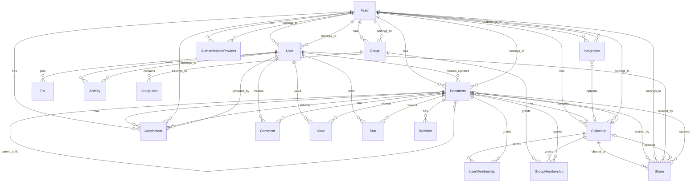

# 领域模型总览（Domain Model Overview）

本模型基于 `server/models/` 的 Sequelize 定义抽取，描述知识库（Outline）核心实体与关系。

## 概览
- **组织与成员**：`Team`、`User`、`Group`
- **知识结构**：`Collection`（文集）与 `Document`（文档）、`Revision`（版本）
- **权限与分享**：`UserMembership`、`GroupMembership`、`Share`、`User.role`、`Collection.permission`、`Document` 级授权
- **交互与协作**：`Comment`、`View`、`Star`、`Pin`、`Attachment`
- **集成与鉴权**：`ApiKey`、`AuthenticationProvider`、`Integration`

## ER 图

## 关键领域规则
- **用户角色（`User.role`）**：`Admin`、`Member`、`Viewer`、`Guest` 影响默认权限与可见性（见 `server/models/User.ts`）。
- **集合可见性（`Collection.permission`）**：`null` 表示私有（仅成员可见）；否则为工作区级 `Read/ReadWrite/Admin`。（见 `server/models/Collection.ts`）
- **授权分层**：集合级与文档级均可通过 `UserMembership` 与 `GroupMembership` 赋权，文档继承/复制父文档授权（见 `Document.publish()`）。
- **文档结构**：`Collection.documentStructure` 保存树形导航（`NavigationNode[]`），文档发布/更新时同步（见 `Collection.updateDocument`、`Document.addDocumentToCollectionStructure`）。
- **分享（Share）**：支持集合/文档分享、可选自定义 `domain`、`urlId`，撤销通过 `revoke()`（`server/models/Share.ts`）。
- **修订（Revision）**：记录文档历史状态，便于还原（`Revision.buildFromDocument`）。
- **互动计数**：`View.count` 累加浏览，`Star`、`Pin` 用于个人化标记。

## 本体边界
- 本体优先覆盖核心知识协作语义；运维脚本、构建、前端呈现细节不在本体范围内。
- 权限策略与事件流（`Event`）作为支撑域在关系中被引用，但不展开实现细节。
