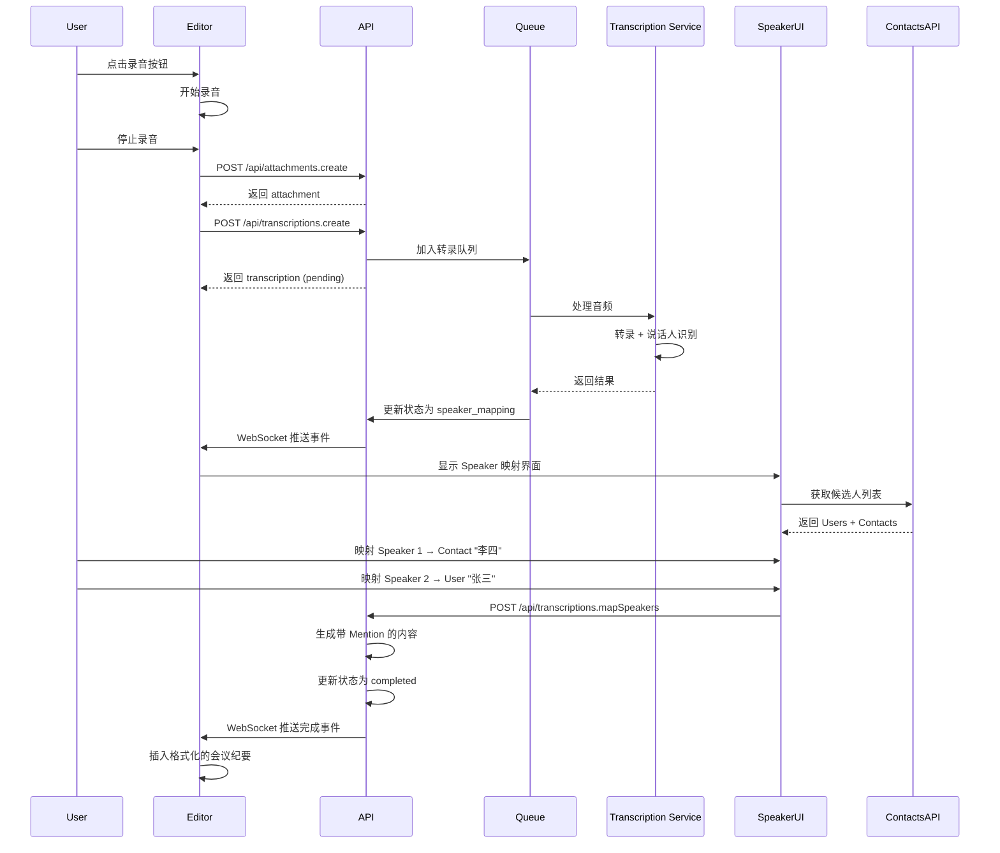
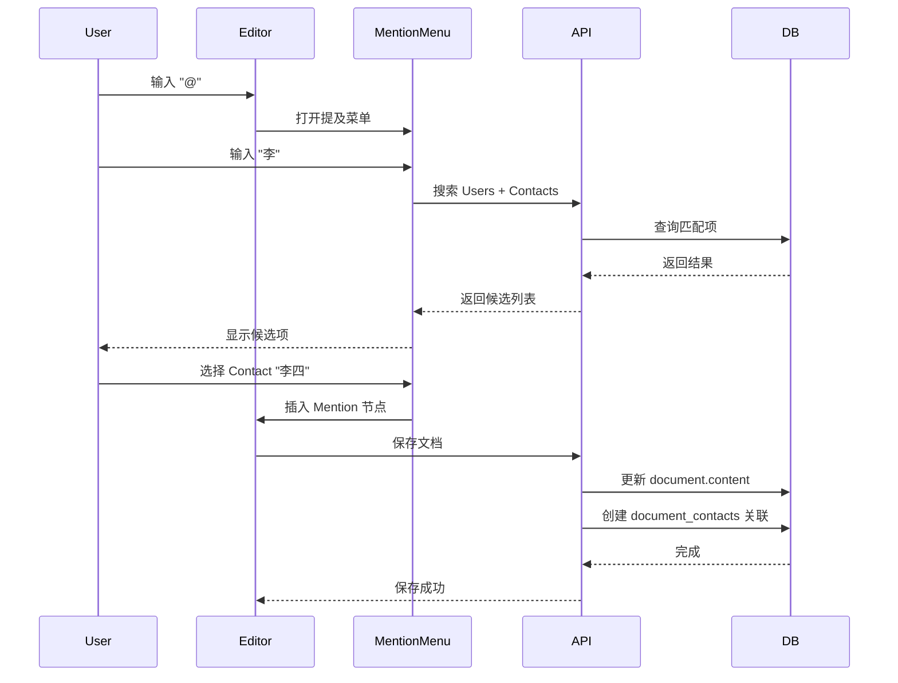
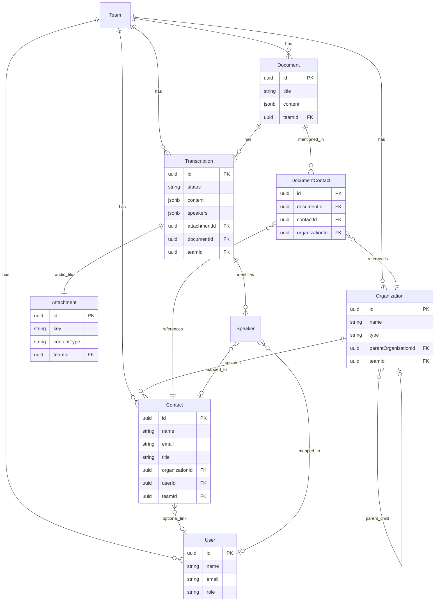
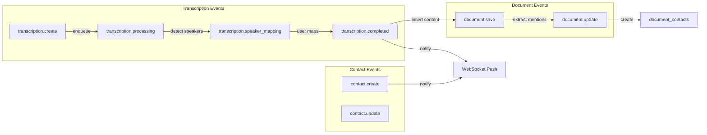

# Contacts & Transcription 架构集成图

本文档展示 Contacts/Organization 和 Meeting Transcription 两个功能如何在 Outline 架构中集成。

## 整体架构图

```mermaid
graph TB
    subgraph "Frontend (React + MobX)"
        Editor[Document Editor]
        Settings[Settings Page]
        Sidebar[Document Sidebar]
        Search[Global Search]
        
        Editor --> RecordBtn[Recording Button]
        Editor --> MentionMenu[@Mention Menu]
        Settings --> ContactsMgmt[Contacts Management]
        Settings --> OrgMgmt[Organizations Management]
    end
    
    subgraph "Shared (ProseMirror)"
        MentionNode[Mention Node]
        AudioNode[AudioTranscription Node]
        
        MentionNode --> |supports| UserMention[User Mention]
        MentionNode --> |supports| ContactMention[Contact Mention]
        MentionNode --> |supports| OrgMention[Organization Mention]
    end
    
    subgraph "Backend API (Koa)"
        ContactsAPI[/api/contacts.*]
        OrgsAPI[/api/organizations.*]
        TransAPI[/api/transcriptions.*]
        SearchAPI[/api/search.all]
        
        ContactsAPI --> ContactModel[(Contact Model)]
        OrgsAPI --> OrgModel[(Organization Model)]
        TransAPI --> TransModel[(Transcription Model)]
    end
    
    subgraph "Queue System (Bull)"
        TransQueue[Transcription Queue]
        TransProcessor[Transcription Processor]
        
        TransQueue --> TransProcessor
    end
    
    subgraph "External Services"
        WhisperAPI[OpenAI Whisper API]
        AzureSpeech[Azure Speech Service]
        
        TransProcessor --> |transcribe| WhisperAPI
        TransProcessor --> |speaker diarization| AzureSpeech
    end
    
    subgraph "Database (PostgreSQL)"
        Users[(users)]
        Contacts[(contacts)]
        Orgs[(organizations)]
        Docs[(documents)]
        Trans[(transcriptions)]
        Attachments[(attachments)]
        DocContacts[(document_contacts)]
        
        Contacts --> |belongs to| Orgs
        Contacts --> |optional link| Users
        Trans --> |references| Attachments
        Trans --> |belongs to| Docs
        DocContacts --> |links| Docs
        DocContacts --> |links| Contacts
        DocContacts --> |links| Orgs
    end
    
    subgraph "Storage (S3)"
        AudioFiles[Audio Files]
    end
    
    RecordBtn --> |upload| TransAPI
    MentionMenu --> |search| ContactsAPI
    MentionMenu --> |search| OrgsAPI
    ContactsMgmt --> ContactsAPI
    OrgMgmt --> OrgsAPI
    TransAPI --> TransQueue
    TransProcessor --> |save result| Trans
    Attachments --> |stored in| AudioFiles
    Search --> SearchAPI
    SearchAPI --> |query| Contacts
    SearchAPI --> |query| Orgs
    
    style MentionNode fill:#e1f5ff
    style AudioNode fill:#e1f5ff
    style TransProcessor fill:#fff4e1
    style WhisperAPI fill:#ffe1e1
    style AzureSpeech fill:#ffe1e1
```

## 数据流图

### 1. 会议转录 + Speaker 映射流程



### 2. 文档中提及联系人流程



## 实体关系图（ER Diagram）



## 组件交互图

### 前端组件层次

```
App
├── DocumentEditor
│   ├── ProseMirror
│   │   ├── MentionNode (扩展支持 Contact/Org)
│   │   └── AudioTranscriptionNode (新增)
│   ├── SlashMenu
│   │   └── RecordingCommand (新增)
│   └── MentionSuggestions
│       ├── UserSuggestions
│       ├── ContactSuggestions (新增)
│       └── OrganizationSuggestions (新增)
├── DocumentSidebar
│   ├── RelatedContacts (新增)
│   └── RelatedOrganizations (新增)
├── Settings
│   ├── ContactsManagement (新增)
│   └── OrganizationsManagement (新增)
├── Modals
│   └── SpeakerMappingModal (新增)
└── GlobalSearch
    ├── DocumentResults
    ├── ContactResults (新增)
    └── OrganizationResults (新增)
```

### Store 层次

```
RootStore
├── UsersStore (现有)
├── DocumentsStore (现有)
├── ContactsStore (新增)
│   ├── orderedData: Contact[]
│   ├── search(query): Contact[]
│   └── fetchByOrganization(orgId): Contact[]
├── OrganizationsStore (新增)
│   ├── orderedData: Organization[]
│   ├── tree: Organization[] (层级结构)
│   └── search(query): Organization[]
└── TranscriptionsStore (新增)
    ├── orderedData: Transcription[]
    ├── create(attachmentId, documentId): Transcription
    ├── mapSpeakers(id, mappings): void
    └── handleTranscriptionCompleted(event): void
```

## API 路由结构

```
/api
├── contacts
│   ├── contacts.create
│   ├── contacts.list
│   ├── contacts.info
│   ├── contacts.update
│   ├── contacts.delete
│   ├── contacts.search
│   └── contacts.import (CSV)
├── organizations
│   ├── organizations.create
│   ├── organizations.list
│   ├── organizations.info
│   ├── organizations.update
│   ├── organizations.delete
│   └── organizations.search
├── transcriptions
│   ├── transcriptions.create
│   ├── transcriptions.status
│   ├── transcriptions.mapSpeakers (新增)
│   ├── transcriptions.delete
│   └── transcriptions.list
└── search
    └── search.all (扩展支持 Contact/Org)
```

## 权限策略

```typescript
// 权限继承关系
DocumentPolicy
    ├── read → TranscriptionPolicy.read
    └── update → TranscriptionPolicy.create

TeamPolicy
    ├── member → ContactPolicy.create
    ├── member → OrganizationPolicy.create
    └── admin → ContactPolicy.delete

ContactPolicy
    ├── read (同团队可读)
    ├── create (Member+)
    ├── update (创建者或 Admin)
    └── delete (创建者或 Admin)

OrganizationPolicy
    └── (同 ContactPolicy)
```

## 事件流



## 部署架构

```
┌─────────────────────────────────────────────────────────┐
│                    Load Balancer                         │
└─────────────────────────────────────────────────────────┘
                          │
        ┌─────────────────┼─────────────────┐
        │                 │                 │
┌───────▼──────┐  ┌──────▼──────┐  ┌──────▼──────┐
│  Web Server  │  │ Web Server  │  │ Web Server  │
│   (Koa)      │  │   (Koa)     │  │   (Koa)     │
└───────┬──────┘  └──────┬──────┘  └──────┬──────┘
        │                │                 │
        └─────────────────┼─────────────────┘
                          │
        ┌─────────────────┼─────────────────┐
        │                 │                 │
┌───────▼──────┐  ┌──────▼──────┐  ┌──────▼──────┐
│  PostgreSQL  │  │    Redis    │  │  S3 Storage │
│  (Database)  │  │   (Queue)   │  │   (Audio)   │
└──────────────┘  └──────┬──────┘  └─────────────┘
                          │
                  ┌───────▼───────┐
                  │ Worker Process│
                  │ (Transcription│
                  │  Processor)   │
                  └───────┬───────┘
                          │
        ┌─────────────────┼─────────────────┐
        │                 │                 │
┌───────▼──────┐  ┌──────▼──────┐  ┌──────▼──────┐
│OpenAI Whisper│  │Azure Speech │  │Google Speech│
│     API      │  │   Service   │  │     API     │
└──────────────┘  └─────────────┘  └─────────────┘
```

## 扩展性考虑

### 水平扩展
- Web 服务器：无状态，可任意扩展
- Worker 进程：通过 Redis 队列协调，可独立扩展
- 数据库：读写分离，主从复制

### 性能优化
- 联系人列表：分页 + 虚拟滚动
- 搜索：全文索引 + Redis 缓存
- 转录队列：优先级队列，短音频优先

### 监控指标
- 转录成功率
- 平均转录时长
- 队列积压情况
- API 响应时间
- 存储使用量

## 总结

这个集成架构展示了：

1. **模块化设计**：Contacts 和 Transcription 作为独立模块，通过 Speaker 映射集成
2. **复用现有基础设施**：Mention 系统、队列系统、存储系统
3. **清晰的数据流**：从录音到转录到映射到文档的完整流程
4. **可扩展性**：支持多种转录服务，支持外部系统集成
5. **性能优化**：异步处理、缓存策略、索引优化

该架构在不破坏 Outline 现有结构的前提下，优雅地集成了两个新功能，并为未来扩展预留了空间。
